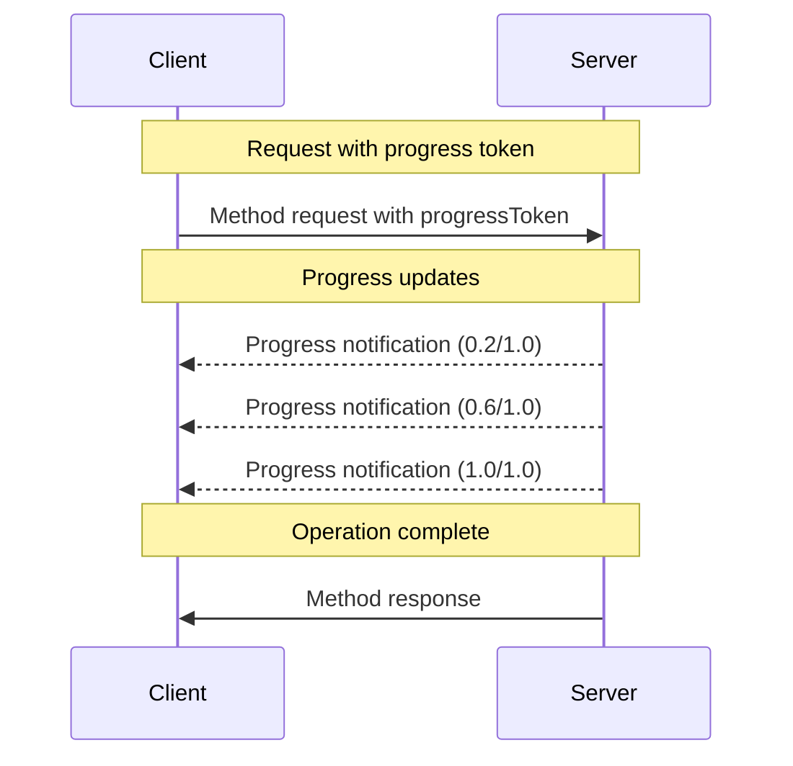

<div id="enable-section-numbers" />

模型上下文协议（MCP）通过通知消息支持长时间运行操作的可选进度跟踪。服务器**可以**发送进度通知，以报告客户端发起的请求状态。

## 进度流程

当客户端希望接收某个请求的进度更新时，它会在请求元数据中包含一个 `progressToken`。

- 进度令牌**必须**是字符串或整数值
- 客户端可以通过任何方式选择进度令牌，但在所有活动请求中**必须**唯一

```json
{
  "jsonrpc": "2.0",
  "id": 1,
  "method": "some_method",
  "params": {
    "_meta": {
      "progressToken": "abc123"
    }
  }
}
```

然后服务器**可以**发送包含以下内容的进度通知：

- 原始进度令牌
- 当前的进度值
- 一个可选的 "总计" 值
- 一个可选的 "消息" 值

```json
{
  "jsonrpc": "2.0",
  "method": "notifications/progress",
  "params": {
    "progressToken": "abc123",
    "progress": 50,
    "total": 100,
    "message": "Reticulating splines..."
  }
}
```

- `progress` 值**必须**随每个通知递增，即使总数未知。
- `progress` 和 `total` 值**可以**为浮点数。
- `message` 字段**应该**提供相关的可读进度信息。

## 行为要求

1. 进度通知**必须**仅引用以下令牌：
   - 在活动请求中提供的
   - 与进行中的操作关联的

2. 接收到带有进度令牌的请求的服务器**可以**：
   - 选择不发送任何进度通知
   - 以其认为合适的任何频率发送通知
   - 如果总计未知，则省略 total 值



## 实现说明

- 客户端和服务器**应该**跟踪活动的进度令牌
- 双方**应该**实现速率限制，以防止消息泛滥
- 进度通知**必须**在完成后停止
