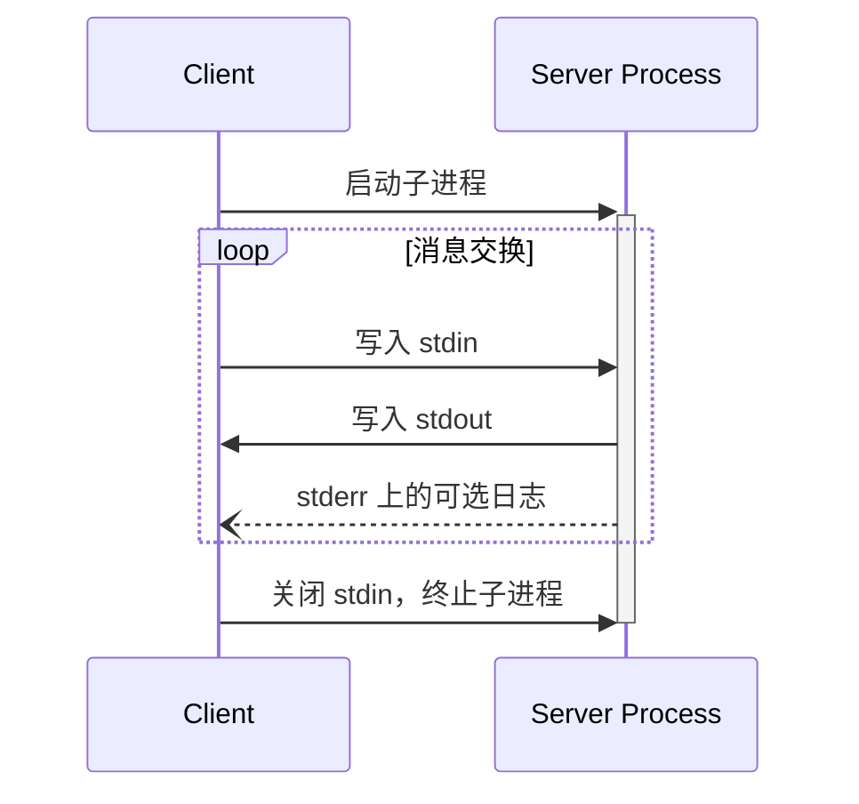
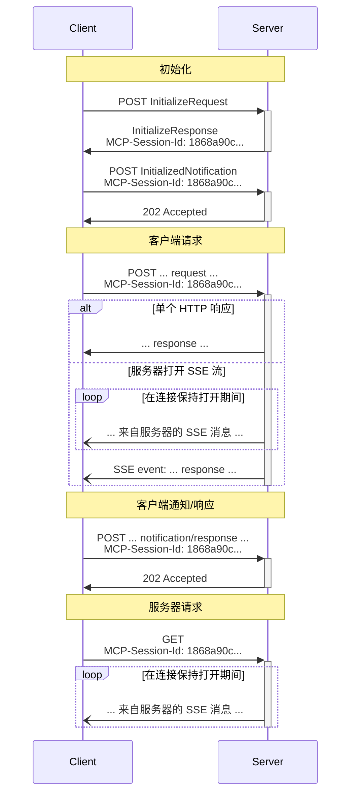

<div id="enable-section-numbers" />

MCP 使用 JSON-RPC 编码消息。JSON-RPC 消息 **必须** 采用 UTF-8 编码。

该协议目前定义了两种用于客户端 - 服务器通信的标准传输机制：

1. [stdio](#stdio)，通过标准输入和标准输出进行通信
2. [Streamable HTTP](#streamable-http)

客户端应尽可能支持 stdio。

客户端和服务器也可以以可插拔的方式实现 [自定义传输](#custom-transports)。

## stdio

在 **stdio** 传输中：

- 客户端将 MCP 服务器作为子进程启动。
- 服务器从其标准输入（`stdin`）读取 JSON-RPC 消息，并将消息发送到其标准输出（`stdout`）。
- 消息是单独的 JSON-RPC 请求、通知或响应。
- 消息由换行符分隔，且 **不得** 包含嵌入式换行符。
- 服务器 **可以** 向其标准错误（`stderr`）写入 UTF-8 字符串，用于任何日志记录目的，包括信息、调试和错误消息。
- 客户端 **可以** 捕获、转发或忽略服务器的 `stderr` 输出，且 **不应** 假设 `stderr` 输出表示错误条件。
- 服务器 **不得** 向其 `stdout` 写入任何非有效 MCP 消息的内容。
- 客户端 **不得** 向服务器的 `stdin` 写入任何非有效 MCP 消息的内容。



## Streamable HTTP

<Info>

这取代了协议版本 2024-11-05 中的 [HTTP+SSE 传输](/specification/2024-11-05/basic/transports#http-with-sse)。请参阅下面的 [向后兼容性](#backwards-compatibility) 指南。

</Info>

在 **Streamable HTTP** 传输中，服务器作为一个独立进程运行，能够处理多个客户端连接。该传输使用 HTTP POST 和 GET 请求。服务器还可以选择使用 [服务器发送事件](https://en.wikipedia.org/wiki/Server-sent_events)（SSE）来流式传输多个服务器消息。这既支持基础 MCP 服务器，也支持更丰富的、支持流式传输以及服务器到客户端通知和请求的服务器。

服务器 **必须** 提供单个 HTTP 端点路径（以下简称 **MCP 端点**），该路径支持 POST 和 GET 方法。例如，这可以是像 `https://example.com/mcp` 这样的 URL。

#### 安全警告

在实现 Streamable HTTP 传输时：

1. 服务器 **必须** 验证所有传入连接上的 `Origin` 头，以防止 DNS 重绑定攻击
   - 如果 `Origin` 头存在且无效，服务器 **必须** 响应 HTTP 403 Forbidden。HTTP 响应体 **可以** 包含一个没有 `id` 的 JSON-RPC _错误响应_
2. 在本地运行时，服务器 **应该** 仅绑定到 localhost (127.0.0.1)，而不是所有网络接口 (0.0.0.0)
3. 服务器 **应该** 为所有连接实现适当的身份验证

如果没有这些保护措施，攻击者可以使用 DNS 重绑定从远程网站与本地 MCP 服务器交互。

### 向服务器发送消息

从客户端发送的每条 JSON-RPC 消息 **必须** 是对 MCP 端点的新 HTTP POST 请求。

1. 客户端 **必须** 使用 HTTP POST 向 MCP 端点发送 JSON-RPC 消息。
2. 客户端 **必须** 包含 `Accept` 头，列出 `application/json` 和 `text/event-stream` 作为支持的内容类型。
3. 客户端 **必须** 在每个 POST 请求中包含 [标准 MCP 请求头](#standard-mcp-request-headers)。
4. HTTP POST 请求的正文 **必须** 是一个单独的 JSON-RPC _请求_、_通知_ 或对服务器发起请求的 _响应_。
5. 如果正文是 JSON-RPC _通知_ 或对服务器发起请求的 _响应_：
   - 如果服务器接受输入，服务器 **必须** 返回 HTTP 状态码 202 Accepted，且不带正文。
   - 如果服务器无法接受输入，它 **必须** 返回 HTTP 错误状态码（例如，400 Bad Request）。HTTP 响应体 **可以** 包含一个没有 `id` 的 JSON-RPC _错误响应_。
6. 如果正文是 JSON-RPC _请求_，服务器 **必须** 要么
   返回 `Content-Type: text/event-stream` 以启动 SSE 流，要么
   返回 `Content-Type: application/json` 以返回一个 JSON 对象。客户端 **必须** 同时支持这两种情况。
7. 如果服务器启动 SSE 流：
   - 服务器 **应该** 立即发送一个由事件 ID 和空 `data` 字段组成的 SSE 事件，以便让客户端为重新连接做准备（将该事件 ID 作为 `Last-Event-ID` 使用）。
   - 在服务器向客户端发送带有事件 ID 的 SSE 事件之后，服务器 **可以** 在任何时候关闭 _连接_（而不终止 _SSE 流_），以避免维持长连接。客户端 **应该** 随后通过尝试重新连接来“轮询”SSE 流。
   - 如果服务器在终止 _SSE 流_ 之前关闭了 _连接_，它 **应该** 在关闭连接前发送一个带有标准 [`retry`](https://html.spec.whatwg.org/multipage/server-sent-events.html#:~:text=field%20name%20is%20%22retry%22) 字段的 SSE 事件。客户端 **必须** 遵守 `retry` 字段，在尝试重新连接前等待给定的毫秒数。
   - SSE 流 **应该** 最终包含对 POST 正文中发送的 JSON-RPC _请求_ 的 JSON-RPC _响应_。
   - 服务器 **可以** 在发送 JSON-RPC _响应_ 之前发送 JSON-RPC _请求_ 和 _通知_。这些消息 **必须** 与发起的客户端 _请求_ 相关。
   - 如果 [会话](#session-management) 过期，服务器 **可以** 终止 SSE 流。
   - 在 JSON-RPC _响应_ 发送后，服务器 **应该** 终止 SSE 流。
   - 断开连接 **可以** 在任何时候发生（例如，由于网络状况）。因此：
     - 断开连接 **不应** 被解释为客户端取消其请求。
     - 要取消，客户端 **应该** 显式发送 MCP `CancelledNotification`。
     - 为避免因断开连接导致消息丢失，服务器 **可以** 将流设计为 [可恢复](#resumability-and-redelivery)。

### 监听来自服务器的消息

1. 客户端 **可以** 向 MCP 端点发出 HTTP GET。这可用于打开 SSE 流，允许服务器与客户端通信，而无需客户端首先通过 HTTP POST 发送数据。
2. 客户端 **必须** 包含一个 `Accept` 头，列出 `text/event-stream` 作为支持的内容类型。
3. 服务器 **必须** 要么在此 HTTP GET 响应中返回 `Content-Type: text/event-stream`，要么返回 HTTP 405 Method Not Allowed，表明服务器在此端点不提供 SSE 流。根据 [RFC 9110 §15.5.6](https://httpwg.org/specs/rfc9110.html#status.405)，如果服务器返回 HTTP 405，它 **必须** 包含一个 `Allow` 头，列出它支持的方法（例如，`Allow: POST`）。
4. 如果服务器启动 SSE 流：
   - 服务器 **可以** 在流上发送 JSON-RPC _通知_ 和 _pings_。
   - 这些消息 **应该** 与任何并发运行的客户端 JSON-RPC _请求_ 无关，**除了** `roots/list`、`sampling/createMessage` 和 `elicitation/create` 请求 **不得** 在独立流上发送。
   - 除非 [恢复](#resumability-and-redelivery) 与先前客户端请求关联的流，否则服务器 **不得** 在流上发送 JSON-RPC _响应_。
   - 服务器 **可以** 随时关闭 SSE 流。
   - 如果服务器在不终止 _流_ 的情况下关闭 _连接_，它 **应该** 遵循与 POST 请求描述的相同的轮询行为：发送 `retry` 字段并允许客户端重新连接。
   - 客户端 **可以** 随时关闭 SSE 流。

### 多连接

1. 客户端 **可以** 同时保持连接到多个 SSE 流。
2. 服务器 **必须** 仅在其中一个连接的流上发送其每条 JSON-RPC 消息；也就是说，它 **不得** 在多个流上广播相同的消息。
   - 消息丢失的风险 **可以** 通过使流 [可恢复](#resumability-and-redelivery) 来减轻。

### 可恢复性和重新交付

为了支持恢复断开的连接，以及重新交付否则可能丢失的消息：

1. 服务器 **可以** 为其 SSE 事件附加一个 `id` 字段，如 [SSE 标准](https://html.spec.whatwg.org/multipage/server-sent-events.html#event-stream-interpretation) 中所述。
   - 如果存在，该 ID 在该 [会话](#session-management) 内的所有流中 **必须** 是全局唯一的——或者如果未使用会话管理，则在与该特定客户端的所有流中唯一。
   - 事件 ID **应该** 编码足够的信息以识别源流，使服务器能够将 `Last-Event-ID` 关联到正确的流。
2. 如果客户端希望在断开连接后恢复（无论是由于网络故障还是服务器发起的关闭），它 **应该** 向 MCP 端点发出 HTTP GET，并包含 [`Last-Event-ID`](https://html.spec.whatwg.org/multipage/server-sent-events.html#the-last-event-id-header) 头，以指示它收到的最后一个事件 ID。
   - 服务器 **可以** 使用此头重放本应在 _断开的流_ 上的最后一个事件 ID 之后发送的消息，并从该点恢复流。
   - 服务器 **不得** 重放本应在不同流上交付的消息。
   - 此机制适用于原始流是如何启动的（通过 POST 或 GET）。恢复始终通过带有 `Last-Event-ID` 的 HTTP GET 进行。

换句话说，这些事件 ID 应由服务器在 _每个流_ 的基础上分配，以作为该特定流内的游标。

### 会话管理

MCP“会话”由客户端和服务器之间逻辑相关的交互组成，始于 [初始化阶段](/specification/draft/basic/lifecycle)。为了支持想要建立有状态会话的服务器：

1. 使用 Streamable HTTP 传输的服务器 **可以** 在初始化时分配一个会话 ID，方法是在包含 `InitializeResult` 的 HTTP 响应的 `MCP-Session-Id` 头中包括它。
   - 会话 ID **应该** 是全局唯一且加密安全的（例如，安全生成的 UUID、JWT 或加密哈希）。
   - 会话 ID **必须** 仅包含可见的 ASCII 字符（范围从 0x21 到 0x7E）。
   - 客户端 **必须** 以安全方式处理会话 ID，有关更多详细信息，请参阅 [会话劫持缓解措施](/specification/draft/basic/security_best_practices#session-hijacking)。
2. 如果服务器在初始化期间返回了 `MCP-Session-Id`，使用 Streamable HTTP 传输的客户端 **必须** 在其所有后续 HTTP 请求的 `MCP-Session-Id` 头中包含它。
   - 需要会话 ID 的服务器 **应该** 响应没有 `MCP-Session-Id` 头的请求（初始化除外），返回 HTTP 400 Bad Request。
3. 服务器 **可以** 随时终止会话，之后它 **必须** 响应包含该会话 ID 的请求，返回 HTTP 404 Not Found。
4. 当客户端收到针对包含 `MCP-Session-Id` 的请求的 HTTP 404 响应时，它 **必须** 通过发送一个新的不带会话 ID 的 `InitializeRequest` 来启动新会话。
5. 不再需要特定会话的客户端（例如，因为用户正在离开客户端应用程序） **应该** 向 MCP 端点发送带有 `MCP-Session-Id` 头的 HTTP DELETE，以显式终止会话。
   - 服务器 **可以** 响应此请求，返回 HTTP 405 Method Not Allowed，表明服务器不允许客户端终止会话。如果服务器返回 HTTP 405，它 **必须** 包含一个 `Allow` 头，列出它支持的方法。

### 序列图



### 协议版本头

如果使用 HTTP，客户端 **必须** 在随后对 MCP 服务器的所有请求中包含 `MCP-Protocol-Version: <protocol-version>` HTTP 头，允许 MCP 服务器根据 MCP 协议版本进行响应。

例如：`MCP-Protocol-Version: 2025-06-18`

客户端发送的协议版本 **应该** 是 [初始化期间协商](/specification/draft/basic/lifecycle#version-negotiation) 的版本。

为了向后兼容，如果服务器 _没有_ 收到 `MCP-Protocol-Version` 头，并且没有其他方法来识别版本 - 例如，通过依赖初始化期间协商的协议版本 - 服务器 **应该** 假设协议版本为 `2025-03-26`。

如果服务器收到带有无效或不受支持的 `MCP-Protocol-Version` 的请求，它 **必须** 响应 `400 Bad Request`。

### 标准 MCP 请求头

Streamable HTTP 传输要求客户端在 POST 请求中包含以下头，这些头与 JSON-RPC 请求正文中的字段相对应：

| 头名称 | 来源字段 | 适用范围 |
| ------------ | ----------------------------- | ------------------------------------------------------ |
| `Mcp-Method` | `method` | 所有请求和通知 |
| `Mcp-Name`   | `params.name` or `params.uri` | `tools/call`、`resources/read`、`prompts/get` 请求 |

这些头对于符合规范是 **必需的**。

#### 示例

**`tools/call` 请求：**

```http
POST /mcp HTTP/1.1
Content-Type: application/json
Mcp-Session-Id: 1f3a4b5c-6d7e-8f9a-0b1c-2d3e4f5a6b7c
Mcp-Method: tools/call
Mcp-Name: get_weather

{
  "jsonrpc": "2.0",
  "id": 1,
  "method": "tools/call",
  "params": {
    "name": "get_weather",
    "arguments": {
      "location": "Seattle, WA"
    }
  }
}
```

**`resources/read` 请求：**

```http
POST /mcp HTTP/1.1
Content-Type: application/json
Mcp-Session-Id: 1f3a4b5c-6d7e-8f9a-0b1c-2d3e4f5a6b7c
Mcp-Method: resources/read
Mcp-Name: file:///projects/myapp/config.json

{
  "jsonrpc": "2.0",
  "id": 2,
  "method": "resources/read",
  "params": {
    "uri": "file:///projects/myapp/config.json"
  }
}
```

**`initialize` 请求（不需要 `Mcp-Name`）：**

```http
POST /mcp HTTP/1.1
Content-Type: application/json
Mcp-Method: initialize

{
  "jsonrpc": "2.0",
  "id": 4,
  "method": "initialize",
  "params": {
    "protocolVersion": "2025-06-18",
    "capabilities": {},
    "clientInfo": {
      "name": "ExampleClient",
      "version": "1.0.0"
    }
  }
}
```

**通知：**

```http
POST /mcp HTTP/1.1
Content-Type: application/json
Mcp-Session-Id: 1f3a4b5c-6d7e-8f9a-0b1c-2d3e4f5a6b7c
Mcp-Method: notifications/initialized

{
  "jsonrpc": "2.0",
  "method": "notifications/initialized"
}
```

#### 大小写敏感性

头名称（在 [RFC 9110](https://datatracker.ietf.org/doc/html/rfc9110#name-field-names) 中称为“字段名”）
不区分大小写。客户端和服务器 **必须** 对头名称使用不区分大小写的比较。头 _值_（例如方法名）则区分大小写。

#### 服务器验证

处理请求正文的服务器 **必须** 拒绝头中指定的值与请求正文中对应值不匹配的请求。这可防止当网络中的不同组件依赖不同事实来源时出现潜在安全漏洞（例如，负载均衡器根据头值进行路由，而 MCP 服务器根据正文值执行）。

当因头验证失败而拒绝请求时，服务器 **必须** 返回 HTTP 状态 `400 Bad Request`，并且 **应该** 使用以下错误代码包含一个 JSON-RPC 错误响应：

| Code     | Name     | Description                                                                                                            |
| -------- | ---------------- | ---------------------------------------------------------------------------------------------------------------------- |
| `-32001` | `HeaderMismatch` | HTTP 头与请求正文中的相应值不匹配，或者必需的头缺失/格式错误。 |

此错误代码位于 JSON-RPC 实现定义的服务器错误范围（`-32000` 到 `-32099`）内。

**错误响应示例：**

```json
{
  "jsonrpc": "2.0",
  "id": 1,
  "error": {
    "code": -32001,
    "message": "Header mismatch: Mcp-Name header value 'foo' does not match body value 'bar'"
  }
}
```

验证失败的条件包括：

- 缺少必需的标准头（`Mcp-Method`、`Mcp-Name`）
- 头值与对应的请求正文值不匹配
- 头值包含无效字符

<Note>

中介组件 **必须** 在验证失败时返回适当的 HTTP 错误状态（例如，`400 Bad Request`），但不要求返回 JSON-RPC 错误响应。

</Note>

### 来自工具参数的自定义头

MCP 服务器 **可以** 使用工具 `inputSchema` 中参数 schema 里的 `x-mcp-header` 扩展属性，指定将特定工具参数映射到 HTTP 头。有关如何为工具参数添加注释的详细信息，请参阅 [工具定义](/specification/draft/server/tools#x-mcp-header)。

虽然服务器使用 `x-mcp-header` 是可选的，但客户端 **必须** 支持此功能。当服务器的工具定义包含 `x-mcp-header` 注释时，符合规范的客户端 **必须** 将指定的参数值映射到 HTTP 头中。

#### Schema 扩展

`x-mcp-header` 属性指定用于构造头名称 `Mcp-Param-{name}` 的名称部分。

**`x-mcp-header` 值的约束**：

- **不得** 为空
- **必须** 仅包含 ASCII 字符（不包括空格和 `:`）
- **必须** 在 `inputSchema` 中所有 `x-mcp-header` 值之间不区分大小写地唯一
- **必须** 仅应用于原始类型参数（number、string、boolean）

客户端 **必须** 拒绝任何 `x-mcp-header` 值违反这些约束的工具定义。拒绝的含义是客户端 **必须** 将无效工具从 `tools/list` 的结果中排除。客户端 **应该** 在拒绝工具定义时记录警告，包括工具名称和拒绝原因。

**工具定义示例：**

```json
{
  "name": "execute_sql",
  "description": "在 Google Cloud Spanner 上执行 SQL",
  "inputSchema": {
    "type": "object",
    "properties": {
      "region": {
        "type": "string",
        "description": "执行查询的区域",
        "x-mcp-header": "Region"
      },
      "query": {
        "type": "string",
        "description": "要执行的 SQL 查询"
      }
    },
    "required": ["region", "query"]
  }
}
```

**生成的 HTTP 请求：**

```http
POST /mcp HTTP/1.1
Content-Type: application/json
Mcp-Session-Id: 1f3a4b5c-6d7e-8f9a-0b1c-2d3e4f5a6b7c
Mcp-Method: tools/call
Mcp-Name: execute_sql
Mcp-Param-Region: us-west1

{
  "jsonrpc": "2.0",
  "id": 1,
  "method": "tools/call",
  "params": {
    "name": "execute_sql",
    "arguments": {
      "region": "us-west1",
      "query": "SELECT * FROM users"
    }
  }
}
```

#### 值编码

客户端 **必须** 在将参数值包含到 HTTP 头之前对其进行编码，以确保安全传输并防止注入攻击。

**类型转换**：将参数值转换为其字符串表示形式：

- `string`：按原值使用
- `number`：转换为十进制字符串表示形式（例如，`42`、`3.14`）
- `boolean`：转换为小写的 `"true"` 或 `"false"`

根据 [RFC 9110](https://datatracker.ietf.org/doc/html/rfc9110#name-field-values)，HTTP 头字段值必须由可见 ASCII 字符（0x21-0x7E）、空格（0x20）和水平制表符（0x09）组成。当某个值无法安全地表示为普通 ASCII 头值时（例如，它包含非 ASCII 字符、控制字符，或者具有前导/尾随空白），客户端 **必须** 使用其 UTF-8 表示的 Base64 编码，并采用以下格式：

```text
Mcp-Param-{Name}: =?base64?{Base64EncodedValue}?=
```

前缀 `=?base64?` 和后缀 `?=` 表示该值已进行 Base64 编码。需要检查这些值的服务器和中介组件 **必须** 相应地对其进行解码。

**编码示例：**

| 原始值   | 原因                  | 编码后的头值                                  |
| ----------------------- | ----------------------- | ----------------------------------------------------- |
| `"us-west1"`     | 纯 ASCII             | `Mcp-Param-Region: us-west1`                          |
| `"Hello, 世界"`  | 包含非 ASCII      | `Mcp-Param-Greeting: =?base64?SGVsbG8sIOS4lueVjA==?=` |
| `" padded "`     | 前导/尾随空格 | `Mcp-Param-Text: =?base64?IHBhZGRlZCA=?=`             |
| `"line1\nline2"` | 包含换行符        | `Mcp-Param-Text: =?base64?bGluZTEKbGluZTI=?=`         |

#### 客户端行为

当通过 HTTP 传输构造 `tools/call` 请求时，客户端 **必须**：

1. 从请求正文中提取任何标准头的值（例如，`method`、`params.name`、`params.uri`）
2. 将 `Mcp-Method` 头以及（如适用）`Mcp-Name` 头附加到请求中
3. 检查工具的 `inputSchema` 中带有 `x-mcp-header` 标记的属性，并提取每个参数的值
4. 根据 [值编码](#value-encoding) 规则对这些值进行编码
5. 将 `Mcp-Param-{Name}: {Value}` 头附加到请求中

#### 自定义头的服务器行为

不识别 `Mcp-Param-{Name}` 头的中间服务器 **必须** 转发该头并忽略其内容，这是 [HTTP 语义 RFC](https://www.rfc-editor.org/rfc/rfc9110.html#name-field-names) 的要求。

服务器 **必须** 拒绝带有被识别的 `Mcp-Param-{Name}` 头且其中包含无效字符的请求（见 [值编码](#value-encoding)）。

任何处理消息正文的服务器 **必须** 验证编码后的头值（如果使用 Base64 编码，则在解码后）与请求正文中的对应值一致。若任何验证失败，服务器 **必须** 返回 HTTP 状态 `400 Bad Request` 和 JSON-RPC 错误代码 `-32001`（`HeaderMismatch`）拒绝请求。

| 场景                                 | 客户端行为                | 服务器行为                          |
| ---------------------------------------- | ------------------------------ | ---------------------------------------- |
| 提供了参数值                 | 客户端必须包含该头 | 服务器必须验证头与正文匹配 |
| 参数值为 `null`                | 客户端必须省略该头 | 服务器不得期望该头 |
| 参数未出现在参数中               | 客户端必须省略该头 | 服务器不得期望该头 |
| 客户端省略头但正文中有值 | 不符合规范的客户端          | 服务器必须拒绝该请求           |

### SSE 流配置

在启动 SSE 流时，服务器 **应该** 在返回 `Content-Type: text/event-stream` 的 HTTP 响应中包含 `X-Accel-Buffering: no` 头。此头指示反向代理（如 nginx）禁用响应缓冲，确保 SSE 事件立即交付给客户端，而不是保存在缓冲区中。如果没有此头，代理可能会在将消息发送给客户端之前积累消息，引入不必要的延迟并可能破坏 SSE 通信的实时性。

### 向后兼容性

客户端和服务器可以通过以下方式与已弃用的 [HTTP+SSE 传输](/specification/2024-11-05/basic/transports#http-with-sse)（来自协议版本 2024-11-05）保持向后兼容性：

**想要支持旧客户端的服务器** 应该：

- 继续托管旧传输的 SSE 和 POST 端点，与为 Streamable HTTP 传输定义的新“MCP 端点”一起。
  - 也可以组合旧的 POST 端点和新的 MCP 端点，但这可能会引入不必要的复杂性。

**想要支持旧服务器的客户端** 应该：

1. 从用户处接受一个 MCP 服务器 URL，该 URL 可能指向使用旧传输或新传输的服务器。
2. 尝试向服务器 URL 发送一个 `InitializeRequest` 的 POST 请求，并带上如上所定义的 `Accept` 头：
   - 如果成功，客户端可以假定这是一个支持新 Streamable HTTP 传输的服务器。
   - 如果返回以下 HTTP 状态码之一而失败：“400 Bad Request”、“404 Not Found”或“405 Method Not Allowed”：
     - 向服务器 URL 发出 GET 请求，期望这将打开一个 SSE 流并将 `endpoint` 事件作为第一个事件返回。
     - 当 `endpoint` 事件到达时，客户端可以假定这是一个运行旧 HTTP+SSE 传输的服务器，并应在后续所有通信中使用该传输。

## 自定义传输

客户端和服务器 **可以** 实现额外的自定义传输机制，以满足其特定需求。该协议与传输无关，可以在任何支持双向消息交换的通信通道上实现。

选择支持自定义传输的实现者 **必须** 确保他们保留 MCP 定义的 JSON-RPC 消息格式和生命周期要求。自定义传输 **应该** 记录其特定的连接建立和消息交换模式，以帮助互操作性。
