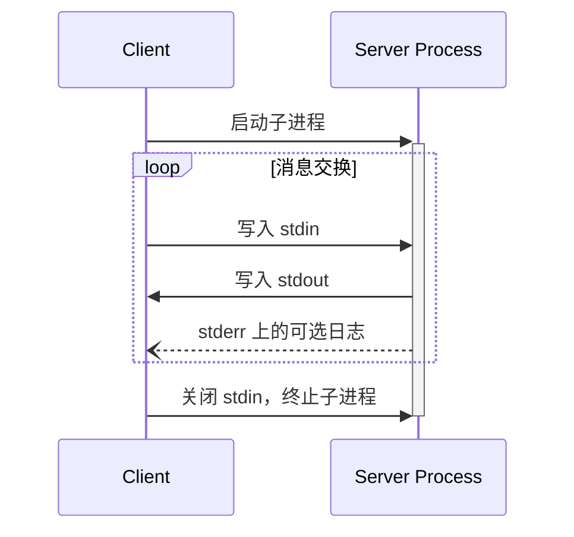
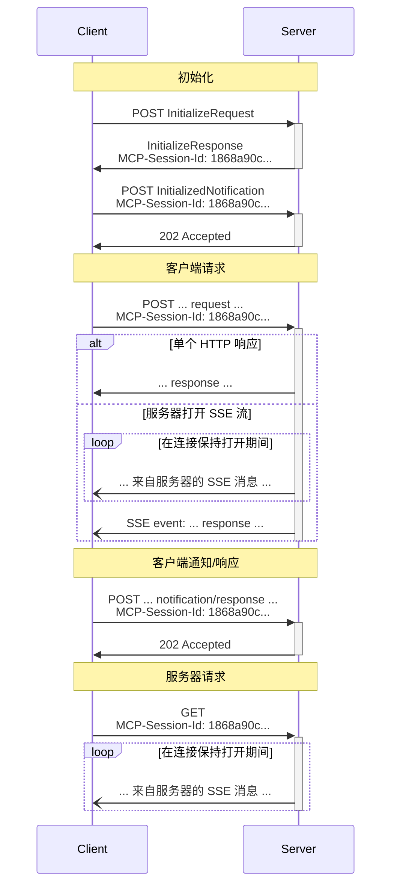

<div id="enable-section-numbers" />

MCP 使用 JSON-RPC 编码消息。JSON-RPC 消息 **必须** 采用 UTF-8 编码。

该协议目前定义了两种用于客户端 - 服务器通信的标准传输机制：

1. [stdio](#stdio)，通过标准输入和标准输出进行通信
2. [Streamable HTTP](#streamable-http)

客户端应尽可能支持 stdio。

客户端和服务器也可以以可插拔的方式实现 [自定义传输](#custom-transports)。

## stdio

在 **stdio** 传输中：

- 客户端将 MCP 服务器作为子进程启动。
- 服务器从其标准输入（`stdin`）读取 JSON-RPC 消息，并将消息发送到其标准输出（`stdout`）。
- 消息是单独的 JSON-RPC 请求、通知或响应。
- 消息由换行符分隔，且 **不得** 包含嵌入式换行符。
- 服务器 **可以** 向其标准错误（`stderr`）写入 UTF-8 字符串，用于任何日志记录目的，包括信息、调试和错误消息。
- 客户端 **可以** 捕获、转发或忽略服务器的 `stderr` 输出，且 **不应** 假设 `stderr` 输出表示错误条件。
- 服务器 **不得** 向其 `stdout` 写入任何非有效 MCP 消息的内容。
- 客户端 **不得** 向服务器的 `stdin` 写入任何非有效 MCP 消息的内容。



## Streamable HTTP

<Info>

这取代了协议版本 2024-11-05 中的 [HTTP+SSE 传输](/specification/2024-11-05/basic/transports#http-with-sse)。请参阅下面的 [向后兼容性](#backwards-compatibility) 指南。

</Info>

在 **Streamable HTTP** 传输中，服务器作为独立进程运行，可以处理多个客户端连接。此传输使用 HTTP POST 和 GET 请求。服务器可以选择使用 [服务器发送事件](https://en.wikipedia.org/wiki/Server-sent_events) (SSE) 来流式传输多个服务器消息。这允许基本的 MCP 服务器，以及支持流式传输和服务器到客户端通知及请求的更功能丰富的服务器。

服务器 **必须** 提供单个 HTTP 端点路径（以下简称 **MCP 端点**），该路径支持 POST 和 GET 方法。例如，这可以是像 `https://example.com/mcp` 这样的 URL。

#### 安全警告

在实现 Streamable HTTP 传输时：

1. 服务器 **必须** 验证所有传入连接上的 `Origin` 头，以防止 DNS 重绑定攻击
   - 如果 `Origin` 头存在且无效，服务器 **必须** 响应 HTTP 403 Forbidden。HTTP 响应体 **可以** 包含一个没有 `id` 的 JSON-RPC _错误响应_
2. 在本地运行时，服务器 **应该** 仅绑定到 localhost (127.0.0.1)，而不是所有网络接口 (0.0.0.0)
3. 服务器 **应该** 为所有连接实现适当的身份验证

如果没有这些保护措施，攻击者可以使用 DNS 重绑定从远程网站与本地 MCP 服务器交互。

### 向服务器发送消息

从客户端发送的每条 JSON-RPC 消息 **必须** 是对 MCP 端点的新 HTTP POST 请求。

1. The client **MUST** use HTTP POST to send JSON-RPC messages to the MCP endpoint.
2. The client **MUST** include an `Accept` header, listing both `application/json` and
   `text/event-stream` as supported content types.
3. The client **MUST** include the [standard MCP request headers](#standard-mcp-request-headers)
   on each POST request.
4. The body of the HTTP POST request **MUST** be a single JSON-RPC _request_, _notification_, or _response_ to a server-sent request.
5. If the body is a JSON-RPC _notification_ or _response_ to a server-sent request:
   - If the server accepts the input, the server **MUST** return HTTP status code 202
     Accepted with no body.
   - If the server cannot accept the input, it **MUST** return an HTTP error status code
     (e.g., 400 Bad Request). The HTTP response body **MAY** comprise a JSON-RPC _error
     response_ that has no `id`.
6. If the body is a JSON-RPC _request_, the server **MUST** either
   return `Content-Type: text/event-stream`, to initiate an SSE stream, or
   `Content-Type: application/json`, to return one JSON object. The client **MUST**
   support both these cases.
7. If the server initiates an SSE stream:
   - The server **SHOULD** immediately send an SSE event consisting of an event
     ID and an empty `data` field in order to prime the client to reconnect
     (using that event ID as `Last-Event-ID`).
   - After the server has sent an SSE event with an event ID to the client, the
     server **MAY** close the _connection_ (without terminating the _SSE stream_)
     at any time in order to avoid holding a long-lived connection. The client
     **SHOULD** then "poll" the SSE stream by attempting to reconnect.
   - If the server does close the _connection_ prior to terminating the _SSE stream_,
     it **SHOULD** send an SSE event with a standard [`retry`](https://html.spec.whatwg.org/multipage/server-sent-events.html#:~:text=field%20name%20is%20%22retry%22) field before
     closing the connection. The client **MUST** respect the `retry` field,
     waiting the given number of milliseconds before attempting to reconnect.
   - The SSE stream **SHOULD** eventually include a JSON-RPC _response_ for the
     JSON-RPC _request_ sent in the POST body.
   - The server **MAY** send JSON-RPC _requests_ and _notifications_ before sending the
     JSON-RPC _response_. These messages **MUST** relate to the originating client
     _request_.
   - The server **MAY** terminate the SSE stream if the [session](#session-management)
     expires.
   - After the JSON-RPC _response_ has been sent, the server **SHOULD** terminate the
     SSE stream.
   - Disconnection **MAY** occur at any time (e.g., due to network conditions).
     Therefore:
     - Disconnection **SHOULD NOT** be interpreted as the client cancelling its request.
     - To cancel, the client **SHOULD** explicitly send an MCP `CancelledNotification`.
     - To avoid message loss due to disconnection, the server **MAY** make the stream
       [resumable](#resumability-and-redelivery).

### 监听来自服务器的消息

1. 客户端 **可以** 向 MCP 端点发出 HTTP GET。这可用于打开 SSE 流，允许服务器与客户端通信，而无需客户端首先通过 HTTP POST 发送数据。
2. 客户端 **必须** 包含一个 `Accept` 头，列出 `text/event-stream` 作为支持的内容类型。
3. 服务器 **必须** 要么在此 HTTP GET 响应中返回 `Content-Type: text/event-stream`，要么返回 HTTP 405 Method Not Allowed，表明服务器在此端点不提供 SSE 流。根据 [RFC 9110 §15.5.6](https://httpwg.org/specs/rfc9110.html#status.405)，如果服务器返回 HTTP 405，它 **必须** 包含一个 `Allow` 头，列出它支持的方法（例如，`Allow: POST`）。
4. 如果服务器启动 SSE 流：
   - 服务器 **可以** 在流上发送 JSON-RPC _通知_ 和 _pings_。
   - 这些消息 **应该** 与任何并发运行的客户端 JSON-RPC _请求_ 无关，**除了** `roots/list`、`sampling/createMessage` 和 `elicitation/create` 请求 **不得** 在独立流上发送。
   - 除非 [恢复](#resumability-and-redelivery) 与先前客户端请求关联的流，否则服务器 **不得** 在流上发送 JSON-RPC _响应_。
   - 服务器 **可以** 随时关闭 SSE 流。
   - 如果服务器在不终止 _流_ 的情况下关闭 _连接_，它 **应该** 遵循与 POST 请求描述的相同的轮询行为：发送 `retry` 字段并允许客户端重新连接。
   - 客户端 **可以** 随时关闭 SSE 流。

### 多连接

1. 客户端 **可以** 同时保持连接到多个 SSE 流。
2. 服务器 **必须** 仅在其中一个连接的流上发送其每条 JSON-RPC 消息；也就是说，它 **不得** 在多个流上广播相同的消息。
   - 消息丢失的风险 **可以** 通过使流 [可恢复](#resumability-and-redelivery) 来减轻。

### 可恢复性和重新交付

为了支持恢复断开的连接，以及重新交付否则可能丢失的消息：

1. 服务器 **可以** 为其 SSE 事件附加一个 `id` 字段，如 [SSE 标准](https://html.spec.whatwg.org/multipage/server-sent-events.html#event-stream-interpretation) 中所述。
   - 如果存在，该 ID 在该 [会话](#session-management) 内的所有流中 **必须** 是全局唯一的——或者如果未使用会话管理，则在与该特定客户端的所有流中唯一。
   - 事件 ID **应该** 编码足够的信息以识别源流，使服务器能够将 `Last-Event-ID` 关联到正确的流。
2. 如果客户端希望在断开连接后恢复（无论是由于网络故障还是服务器发起的关闭），它 **应该** 向 MCP 端点发出 HTTP GET，并包含 [`Last-Event-ID`](https://html.spec.whatwg.org/multipage/server-sent-events.html#the-last-event-id-header) 头，以指示它收到的最后一个事件 ID。
   - 服务器 **可以** 使用此头重放本应在 _断开的流_ 上的最后一个事件 ID 之后发送的消息，并从该点恢复流。
   - 服务器 **不得** 重放本应在不同流上交付的消息。
   - 此机制适用于原始流是如何启动的（通过 POST 或 GET）。恢复始终通过带有 `Last-Event-ID` 的 HTTP GET 进行。

换句话说，这些事件 ID 应由服务器在 _每个流_ 的基础上分配，以作为该特定流内的游标。

### 会话管理

MCP“会话”由客户端和服务器之间逻辑相关的交互组成，始于 [初始化阶段](/specification/draft/basic/lifecycle)。为了支持想要建立有状态会话的服务器：

1. 使用 Streamable HTTP 传输的服务器 **可以** 在初始化时分配一个会话 ID，方法是在包含 `InitializeResult` 的 HTTP 响应的 `MCP-Session-Id` 头中包括它。
   - 会话 ID **应该** 是全局唯一且加密安全的（例如，安全生成的 UUID、JWT 或加密哈希）。
   - 会话 ID **必须** 仅包含可见的 ASCII 字符（范围从 0x21 到 0x7E）。
   - 客户端 **必须** 以安全方式处理会话 ID，有关更多详细信息，请参阅 [会话劫持缓解措施](/specification/draft/basic/security_best_practices#session-hijacking)。
2. 如果服务器在初始化期间返回了 `MCP-Session-Id`，使用 Streamable HTTP 传输的客户端 **必须** 在其所有后续 HTTP 请求的 `MCP-Session-Id` 头中包含它。
   - 需要会话 ID 的服务器 **应该** 响应没有 `MCP-Session-Id` 头的请求（初始化除外），返回 HTTP 400 Bad Request。
3. 服务器 **可以** 随时终止会话，之后它 **必须** 响应包含该会话 ID 的请求，返回 HTTP 404 Not Found。
4. 当客户端收到针对包含 `MCP-Session-Id` 的请求的 HTTP 404 响应时，它 **必须** 通过发送一个新的不带会话 ID 的 `InitializeRequest` 来启动新会话。
5. 不再需要特定会话的客户端（例如，因为用户正在离开客户端应用程序） **应该** 向 MCP 端点发送带有 `MCP-Session-Id` 头的 HTTP DELETE，以显式终止会话。
   - 服务器 **可以** 响应此请求，返回 HTTP 405 Method Not Allowed，表明服务器不允许客户端终止会话。如果服务器返回 HTTP 405，它 **必须** 包含一个 `Allow` 头，列出它支持的方法。

### 序列图



### 协议版本头

如果使用 HTTP，客户端 **必须** 在随后对 MCP 服务器的所有请求中包含 `MCP-Protocol-Version: <protocol-version>` HTTP 头，允许 MCP 服务器根据 MCP 协议版本进行响应。

例如：`MCP-Protocol-Version: 2025-06-18`

客户端发送的协议版本 **应该** 是 [初始化期间协商](/specification/draft/basic/lifecycle#version-negotiation) 的版本。

为了向后兼容，如果服务器 _没有_ 收到 `MCP-Protocol-Version` 头，并且没有其他方法来识别版本 - 例如，通过依赖初始化期间协商的协议版本 - 服务器 **应该** 假设协议版本为 `2025-03-26`。

如果服务器收到带有无效或不受支持的 `MCP-Protocol-Version` 的请求，它 **必须** 响应 `400 Bad Request`。

### Standard MCP Request Headers

The Streamable HTTP transport requires clients to include the following headers on POST
requests, mirrored from the JSON-RPC request body:

| Header Name  | Source Field                  | Required For                                           |
| ------------ | ----------------------------- | ------------------------------------------------------ |
| `Mcp-Method` | `method`                      | All requests and notifications                         |
| `Mcp-Name`   | `params.name` or `params.uri` | `tools/call`, `resources/read`, `prompts/get` requests |

These headers are **REQUIRED** for compliance.

#### Examples

**`tools/call` request:**

```http
POST /mcp HTTP/1.1
Content-Type: application/json
Mcp-Session-Id: 1f3a4b5c-6d7e-8f9a-0b1c-2d3e4f5a6b7c
Mcp-Method: tools/call
Mcp-Name: get_weather

{
  "jsonrpc": "2.0",
  "id": 1,
  "method": "tools/call",
  "params": {
    "name": "get_weather",
    "arguments": {
      "location": "Seattle, WA"
    }
  }
}
```

**`resources/read` request:**

```http
POST /mcp HTTP/1.1
Content-Type: application/json
Mcp-Session-Id: 1f3a4b5c-6d7e-8f9a-0b1c-2d3e4f5a6b7c
Mcp-Method: resources/read
Mcp-Name: file:///projects/myapp/config.json

{
  "jsonrpc": "2.0",
  "id": 2,
  "method": "resources/read",
  "params": {
    "uri": "file:///projects/myapp/config.json"
  }
}
```

**`initialize` request (no `Mcp-Name` needed):**

```http
POST /mcp HTTP/1.1
Content-Type: application/json
Mcp-Method: initialize

{
  "jsonrpc": "2.0",
  "id": 4,
  "method": "initialize",
  "params": {
    "protocolVersion": "2025-06-18",
    "capabilities": {},
    "clientInfo": {
      "name": "ExampleClient",
      "version": "1.0.0"
    }
  }
}
```

**Notification:**

```http
POST /mcp HTTP/1.1
Content-Type: application/json
Mcp-Session-Id: 1f3a4b5c-6d7e-8f9a-0b1c-2d3e4f5a6b7c
Mcp-Method: notifications/initialized

{
  "jsonrpc": "2.0",
  "method": "notifications/initialized"
}
```

#### Case Sensitivity

Header names (called "field names" in [RFC 9110](https://datatracker.ietf.org/doc/html/rfc9110#name-field-names))
are case-insensitive. Clients and servers **MUST** use case-insensitive comparisons for
header names. Header _values_ (such as method names) are case-sensitive.

#### Server Validation

Servers that process the request body **MUST** reject requests where the values specified
in the headers do not match the corresponding values in the request body. This prevents
potential security vulnerabilities when different components in the network rely on
different sources of truth (e.g., a load balancer routing on the header value while the
MCP server executes based on the body value).

When rejecting a request due to header validation failure, servers **MUST** return HTTP
status `400 Bad Request` and **SHOULD** include a JSON-RPC error response using the following error code:

| Code     | Name     | Description                                                                                                            |
| -------- | -------- | ---------------------------------------------------------------------------------------------------------------------- |
| `-32001` | `HeaderMismatch` | HTTP 头与请求正文中的相应值不匹配，或者必需的头缺失/格式错误。 |

This error code is in the JSON-RPC implementation-defined server error range (`-32000` to
`-32099`).

**Example error response:**

```json
{
  "jsonrpc": "2.0",
  "id": 1,
  "error": {
    "code": -32001,
    "message": "Header mismatch: Mcp-Name header value 'foo' does not match body value 'bar'"
  }
}
```

Validation failure conditions include:

- A required standard header (`Mcp-Method`, `Mcp-Name`) is missing
- A header value does not match the corresponding request body value
- A header value contains invalid characters

<Note>

Intermediaries **MUST** return an appropriate HTTP error status (e.g., `400 Bad Request`)
for validation failures but are not required to return a JSON-RPC error response.

</Note>

### Custom Headers from Tool Parameters

MCP servers **MAY** designate specific tool parameters to be mirrored into HTTP headers
using an `x-mcp-header` extension property in the parameter's schema within the tool's
`inputSchema`. See [Tool Definitions](/specification/draft/server/tools#x-mcp-header) for
details on how to annotate tool parameters.

While the use of `x-mcp-header` is optional for servers, clients **MUST** support this
feature. When a server's tool definition includes `x-mcp-header` annotations, conforming
clients **MUST** mirror the designated parameter values into HTTP headers.

#### Schema Extension

The `x-mcp-header` property specifies the name portion used to construct the header name
`Mcp-Param-{name}`.

**Constraints on `x-mcp-header` values**:

- **MUST NOT** be empty
- **MUST** contain only ASCII characters (excluding space and `:`)
- **MUST** be case-insensitively unique among all `x-mcp-header` values in the
  `inputSchema`
- **MUST** only be applied to parameters with primitive types (number, string, boolean)

Clients **MUST** reject tool definitions where any `x-mcp-header` value violates these
constraints. Rejection means the client **MUST** exclude the invalid tool from the result
of `tools/list`. Clients **SHOULD** log a warning when rejecting a tool definition,
including the tool name and the reason for rejection.

**Example tool definition:**

```json
{
  "name": "execute_sql",
  "description": "在 Google Cloud Spanner 上执行 SQL",
  "inputSchema": {
    "type": "object",
    "properties": {
      "region": {
        "type": "string",
        "description": "执行查询的区域",
        "x-mcp-header": "Region"
      },
      "query": {
        "type": "string",
        "description": "要执行的 SQL 查询"
      }
    },
    "required": ["region", "query"]
  }
}
```

**Resulting HTTP request:**

```http
POST /mcp HTTP/1.1
Content-Type: application/json
Mcp-Session-Id: 1f3a4b5c-6d7e-8f9a-0b1c-2d3e4f5a6b7c
Mcp-Method: tools/call
Mcp-Name: execute_sql
Mcp-Param-Region: us-west1

{
  "jsonrpc": "2.0",
  "id": 1,
  "method": "tools/call",
  "params": {
    "name": "execute_sql",
    "arguments": {
      "region": "us-west1",
      "query": "SELECT * FROM users"
    }
  }
}
```

#### Value Encoding

Clients **MUST** encode parameter values before including them in HTTP headers to ensure
safe transmission and prevent injection attacks.

**Type conversion**: Convert the parameter value to its string representation:

- `string`: Use the value as-is
- `number`: Convert to decimal string representation (e.g., `42`, `3.14`)
- `boolean`: Convert to lowercase `"true"` or `"false"`

Per [RFC 9110](https://datatracker.ietf.org/doc/html/rfc9110#name-field-values), HTTP
header field values must consist of visible ASCII characters (0x21-0x7E), space (0x20),
and horizontal tab (0x09). When a value cannot be safely represented as a plain ASCII
header value (e.g., it contains non-ASCII characters, control characters, or has
leading/trailing whitespace), clients **MUST** use Base64 encoding of the UTF-8
representation with the following format:

```text
Mcp-Param-{Name}: =?base64?{Base64EncodedValue}?=
```

The prefix `=?base64?` and suffix `?=` indicate that the value is Base64-encoded.
Servers and intermediaries that need to inspect these values **MUST** decode them
accordingly.

**Encoding examples:**

| Original Value   | Reason                  | Encoded Header Value                                  |
| ---------------- | ----------------------- | ----------------------------------------------------- |
| `"us-west1"`     | Plain ASCII             | `Mcp-Param-Region: us-west1`                          |
| `"Hello, 世界"`  | Contains non-ASCII      | `Mcp-Param-Greeting: =?base64?SGVsbG8sIOS4lueVjA==?=` |
| `" padded "`     | Leading/trailing spaces | `Mcp-Param-Text: =?base64?IHBhZGRlZCA=?=`             |
| `"line1\nline2"` | Contains newline        | `Mcp-Param-Text: =?base64?bGluZTEKbGluZTI=?=`         |

#### Client Behavior

When constructing a `tools/call` request via HTTP transport, the client **MUST**:

1. Extract the values for any standard headers from the request body (e.g., `method`,
   `params.name`, `params.uri`)
2. Append the `Mcp-Method` header and, if applicable, `Mcp-Name` header to the request
3. Inspect the tool's `inputSchema` for properties marked with `x-mcp-header` and extract
   the value for each parameter
4. Encode the values according to the [Value Encoding](#value-encoding) rules
5. Append a `Mcp-Param-{Name}: {Value}` header to the request

#### Server Behavior for Custom Headers

Intermediate servers that do not recognize an `Mcp-Param-{Name}` header **MUST** forward it and otherwise ignore it, as required by the [HTTP Semantics RFC](https://www.rfc-editor.org/rfc/rfc9110.html#name-field-names).

Servers **MUST** reject requests with a recognized `Mcp-Param-{Name}` headers that contain invalid
characters (see [Value Encoding](#value-encoding)).

Any server that processes the message body **MUST** validate that encoded header values,
after decoding if Base64-encoded, match the corresponding values in the request body.
Servers **MUST** reject requests with a `400 Bad Request` HTTP status and JSON-RPC error
code `-32001` (`HeaderMismatch`) if any validation fails.

| Scenario                                 | Client Behavior                | Server Behavior                          |
| ---------------------------------------- | ------------------------------ | ---------------------------------------- |
| Parameter value provided                 | Client MUST include the header | Server MUST validate header matches body |
| Parameter value is `null`                | Client MUST omit the header    | Server MUST NOT expect the header        |
| Parameter not in arguments               | Client MUST omit the header    | Server MUST NOT expect the header        |
| Client omits header but value is in body | Non-conforming client          | Server MUST reject the request           |

### SSE Stream Configuration

在启动 SSE 流时，服务器 **应该** 在返回 `Content-Type: text/event-stream` 的 HTTP 响应中包含 `X-Accel-Buffering: no` 头。此头指示反向代理（如 nginx）禁用响应缓冲，确保 SSE 事件立即交付给客户端，而不是保存在缓冲区中。如果没有此头，代理可能会在将消息发送给客户端之前积累消息，引入不必要的延迟并可能破坏 SSE 通信的实时性。

### 向后兼容性

客户端和服务器可以通过以下方式与已弃用的 [HTTP+SSE 传输](/specification/2024-11-05/basic/transports#http-with-sse)（来自协议版本 2024-11-05）保持向后兼容性：

**想要支持旧客户端的服务器** 应该：

- 继续托管旧传输的 SSE 和 POST 端点，与为 Streamable HTTP 传输定义的新"MCP 端点”一起。
  - 也可以组合旧的 POST 端点和新的 MCP 端点，但这可能会引入不必要的复杂性。

**想要支持旧服务器的客户端** 应该：

1. 接受用户提供的 MCP 服务器 URL，该 URL 可能指向使用旧传输或新传输的服务器。
2. 尝试向服务器 URL POST 一个 `InitializeRequest`，带有如上定义的 `Accept` 头：
   - 如果成功，客户端可以假设这是一个支持新 Streamable HTTP 传输的服务器。
   - 如果失败，返回以下 HTTP 状态码"400 Bad Request"、"404 Not Found"或"405 Method Not Allowed"：
     - 向服务器 URL 发出 GET 请求，期望这将打开一个 SSE 流并作为第一个事件返回一个 `endpoint` 事件。
     - 当 `endpoint` 事件到达时，客户端可以假设这是一个运行旧 HTTP+SSE 传输的服务器，并且应该在所有后续通信中使用该传输。

## 自定义传输

客户端和服务器 **可以** 实现额外的自定义传输机制，以满足其特定需求。该协议与传输无关，可以在任何支持双向消息交换的通信通道上实现。

选择支持自定义传输的实现者 **必须** 确保他们保留 MCP 定义的 JSON-RPC 消息格式和生命周期要求。自定义传输 **应该** 记录其特定的连接建立和消息交换模式，以帮助互操作性。
