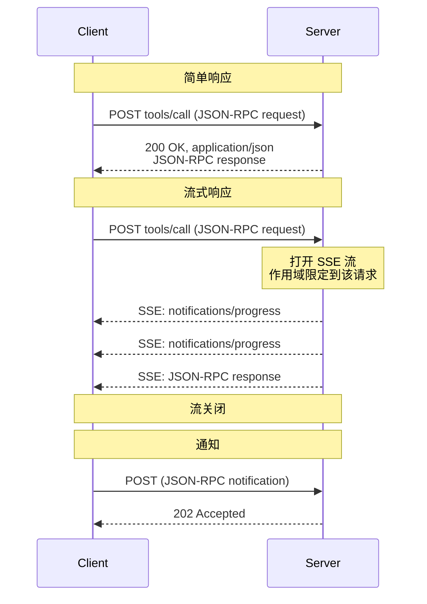
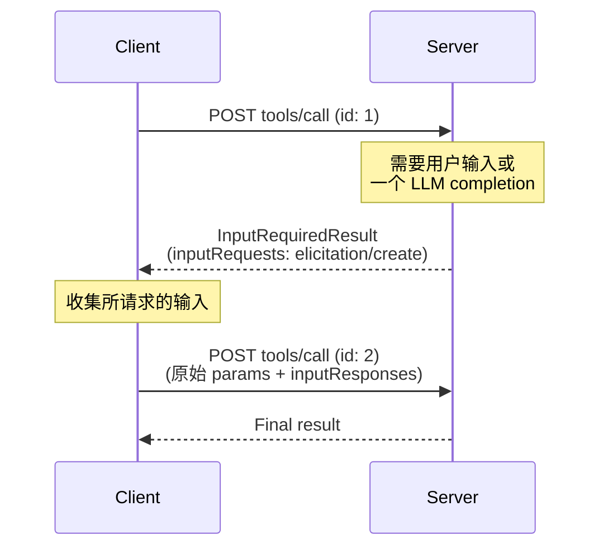
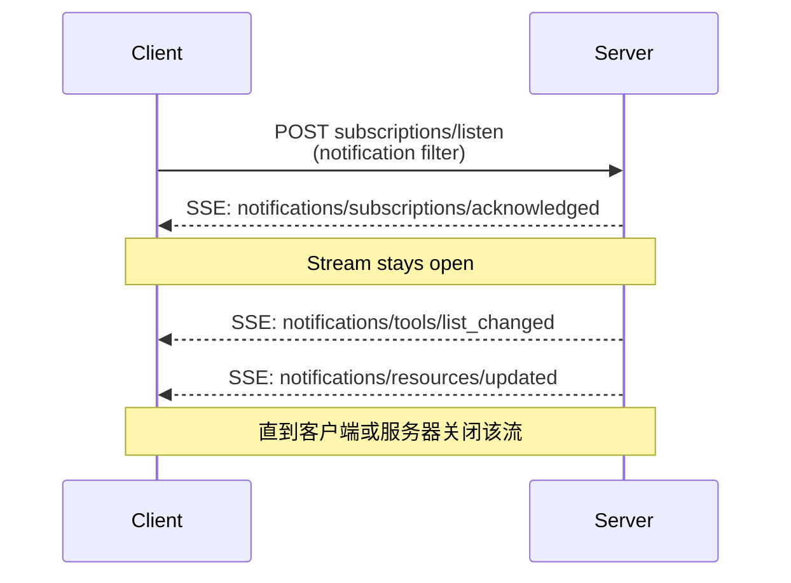

<div id="enable-section-numbers" />

<Info>

Streamable HTTP 于协议版本 2025-03-26 引入，用作协议版本 2024-11-05 中 [HTTP+SSE 传输][http-sse] 的替代方案。

</Info>

<Info>

2026-07-28 修订更改了 Streamable HTTP 的行为。客户端必须确保正确处理向后兼容性。变更包括：

- 移除了 GET 流端点。
- 移除了协议级会话。

请参见下面的 [变更日志](/specification/draft/changelog) 和
[向后兼容性](#backward-compatibility)。

</Info>

在 **Streamable HTTP** 传输中，服务器作为一个独立进程运行，能够处理多个客户端连接。简而言之：

- 服务器暴露一个单一的 HTTP 端点（**MCP endpoint**），接受 POST。
- 客户端将每个 JSON-RPC 请求或通知作为各自独立的 HTTP POST 发送。
- 服务器对每个请求返回单个 JSON 对象，或者返回一个作用域限定到该请求的 [Server-Sent Events][sse]（SSE）流，该流携带与请求相关的通知，随后是最终响应。
- 服务器到客户端的交互（sampling、elicitation、roots）作为输入请求嵌入到结果中，遵循 [Multi Round-Trip Requests (MRTR)][mrtr]（[SEP-2322][sep-2322]）。
- 长生命周期的变更通知（例如列表变更和资源更新）通过 [`subscriptions/listen`][subscriptions-listen] 请求的响应流传递。

有关这些交互的时序图，请参见 [消息流](#message-flow)。

服务器 **MUST** 提供一个支持 POST 的单一 HTTP 端点路径（以下称为
**MCP endpoint**）。例如，这可以是一个类似
`https://example.com/mcp` 的 URL。

[http-sse]: /specification/2024-11-05/basic/transports#http-with-sse
[sse]: https://en.wikipedia.org/wiki/Server-sent_events

## 安全性与端点

在实现 Streamable HTTP 传输时：

1. 服务器 **MUST** 验证所有传入连接上的 `Origin` 标头，以防止 DNS rebinding 攻击。
   - 如果存在 `Origin` 标头且无效，服务器 **MUST** 返回 HTTP 403 Forbidden。HTTP 响应体 **MAY** 包含一个没有 `id` 的 JSON-RPC _错误响应_。
2. 在本地运行时，服务器 **SHOULD** 只绑定到 localhost（127.0.0.1），而不是所有网络接口（0.0.0.0）。
3. 服务器 **SHOULD** 对所有连接实施适当的身份验证。

如果没有这些保护，攻击者可能利用 DNS rebinding 从远程网站与本地 MCP 服务器交互。

## 发送消息

客户端发送的每条 JSON-RPC 消息 **MUST** 都是到 MCP endpoint 的一个新的
HTTP POST 请求。

1. 客户端 **MUST** 使用 HTTP POST 发送 JSON-RPC 消息。
2. 客户端 **MUST** 包含一个 `Accept` 标头，列出 `application/json` 和 `text/event-stream` 作为受支持的内容类型。
3. 客户端 **MUST** 在每个 POST 请求中包含 [请求元数据标头](#request-metadata)。
4. HTTP POST 的主体 **MUST** 是单个 JSON-RPC _request_ 或 _notification_。客户端 **MUST NOT** 发送 JSON-RPC _responses_。
5. 如果主体是 JSON-RPC _notification_：
   - 如果服务器接受它，服务器 **MUST** 返回 HTTP 状态码 `202 Accepted`，且没有响应体。
   - 如果服务器无法接受它，它 **MUST** 返回一个 HTTP 错误状态码（例如 `400 Bad Request`）。HTTP 响应体 **MAY** 包含一个没有 `id` 的 JSON-RPC _错误响应_。
6. 如果主体是 JSON-RPC _request_，服务器 **MUST** 返回 `Content-Type: application/json`（单个 JSON 对象）或 `Content-Type: text/event-stream`（SSE 响应流）之一。客户端 **MUST** 同时支持两者。

## 接收消息

当服务器返回 SSE 响应流
（`Content-Type: text/event-stream`）时：

- 服务器 **MAY** 发送 JSON-RPC _notifications_——例如
  [`notifications/progress`][notifications-progress]
  或 [`notifications/message`][notifications-message] —
  在最终响应之前发送。这些通知 **MUST** 与发起该通知的客户端请求相关联。
- 服务器 **MUST NOT** 在此流上发送独立的 JSON-RPC _requests_。
  服务器到客户端的交互（sampling、elicitation、list-roots）作为输入请求嵌入到
  [`InputRequiredResult`][input-required-result] 中，遵循
  [MRTR][mrtr]（[SEP-2322][sep-2322]），而不是作为单独的请求在此流或任何其他流上发送。这是对协议版本 `2025-03-26` 至 `2025-11-25` 中 Streamable HTTP 的一项更改；在这些版本中，服务器可以在 SSE 流上发送此类请求。
- 最终的 JSON-RPC _response_ **SHOULD** 终止该流。

长生命周期的通知流可通过发送
[`subscriptions/listen`][subscriptions-listen]
request。服务器的响应本身是一个保持打开的 SSE 流，并
投递客户端选择订阅的变更通知（例如
`notifications/tools/list_changed` 或 `notifications/resources/updated`）。
诸如 `notifications/progress` 和
`notifications/message` 之类按请求作用域的通知 **不会** 在 listen 流上投递——它们
只会在其所关联请求的响应流中传输。

在启动 SSE 流时，服务器 **SHOULD** 在 HTTP 响应中包含
`X-Accel-Buffering: no` 头。这会指示反向代理（例如 nginx）禁用响应缓冲，确保 SSE 事件能够立即传递给客户端，而不是被保留在缓冲区中。没有该头时，代理可能会在发送给客户端之前累积消息，从而引入不必要的延迟，并可能破坏 SSE 通信的实时特性。

不支持通过 `Last-Event-ID` 进行可恢复的 SSE 流。

[notifications-progress]: /specification/draft/basic/patterns/progress
[notifications-message]: /specification/draft/server/utilities/logging
[input-required-result]: /specification/draft/schema#inputrequiredresult
[mrtr]: /specification/draft/basic/patterns/mrtr
[sep-2322]: /seps/2322-MRTR
[subscriptions-listen]: /specification/draft/basic/patterns/subscriptions

## 消息流

以下图示展示了单个 MCP endpoint 上的消息流。

**请求与响应。** 每个请求都是一个独立的 POST；服务器会针对每个请求自行决定返回单个 JSON 对象还是 SSE 流：



**服务器到客户端交互（MRTR）。** 当服务器需要来自客户端的输入——sampling、elicitation 或 roots——它不会发送自己的 JSON-RPC 请求。它会返回一个包含 `inputRequests` 的 [`InputRequiredResult`][input-required-result]，而客户端会携带匹配的 `inputResponses` 重试原始请求（参见 [Multi Round-Trip Requests][mrtr]）：



**变更通知。** 希望接收服务器发起的变更通知的客户端会使用
[`subscriptions/listen`][subscriptions-listen] 打开一个长生命周期流；响应流保持
打开状态，并且只携带客户端选择接收的通知类型：



## 取消

关闭 SSE 响应流 **MUST** 被服务器视为该请求的取消。由于
每个请求都有自己的响应流，因此传输级断开是明确无歧义的。服务器 **SHOULD**
尽快停止已取消请求的工作，并且 **MUST NOT** 为其发送任何后续消息。完整规则请参见
[Cancellation][cancellation]。

[cancellation]: /specification/draft/basic/patterns/cancellation

## 请求元数据

Streamable HTTP 传输会将选定的 JSON-RPC 正文字段镜像到 HTTP
头中，以便中介层（负载均衡器、网关、可观测性
工具）无需解析正文即可路由和检查请求。

### 协议版本头

发送到 MCP endpoint 的每个 POST 请求 **MUST** 包含一个
`MCP-Protocol-Version` 头。

例如：`MCP-Protocol-Version: 2026-07-28`

该头值 **MUST** 与请求正文的
`_meta` 中携带的 `io.modelcontextprotocol/protocolVersion` 字段匹配。
如果这些值不匹配，服务器 **MUST** 拒绝该请求，
返回 `400 Bad Request` 和一个 `HeaderMismatch` JSON-RPC 错误
（见 [Server Validation](#server-validation)）。

如果服务器未实现所请求的协议版本（无论该版本对服务器而言是未知版本，还是服务器已知但选择不支持的版本），它 **MUST** 返回 `400 Bad Request` 和一个
[`UnsupportedProtocolVersionError`][unsupported-version]，列出其支持的版本。请参见
[Versioning: Protocol Version Negotiation][lifecycle-version] 了解协商流程。

如果服务器未实现所请求的 RPC 方法，它 **MUST** 返回
`404 Not Found` 和一个错误码为 `-32601`
（`Method not found`）的 JSON-RPC 错误。该 JSON-RPC 错误体将此情形与由不托管现代 MCP endpoint 的旧版 [HTTP+SSE][http-sse] 服务器返回的 `404` 区分开来（见 [Backward Compatibility](#backward-compatibility)）。

支持早于 `2025-06-18` 的协议版本客户端（该版本未定义 `MCP-Protocol-Version` 头）的服务器 **MAY** 将缺少该头的请求视为协议版本 `2025-03-26`。不支持此类客户端的服务器 **MUST** 按照 [Server Validation](#server-validation) 拒绝缺少该头的请求。

[unsupported-version]: /specification/draft/schema#unsupportedprotocolversionerror
[lifecycle-version]: /specification/draft/basic/versioning#protocol-version-negotiation

### 标准请求头

| 头名称 | 来源字段 | 适用范围 |
| ------------ | ----------------------------- | ------------------------------------------------------ |
| `Mcp-Method` | `method` | 所有请求和通知 |
| `Mcp-Name`   | `params.name` or `params.uri` | `tools/call`、`resources/read`、`prompts/get` 请求 |

这些头对于符合规范是 **必需的**。

**`tools/call` 请求：**

```http
POST /mcp HTTP/1.1
Content-Type: application/json
MCP-Protocol-Version: 2026-07-28
Mcp-Method: tools/call
Mcp-Name: get_weather

{
  "jsonrpc": "2.0",
  "id": 1,
  "method": "tools/call",
  "params": {
    "name": "get_weather",
    "arguments": {
      "location": "Seattle, WA"
    },
    "_meta": {
      "io.modelcontextprotocol/protocolVersion": "2026-07-28",
      "io.modelcontextprotocol/clientInfo": {
        "name": "ExampleClient",
        "version": "1.0.0"
      },
      "io.modelcontextprotocol/clientCapabilities": {}
    }
  }
}
```

**`resources/read` 请求：**

```http
POST /mcp HTTP/1.1
Content-Type: application/json
MCP-Protocol-Version: 2026-07-28
Mcp-Method: resources/read
Mcp-Name: file:///projects/myapp/config.json

{
  "jsonrpc": "2.0",
  "id": 2,
  "method": "resources/read",
  "params": {
    "uri": "file:///projects/myapp/config.json",
    "_meta": {
      "io.modelcontextprotocol/protocolVersion": "2026-07-28",
      "io.modelcontextprotocol/clientInfo": {
        "name": "ExampleClient",
        "version": "1.0.0"
      },
      "io.modelcontextprotocol/clientCapabilities": {}
    }
  }
}
```

### 来自工具参数的自定义头

MCP 服务器 **MAY** 使用参数的 schema 中的 `inputSchema` 内的
`x-mcp-header` 扩展属性，将特定工具参数映射到
HTTP 头中。详见
[Tool Definitions][tool-definitions]
，了解如何为工具参数添加注解。

虽然服务器使用 `x-mcp-header` 是可选的，但客户端 **MUST**
支持此功能。当服务器的工具定义包含
`x-mcp-header` 注解时，符合规范的客户端 **MUST** 将指定的参数值映射到 HTTP 头中。

[tool-definitions]: /specification/draft/server/tools#x-mcp-header

#### Schema 扩展

`x-mcp-header` 属性指定用于构造
头名称 `Mcp-Param-{name}` 的名称部分。

**`x-mcp-header` 值的约束**：

- **MUST NOT** 为空
- **MUST** 符合 HTTP field-name token 语法（`1*tchar`，[RFC 9110 Section 5.1](https://datatracker.ietf.org/doc/html/rfc9110#section-5.1)）
- **MUST NOT** 包含控制字符，包括回车符（CR，`\r`）
  或换行符（LF，`\n`）
- 在 `inputSchema` 中所有 `x-mcp-header` 值之间，**MUST** 进行不区分大小写的唯一性保证
- **MUST** 仅应用于原始类型（integer、string、boolean）的参数。不允许类型为 `number` 的参数。整数值 **MUST** 位于 JavaScript 的安全范围内
  （−2<sup>53</sup>+1 到 2<sup>53</sup>−1）
- **MAY** 应用于 `inputSchema` 中任意嵌套层级的属性，而不仅限于顶层属性

使用 Streamable HTTP 传输的客户端 **MUST** 拒绝任何 `x-mcp-header` 值违反这些约束的工具定义。拒绝意味着客户端 **MUST** 将该无效工具从 `tools/list` 的结果中排除。客户端 **SHOULD** 在拒绝工具定义时记录警告，包括工具名称和被拒绝的原因。这样可以确保单个格式错误的工具定义不会阻止其他有效工具的使用。使用其他传输方式（例如 stdio）的客户端 **MAY** 完全忽略 `x-mcp-header` 注解。

**工具定义示例：**

```json
{
  "name": "execute_sql",
  "description": "在 Google Cloud Spanner 上执行 SQL",
  "inputSchema": {
    "type": "object",
    "properties": {
      "region": {
        "type": "string",
        "description": "执行查询的区域",
        "x-mcp-header": "Region"
      },
      "query": {
        "type": "string",
        "description": "要执行的 SQL 查询"
      }
    },
    "required": ["region", "query"]
  }
}
```

**生成的 HTTP 请求：**

```http
POST /mcp HTTP/1.1
Content-Type: application/json
MCP-Protocol-Version: 2026-07-28
Mcp-Method: tools/call
Mcp-Name: execute_sql
Mcp-Param-Region: us-west1

{
  "jsonrpc": "2.0",
  "id": 1,
  "method": "tools/call",
  "params": {
    "_meta": {
      "io.modelcontextprotocol/protocolVersion": "2026-07-28",
      "io.modelcontextprotocol/clientInfo": {
        "name": "ExampleClient",
        "version": "1.0.0"
      },
      "io.modelcontextprotocol/clientCapabilities": {}
    },
    "name": "execute_sql",
    "arguments": {
      "region": "us-west1",
      "query": "SELECT * FROM users"
    }
  }
}
```

#### 值编码

客户端 **MUST** 在将参数值包含到 HTTP
头之前对其进行编码，以确保安全传输并防止注入攻击。

**类型转换**：将参数值转换为其字符串表示形式：

- `string`: 原样使用该值
- `integer`: 转换为十进制字符串表示形式（例如 `42`、`-7`）
- `boolean`: 转换为小写 `"true"` 或 `"false"`

根据 [RFC 9110][rfc9110-values]，
HTTP 头字段值必须由可见 ASCII 字符
（0x21-0x7E）、空格（0x20）以及水平制表符（0x09）组成。当某个值无法
安全地表示为普通 ASCII 头值时（例如，它包含
非 ASCII 字符、控制字符，或具有前导/尾随
空白），客户端 **MUST** 使用其 UTF-8
表示的 Base64 编码，格式如下：

```text
Mcp-Param-{Name}: =?base64?{Base64EncodedValue}?=
```

前缀 `=?base64?` 和后缀 `?=` 表示该值已进行 Base64 编码。这些标记区分大小写，并且 **MUST** 完全按所示形式出现（小写）。需要检查这些值的服务器和中介层 **MUST** 相应地对其解码。

为避免歧义，客户端 **MUST** 还要对任何匹配哨兵模式的纯 ASCII 值进行 Base64 编码（即，以 `=?base64?` 开头并以 `?=` 结尾）。

**编码示例：**

| 原始值                  | 原因                     | 编码后的头值                                            |
| ---------------------- | ------------------------ | ----------------------------------------------------- |
| `"us-west1"`           | 纯 ASCII               | `Mcp-Param-Region: us-west1`                          |
| `"Hello, 世界"`        | 包含非 ASCII            | `Mcp-Param-Greeting: =?base64?SGVsbG8sIOS4lueVjA==?=` |
| `" padded "`           | 前导/尾随空格           | `Mcp-Param-Text: =?base64?IHBhZGRlZCA=?=`             |
| `"line1\nline2"`       | 包含换行符               | `Mcp-Param-Text: =?base64?bGluZTEKbGluZTI=?=`         |
| `"=?base64?literal?="` | 匹配哨兵模式             | `Mcp-Param-Val: =?base64?PT9iYXNlNjQ/bGl0ZXJhbD89?=`  |

[rfc9110-values]: https://datatracker.ietf.org/doc/html/rfc9110#name-field-values

#### 客户端行为

当通过 HTTP 传输构造 `tools/call` 请求时，客户端
**MUST**：

1. 从请求正文中提取任何标准头的值（例如，
   `method`、`params.name`、`params.uri`）。
2. 将 `Mcp-Method` 头以及（如适用）`Mcp-Name` 头附加到
   请求中。
3. 检查工具的 `inputSchema` 中标记了
   `x-mcp-header` 的属性，并提取每个参数的值。
4. 按照 [值编码](#value-encoding)
   规则对这些值进行编码。
5. 将 `Mcp-Param-{Name}: {Value}` 头附加到请求中。

<Note>

如果客户端没有该工具的 `inputSchema`（例如尚未调用 `tools/list`），或者缓存的 schema 已过期（例如其 TTL 已过期），客户端 **SHOULD** 在不带自定义 `Mcp-Param-*` 头的情况下发送请求。如果服务器因为缺少必需的自定义头而拒绝该请求，客户端 **SHOULD** 调用 `tools/list` 获取当前的 `inputSchema`，然后使用适当的头重试原始请求。客户端 **MAY** 通过其他方式预加载工具定义（例如来自先前会话或配置），以便在未先调用 `tools/list` 的情况下也能发送这些头。

</Note>

#### 服务器对自定义头的行为

不识别 `Mcp-Param-{Name}` 头的中介服务器
**MUST** 转发它，并在其他方面忽略它，正如
[HTTP Semantics RFC][http-semantics] 所要求的那样。

服务器 **MUST** 拒绝包含无效字符的、被识别的 `Mcp-Param-{Name}` 头
（见 [值编码](#value-encoding)）。

任何处理消息正文的服务器 **MUST** 验证已编码的
头值（若为 Base64 编码，则在解码后）是否与请求正文中的相应
值匹配。若任何验证失败，服务器 **MUST** 以
`400 Bad Request` HTTP 状态和 JSON-RPC 错误码
`-32001`（`HeaderMismatch`）拒绝请求。

| 场景                                 | 客户端行为                | 服务器行为                          |
| ---------------------------------------- | ------------------------------ | ---------------------------------------- |
| 提供了参数值                 | 客户端必须包含该头 | 服务器必须验证头与正文匹配 |
| 参数值为 `null`                | 客户端必须省略该头 | 服务器不得期望该头 |
| 参数未出现在参数中               | 客户端必须省略该头 | 服务器不得期望该头 |
| 客户端省略头但正文中有值 | 不符合规范的客户端          | 服务器必须拒绝该请求           |

[http-semantics]: https://www.rfc-editor.org/rfc/rfc9110.html#name-field-names

### 大小写敏感性

头名称（在
[RFC 9110][rfc9110-names] 中称为“字段名”）
是不区分大小写的。客户端和服务器 **MUST** 对头名称使用不区分大小写的
比较。头_值_（例如方法名）是
区分大小写的。

[rfc9110-names]: https://datatracker.ietf.org/doc/html/rfc9110#name-field-names

### 服务器验证

处理请求正文的服务器 **MUST** 拒绝那些其
头中指定的值与请求正文中的相应值不匹配的请求。这可防止在
网络中不同组件依赖不同事实来源时出现潜在安全漏洞
（例如，负载均衡器根据头值进行路由，而 MCP 服务器
根据正文值执行）。

<Note>

在验证整数参数值时，服务器 **SHOULD** 以数值方式而不是字符串方式比较头值和正文值（例如，
`42.0` 和 `42` 被视为相等）。

</Note>

当由于头验证失败而拒绝请求时，服务器 **MUST**
返回 HTTP 状态 `400 Bad Request`，并且 **MUST** 使用以下错误码
包含一个 JSON-RPC 错误响应：

| Code     | Name             | Description                                                                                                            |
| ---------------- | ---------------- | ---------------------------------------------------------------------------------------------------------------------- |
| `-32001` | `HeaderMismatch` | HTTP 头与请求正文中的相应值不匹配，或者必需的头缺失/格式错误。 |

此错误码位于 JSON-RPC 实现定义的服务器错误范围
（`-32000` 到 `-32099`）内。

**错误响应示例：**

```json
{
  "jsonrpc": "2.0",
  "id": 1,
  "error": {
    "code": -32001,
    "message": "Header mismatch: Mcp-Name header value 'foo' does not match body value 'bar'"
  }
}
```

验证失败的条件包括：

- 缺少必需的标准头（`MCP-Protocol-Version`、`Mcp-Method`、
  `Mcp-Name`）。
- 头值与对应的请求正文值不匹配。
- 头值包含无效字符。

<Note>

中介层 **MUST** 在验证失败时返回适当的 HTTP 错误状态（例如，
`400 Bad Request`），但不要求返回
JSON-RPC 错误响应。

</Note>

<Note>

实施基于镜像头的策略的中介层（例如按租户路由
或限流）**SHOULD** 验证 `MCP-Protocol-Version`
头所指示的版本是否需要进行头-正文验证。如果该
版本较旧或缺少该头，中介层 **SHOULD** 拒绝
该请求，而不是信任未经验证的头值。

</Note>

## Backward Compatibility

Support for modern MCP versions (as indicated by request metadata) and older versions that require an `initialize` handshake **MAY** be detected by clients by first attempting a modern request to see which era the server implements. On `400 Bad Request`, clients **SHOULD** inspect the response body before falling back: modern servers also use `400` for [`UnsupportedProtocolVersionError`][unsupported-version], `MissingRequiredClientCapabilityError`, and header validation failures.

- If the body contains a recognizable modern JSON-RPC error, the server supports a modern MCP version — retry using the advertised `supported` version or fix the request, rather than falling back.
- If the body is empty or not a recognizable modern JSON-RPC error, fall back to `initialize` and continue using the older version for subsequent requests.

See [Versioning: Backward Compatibility][lifecycle-compat] for the era model and implementation-oriented compatibility matrix.

### Earlier Streamable HTTP Revisions

Protocol versions `2025-03-26` through [`2025-11-25`](/specification/2025-11-25/basic/transports) also used the Streamable HTTP transport, but in a different form: servers could assign sessions via an `Mcp-Session-Id` header (terminated via HTTP DELETE), clients could open a separate SSE stream with HTTP GET to receive server-initiated messages, servers could send JSON-RPC _requests_ on the SSE stream, and the stream could be resumed via `Last-Event-ID`. None of these mechanisms are part of this revision.

Servers that only support this revision and receive such traffic from older clients **SHOULD** respond as follows:

- HTTP GET or DELETE to the MCP endpoint: respond with `405 Method Not Allowed`.
- `Mcp-Session-Id` header in the request: ignore it; do not generate or echo session IDs.
- `Last-Event-ID` header: ignore it; the stream is not resumable.

Servers and clients that need to interoperate with peers using these protocol versions should also implement the behavior described in the corresponding revision, in addition to the version-negotiation fallback described above (for example, [2025-11-25: Streamable HTTP](/specification/2025-11-25/basic/transports#streamable-http)).

### HTTP+SSE Transport (2024-11-05)

<Warning>
  **Deprecated**: The [HTTP+SSE transport][http-sse] from protocol version
  2024-11-05 has been deprecated since protocol version `2025-03-26` and is
  classified as deprecated under the [Feature Lifecycle Policy](/community/feature-lifecycle#deprecating-a-feature)
  ([SEP-2596](https://github.com/modelcontextprotocol/modelcontextprotocol/pull/2596)).
  New implementations **SHOULD NOT** adopt it; existing implementations **SHOULD**
  migrate to [Streamable HTTP](/specification/draft/basic/transports/streamable-http). It is expected
  to be removed in a future revision; see the
  [Deprecated Features Registry](/specification/draft/deprecated).
</Warning>

Clients and servers can maintain backward compatibility with the deprecated
[HTTP+SSE transport][http-sse] (from protocol version 2024-11-05) as follows:

**Servers wanting to support older clients** should:

- Continue to host both the old transport's SSE and POST endpoints,
  as well as the new “MCP endpoint” defined for Streamable HTTP transport.
  - It is also possible to merge the old POST endpoint with the new MCP
    endpoint, but this may introduce unnecessary complexity.

**Clients wanting to support older servers** should:

1. Accept an MCP server URL from the user, which may point to a server using either the old or new transport.
2. Attempt a POST request to that server URL, using the `Accept` header as defined above:
   - If successful, the client can assume this is a server that supports
     the new Streamable HTTP transport.
   - If it fails with HTTP status code `400 Bad Request`, `404 Not Found`
     or `405 Method Not Allowed`, and the response body is not a
     recognizable modern JSON-RPC error (such errors are returned by modern servers for unsupported versions, unknown methods, or header validation failures):
     - Issue a GET request to the server URL, expecting this to open
       an SSE stream and return an `endpoint` event as the first event.
     - When the `endpoint` event is received, the client can assume this is
       a server running the old HTTP+SSE transport and should use that
       transport for all subsequent communication.

[lifecycle-compat]: /specification/draft/basic/versioning#backward-compatibility-with-initialization-based-versions
