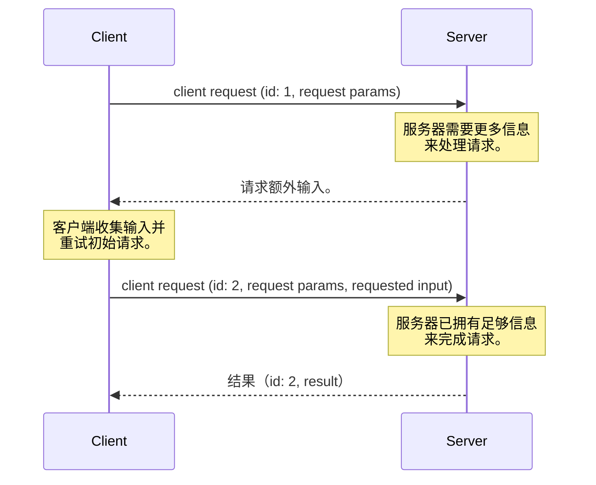
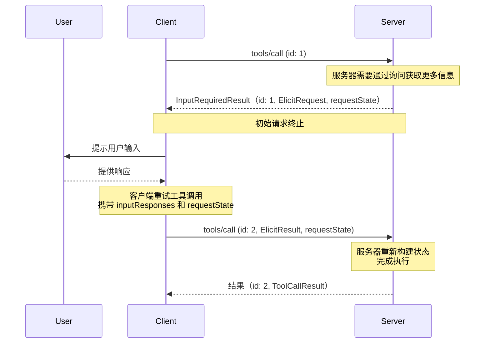

<div id="enable-section-numbers" />

<Note>
  多轮往返请求（MRTR）是在本版本的 MCP 规范中引入的。这取代了之前发送由服务器发起请求的方法。服务器 **MUST** 使用 MRTR 模式发送服务器到客户端的请求（例如 `roots/list`、`sampling/createMessage` 或 `elicitation/create`）。之前的服务器发起请求模式不再受支持。这是一个破坏性变更。
</Note>

## 多轮往返请求

模型上下文协议（MCP）定义了服务器在处理客户端请求期间向用户请求额外信息的几种方式（例如 `roots/list`、`sampling/createMessage` 或 `elicitation/create`）。**多轮往返请求**模式提供了一种标准化方式来处理这些服务器请求，而无需在服务器实例之间共享存储层，也无需有状态负载均衡。

高层流程如下：

1. 客户端向服务器发送包含执行操作所需参数的初始请求。
1. 服务器确定需要额外信息来完成请求，并响应请求更多信息。
1. 客户端从用户或其他来源收集所请求的信息，然后重试原始请求，并包含额外请求的信息。
1. 服务器确定其已拥有足够信息来完成操作，并返回最终结果。



### 核心类型

在 MCP 中，此流程使用以下类型实现。

#### InputRequests

[`InputRequests`](/specification/draft/schema#inputrequests) 对象是服务器到客户端请求的映射。键是服务器分配的字符串标识符；值是请求对象（例如 [`ElicitRequest`](/specification/draft/schema#elicitrequest)、[`CreateMessageRequest`](/specification/draft/schema#createmessagerequest) 或 [`ListRootsRequest`](/specification/draft/schema#listrootsrequest)）。

```json
{
  "github_login": {
    "method": "elicitation/create",
    "params": {
      "mode": "form",
      "message": "请提供您的 GitHub 用户名",
      "requestedSchema": {
        "type": "object",
        "properties": {
          "name": { "type": "string" }
        },
        "required": ["name"]
      }
    }
  },
  "capital_of_france": {
    "method": "sampling/createMessage",
    "params": {
      "messages": [
        {
          "role": "user",
          "content": {
            "type": "text",
            "text": "法国的首都是什么？"
          }
        }
      ],
      "systemPrompt": "你是一个乐于助人的助手。",
      "maxTokens": 100
    }
  }
}
```

#### InputResponses

[`InputResponses`](/specification/draft/schema#inputresponses) 对象是客户端对服务器请求的响应映射。键对应于 `InputRequests` 映射中的键；值是客户端对每个请求的结果（例如 [`ElicitResult`](/specification/draft/schema#elicitresult)、[`CreateMessageResult`](/specification/draft/schema#createmessageresult) 或 [`ListRootsResult`](/specification/draft/schema#listrootsresult)）。

```json
{
  "github_login": {
    "action": "accept",
    "content": {
      "name": "octocat"
    }
  },
  "capital_of_france": {
    "role": "assistant",
    "content": {
      "type": "text",
      "text": "法国的首都是巴黎。"
    },
    "model": "claude-3-sonnet-20240307",
    "stopReason": "endTurn"
  }
}
```

#### InputRequiredResult

[`InputRequiredResult`](/specification/draft/schema#InputRequiredResult) 是 [`Result`](https://modelcontextprotocol.io/specification/2025-11-25/basic#responses) 的一种类型，表示在完成请求之前需要额外输入。

- `inputRequests` _(可选)_: 一个 [`InputRequests`](/specification/draft/schema#inputrequests) 映射，包含客户端必须完成的服务器发起请求。
- `requestState` _(可选)_: 仅对服务器有意义的不透明字符串。客户端 **MUST NOT** 检查、解析、修改或对其内容作出任何假设。

```json
{
  "jsonrpc": "2.0",
  "id": 1,
  "result": {
    "resultType": "input_required",
    "inputRequests": {
      // 询问请求。
      "github_login": {
        "method": "elicitation/create",
        "params": {
          "mode": "form",
          "message": "请提供您的 GitHub 用户名",
          "requestedSchema": {
            "type": "object",
            "properties": {
              "name": { "type": "string" }
            },
            "required": ["name"]
          }
        }
      },
      // 采样请求。
      "capital_of_france": {
        "method": "sampling/createMessage",
        "params": {
          "messages": [
            {
              "role": "user",
              "content": {
                "type": "text",
                "text": "法国的首都是什么？"
              }
            }
          ],
          "modelPreferences": {
            "hints": [{ "name": "claude-3-sonnet" }],
            "intelligencePriority": 0.8,
            "speedPriority": 0.5
          },
          "systemPrompt": "你是一个乐于助人的助手。",
          "maxTokens": 100
        }
      }
    },
    "requestState": "AEAD-protected blob"
  }
}
```

### 支持的请求

服务器 **MAY** 在以下客户端请求上发送 `InputRequiredResult` 响应：

| Client Request                                                              | Supports InputRequiredResult |
| --------------------------------------------------------------------------- | ---------------------------- |
| [`prompts/get`](/specification/draft/server/prompts#getting-a-prompt)       | Yes                          |
| [`resources/read`](/specification/draft/server/resources#reading-resources) | Yes                          |
| [`tools/call`](/specification/draft/server/tools#calling-tools)             | Yes                          |

服务器 **MUST NOT** 在任何其他客户端请求上发送 `InputRequiredResult` 响应。

### 基本工作流

基本工作流描述了服务器如何作为客户端-服务器请求的一部分向客户端请求额外输入。
在此示例中，我们使用 `tools/call` 作为客户端请求，但相同模式适用于上面列出的任何受支持请求。

值得注意的是，它允许服务器在不维护任何服务器端状态的情况下请求额外信息。
服务器将所需的任何上下文编码到 `requestState` 字段中，客户端在重试时会将其回显回来。



注意，每一步中的请求都是完全独立的：处理重试的服务器不需要除重试请求中直接包含的信息之外的任何信息。

#### 服务器要求（基本工作流）

1. 服务器 **MAY** 对任何[受支持的客户端请求](#supported-requests)响应 `InputRequiredResult`。
1. `InputRequiredResult` **MAY** 包含 `inputRequests` 字段。
   - `inputRequests` 的键是服务器分配的标识符，并且在该请求范围内 **MUST** 唯一。
   - `inputRequests` 的值是请求对象，并且 **MUST** 为 [`ElicitRequest`](/specification/draft/schema#elicitrequest)、[`CreateMessageRequest`](/specification/draft/schema#createmessagerequest) 或 [`ListRootsRequest`](/specification/draft/schema#listrootsrequest) 之一

1. `InputRequiredResult` **MAY** 包含 `requestState` 字段。如果指定，此字段是仅对服务器有意义的不透明字符串。服务器可以自由地以任何格式编码该状态（例如 base64 编码的 JSON、加密 JWT、序列化二进制数据）。
1. 如果客户端请求包含 `requestState` 字段，服务器 **MUST** 将 `requestState` 视为攻击者可控输入。如果 `requestState` 会影响授权、资源访问或业务逻辑，服务器 **MUST** 保护其完整性（例如使用 HMAC 或 AEAD）
   并且 **MUST** 拒绝验证失败的状态。只有在篡改造成的后果不比请求失败更严重时，才 **MAY** 省略完整性保护。
1. 为防止重放，服务器 **SHOULD** 在受完整性保护的 `requestState` 载荷中包含以下内容，并在接收时逐一验证：
   - 已认证主体，拒绝由不同主体 प्रस्तुत的状态。
   - 一个较短的过期时间（TTL），拒绝在其过期后呈现的状态；
   - 原始请求的标识符，例如方法名以及其关键参数的摘要，拒绝在不匹配的请求上呈现的状态。
     <Warning>
       请注意，这些措施限制了重放窗口并防止跨用户
       和跨请求复用，但本身并不能保证单次使用。
       对于某个 `requestState` 必须最多只被消费一次的服务器
       （例如，一次性兑换），**MUST** 在服务器端强制执行该不变式。
     </Warning>

1. 服务器在每个 `InputRequiredResult` 响应中 **MUST** 至少包含 `inputRequests` 或 `requestState` 之一。
1. 服务器 **MUST NOT** 发送客户端未在其能力中声明支持的 `inputRequests`。例如，如果客户端未声明对 `elicitation` 的支持，服务器 **MUST NOT** 在 `inputRequests` 字段中包含任何 `elicitation/create` 请求。
1. 服务器 **MUST NOT** 假定客户端会完成 `inputRequests` 或重试原始请求。如果服务器希望反复提示用户输入信息，直到获得完成请求所需的信息，服务器 **MAY** 在同一请求的多次尝试中返回 `InputRequiredResult`。

#### 客户端要求（基本工作流）

1. 如果客户端接收到包含 `inputRequests` 字段的 `InputRequiredResult`，客户端在重试原始请求之前 **MUST** 构造所请求的输入。如果 `InputRequiredResult` 不包含 `inputRequests` 字段，客户端 **MAY** 立即重试原始请求。
1. 如果 `InputRequiredResult` 包含 `requestState` 字段，客户端在重试原始请求时 **MUST** 回显该字段的精确值。
   客户端 **MUST NOT** 检查、解析、修改或对 `requestState` 的内容作出任何假设。如果 `InputRequiredResult` 不包含 `requestState` 字段，客户端在重试中 **MUST NOT** 包含该字段。
1. JSON-RPC `id` 在初始请求和重试之间 **MUST** 不同，因为它们是独立的请求。
1. `inputRequests` 和 `requestState` 字段仅影响客户端对原始请求的重试。它们 **MUST NOT** 用于客户端可能并行发送的任何其他请求。

### Error Handling

服务器 **SHOULD** 验证客户端提供的数据是否为有效的 `InputResponses` 对象，以及其中的信息是否可以被正确解析。
协议错误（格式错误的 JSON、无效的 schema、内部服务器错误）**SHOULD** 返回带有适当错误码和消息的 JSON-RPC 错误响应。

如果在 `InputResponses` 对象中提供了额外的、意外的参数，服务器 **SHOULD** 忽略其不认识或不需要的任何信息。

如果客户端未能发送先前 `InputRequests` 中请求的全部信息，而缺失的信息对服务器处理请求是必要的，
服务器 **SHOULD** 重新返回一个请求缺失信息的 `InputRequiredResult`，而不是返回错误。

### 安全注意事项

由于 `requestState` 会经过客户端，恶意或被入侵的客户端可能尝试修改它以改变服务器行为、
绕过授权检查或破坏服务器逻辑。服务器 **MUST** 按照上面的[服务器要求](#server-requirements-ephemeral)验证请求状态。
