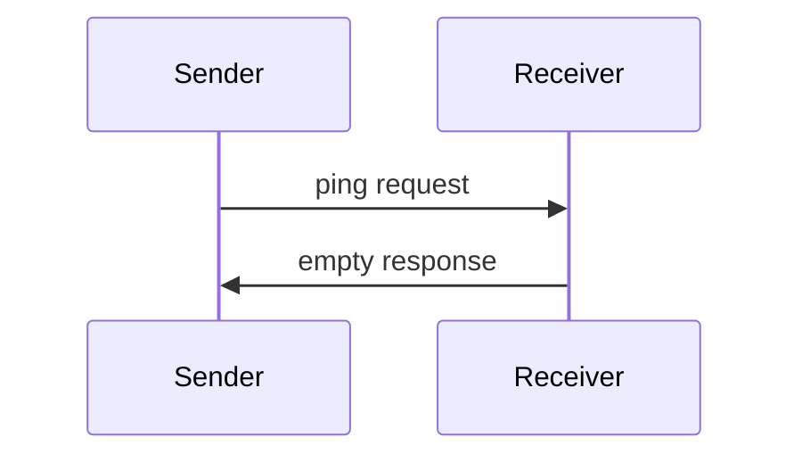

<div id="enable-section-numbers" />

Model Context Protocol 包含一个 ping 机制，任何一方都可以使用该机制来验证对方是否仍然响应以及连接是否存活。

## 概述

ping 功能通过简单的请求/响应模式实现。客户端或服务器均可通过发送 `ping` 请求来发起 ping。

<Warning>

`ping` 是 MCP 级别的存活检查，**可以**由任何一方在任何时候在已建立的会话/连接上发送。

在 Streamable HTTP 中，实现**应该**优先使用传输级别的 SSE 保活机制进行空闲连接维护；`ping` 仍然可用于协议级别的响应性检查。

`roots/list`、`sampling/createMessage` 和 `elicitation/create` 的请求关联要求不适用于 `ping`。

</Warning>

## 消息格式

ping 请求是一个没有参数的标准 JSON-RPC 请求：

```json
{
  "jsonrpc": "2.0",
  "id": "123",
  "method": "ping"
}
```

## 行为要求

1. 接收者**必须**迅速响应一个空响应：

```json
{
  "jsonrpc": "2.0",
  "id": "123",
  "result": {}
}
```

2. 如果在合理的超时期限内未收到响应，发送者**可以**：
   - 认为连接已失效
   - 终止连接
   - 尝试重连程序

## 使用模式



## 实现注意事项

- 实现**应该**定期发出 ping 以检测连接健康状态
- ping 的频率**应该**是可配置的
- 超时时间**应该**适合网络环境
- **应该**避免过度 ping 以减少网络开销

## 错误处理

- 超时**应该**被视为连接失败
- 多次 ping 失败**可以**触发连接重置
- 实现**应该**记录 ping 失败日志以便诊断
