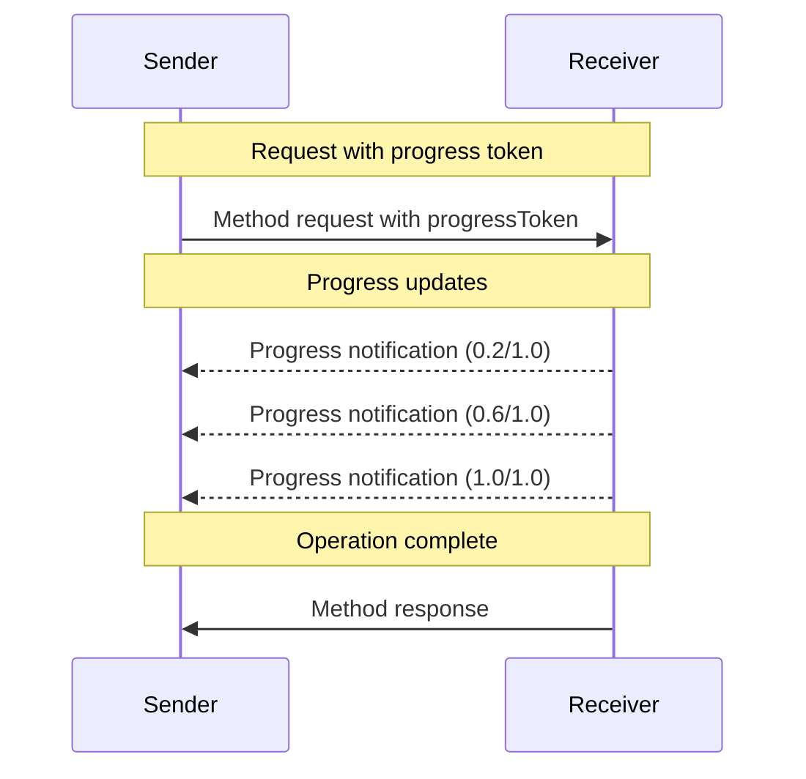

<div id="enable-section-numbers" />

模型上下文协议 (MCP) 通过通知消息支持对长时间运行的操作进行可选的进度跟踪。任何一方都可以发送进度通知以提供有关操作状态的更新。

## 进度流程

当一方想要_接收_请求的进度更新时，它会在请求元数据中包含一个 `progressToken`。

- 进度令牌 **必须** 为字符串或整数值
- 进度令牌可以由发送方通过任何方式选择，但在所有活动请求中 **必须** 是唯一的。

```json
{
  "jsonrpc": "2.0",
  "id": 1,
  "method": "some_method",
  "params": {
    "_meta": {
      "progressToken": "abc123"
    }
  }
}
```

接收方 **可以** 随后发送包含以下内容的进度通知：

- 原始进度令牌
- 当前的进度值
- 一个可选的 "total" 值
- 一个可选的 "message" 值

```json
{
  "jsonrpc": "2.0",
  "method": "notifications/progress",
  "params": {
    "progressToken": "abc123",
    "progress": 50,
    "total": 100,
    "message": "Reticulating splines..."
  }
}
```

- `progress` 值 **必须** 随每个通知增加，即使总数未知。
- `progress` 和 `total` 值 **可以** 为浮点数。
- `message` 字段 **应该** 提供相关的可读进度信息。

## 行为要求

1. 进度通知 **必须** 仅引用以下令牌：
   - 在活动请求中提供的
   - 与进行中的操作关联的

2. 进度请求的接收方 **可以**：
   - 选择不发送任何进度通知
   - 以其认为合适的任何频率发送通知
   - 如果未知则省略 total 值

3. 对于 [任务增强请求](./tasks)，原始请求中提供的 `progressToken` **必须** 在整个任务生命周期内继续用于进度通知，即使在 `CreateTaskResult` 返回之后。进度令牌保持有效并与任务关联，直到任务达到终端状态。
   - 任务的进度通知 **必须** 使用与初始任务增强请求中提供的相同的 `progressToken`
   - 任务的进度通知 **必须** 在任务达到终端状态（`completed`、`failed` 或 `cancelled`）后停止



## 实现说明

- 发送方和接收方 **应该** 跟踪活动进度令牌
- 双方 **应该** 实施速率限制以防止泛滥
- 进度通知 **必须** 在完成后停止
