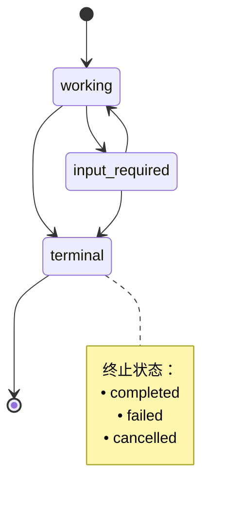
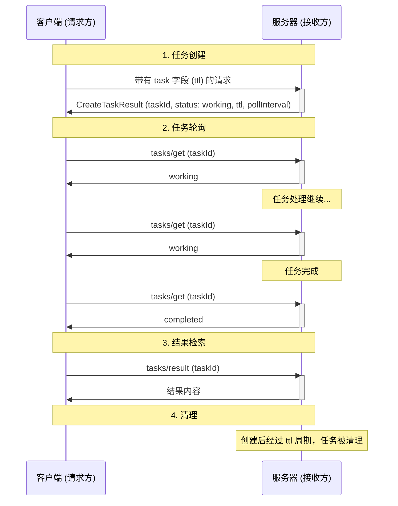
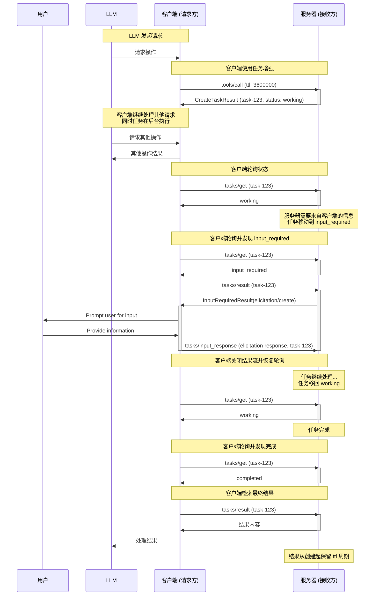
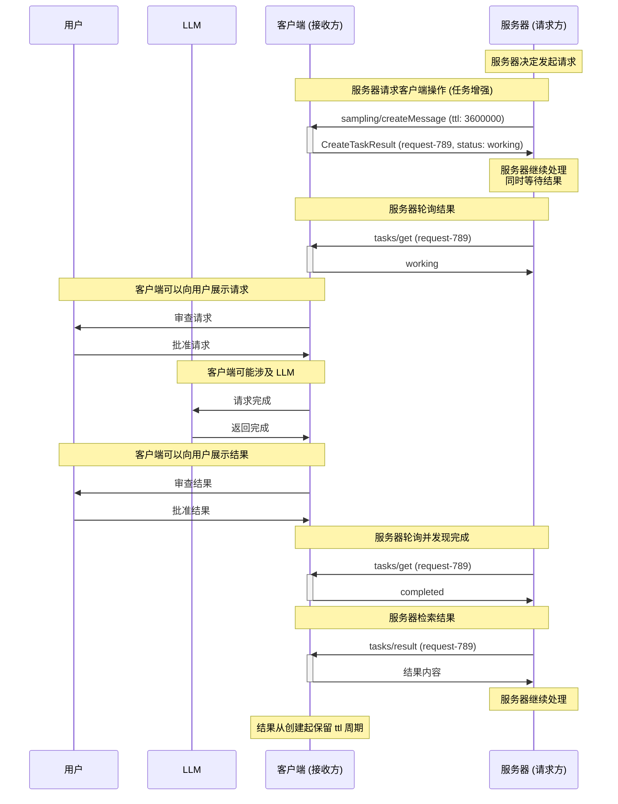
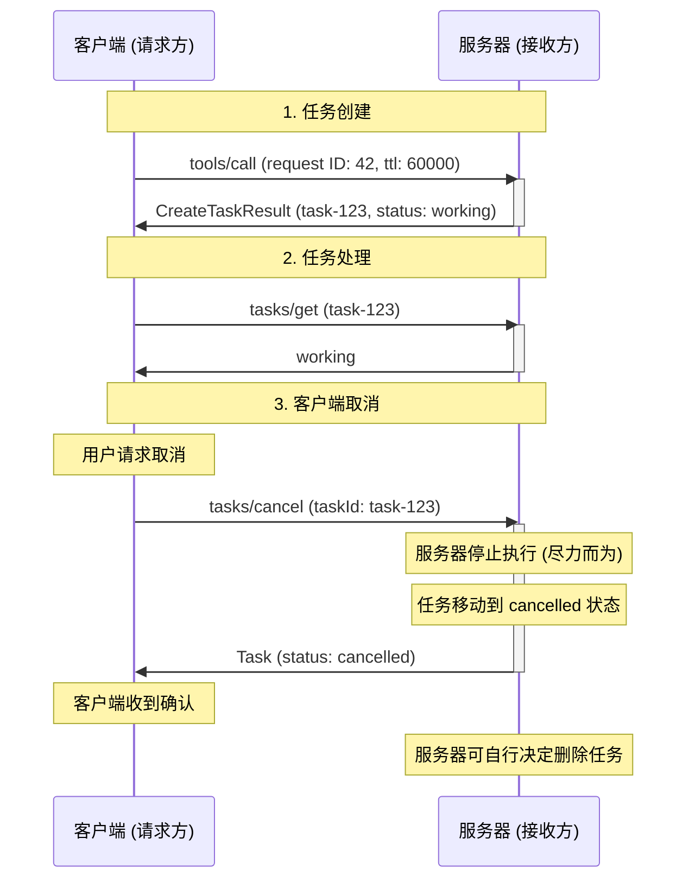

<div id="enable-section-numbers" />

<Note>

任务是在 2025-11-25 版本的 MCP 规范中引入的，目前被视为**实验性**功能。
任务的设计和行为可能会在未来的协议版本中演变。

</Note>

模型上下文协议 (MCP) 允许请求者——可以是客户端或服务器，取决于通信方向——通过**任务**来增强他们的请求。任务是持久的状态机，携带有关它们所封装请求的底层执行状态的信息，旨在用于请求者轮询和延迟结果检索。每个任务都可以通过接收者生成的**任务 ID** 进行唯一标识。

任务对于表示耗时计算和批处理请求非常有用，并且可以与外部作业 API 无缝集成。

## 定义

任务将各方表示为“请求者”或“接收者”，定义如下：

- **请求者：** 任务增强请求的发送者。这可以是客户端或服务器——任何一方都可以创建任务。
- **接收者：** 任务增强请求的接收者，以及执行任务的实体。这可以是客户端或服务器——任何一方都可以接收和执行任务。

## 用户交互模型

任务被设计为**由请求者驱动**——请求者负责用任务增强请求，并轮询这些任务的结果；与此同时，接收者严格控制哪些请求（如果有）支持基于任务的执行，并管理这些任务的生命周期。

这种请求者驱动的方法确保了确定性响应处理，并实现了复杂的模式，例如分发并发请求，只有请求者才有足够的上下文来编排这些请求。

实现可以自由暴露任务通过任何适合其需求的接口模式——协议本身不强制任何特定的用户交互模型。

## 能力

支持任务增强请求的服务器和客户端**必须**声明 `tasks` 能力。服务器在其 [`DiscoverResult`](/specification/draft/schema#discoverresult) 中包含它；客户端在每个请求的 `_meta.io.modelcontextprotocol/clientCapabilities` 中包含它。`tasks` 能力按请求类别进行结构化，布尔属性指示哪些特定请求类型支持任务增强。

### 服务器能力

服务器声明它们是否支持任务，如果支持，哪些服务器端请求可以用任务增强。

| 能力                          | 描述                                               |
| --------------------------- | ---------------------------------------------------- |
| `tasks.list`                | 服务器支持 `tasks/list` 操作           |
| `tasks.cancel`              | 服务器支持 `tasks/cancel` 操作         |
| `tasks.requests.tools.call` | 服务器支持任务增强的 `tools/call` 请求 |

```json
{
  "capabilities": {
    "tasks": {
      "list": {},
      "cancel": {},
      "requests": {
        "tools": {
          "call": {}
        }
      }
    }
  }
}
```

### 客户端能力

客户端声明它们是否支持任务，如果支持，哪些客户端请求可以用任务增强。

| 能力                                  | 描述                                                       |
| --------------------------------------- | ---------------------------------------------------------------- |
| `tasks.list`                            | 客户端支持 `tasks/list` 操作                       |
| `tasks.cancel`                          | 客户端支持 `tasks/cancel` 操作                     |
| `tasks.requests.sampling.createMessage` | 客户端支持任务增强的 `sampling/createMessage` 请求 |
| `tasks.requests.elicitation.create`     | 客户端支持任务增强的 `elicitation/create` 请求     |

```json
{
  "capabilities": {
    "tasks": {
      "list": {},
      "cancel": {},
      "requests": {
        "sampling": {
          "createMessage": {}
        },
        "elicitation": {
          "create": {}
        }
      }
    }
  }
}
```

### 能力协商

请求者**应该**只在接收者已声明相应能力时才用任务增强请求。客户端通过 `server/discover` 发现服务器的 `tasks` 能力；服务器通过每个请求 `_meta` 中的 `clientCapabilities` 了解客户端的 `tasks` 能力。

例如，如果服务器的能力包括 `tasks.requests.tools.call: {}`，则客户端可以用任务增强 `tools/call` 请求。如果客户端的能力包括 `tasks.requests.sampling.createMessage: {}`，则服务器可以用任务增强 `sampling/createMessage` 请求。

如果未定义 `capabilities.tasks`，对等方**不应该**尝试在请求期间创建任务。

`capabilities.tasks.requests` 中的能力集是详尽的。如果不存在请求类型，则它不支持任务增强。

`capabilities.tasks.list` 控制该方是否支持 `tasks/list` 操作。

`capabilities.tasks.cancel` 控制该方是否支持 `tasks/cancel` 操作。

### 工具级协商

出于任务增强的目的，工具调用被给予特殊考虑。在 `tools/list` 的结果中，工具通过 `execution.taskSupport` 声明对任务的支持，如果存在，其值可以是 `"required"`、`"optional"` 或 `"forbidden"`。

这将被解释为除了能力之外的细粒度层，遵循以下规则：

1. 如果服务器的能力不包括 `tasks.requests.tools.call`，则客户端**不得**尝试在该服务器的工具上使用任务增强，无论 `execution.taskSupport` 值如何。
1. 如果服务器的能力包括 `tasks.requests.tools.call`，则客户端考虑 `execution.taskSupport` 的值，并相应处理：
   1. 如果 `execution.taskSupport` 不存在或 `"forbidden"`，客户端**不得**尝试将工具作为任务调用。如果客户端尝试这样做，服务器**应该**返回 `-32601` (方法未找到) 错误。这是默认行为。
   1. 如果 `execution.taskSupport` 是 `"optional"`，客户端**可以**将工具作为任务或作为普通请求调用。
   1. 如果 `execution.taskSupport` 是 `"required"`，客户端**必须**将工具作为任务调用。如果客户端不尝试这样做，服务器**必须**返回 `-32601` (方法未找到) 错误。

## 协议消息

### 创建任务

任务增强请求遵循不同于普通请求的两阶段响应模式：

- **普通请求**：服务器处理请求并直接返回实际操作结果。
- **任务增强请求**：服务器接受请求并立即返回包含任务数据的 `CreateTaskResult`。实际操作结果在任务完成后通过 `tasks/result` 变为可用。

要创建任务，请求者发送一个在请求参数中包含 `task` 字段的请求。请求者**可以**包含一个 `ttl` 值，指示自创建以来期望的任务生命周期持续时间（以毫秒为单位）。

**请求：**

```json
{
  "jsonrpc": "2.0",
  "id": 1,
  "method": "tools/call",
  "params": {
    "name": "get_weather",
    "arguments": {
      "city": "New York"
    },
    "task": {
      "ttl": 60000
    }
  }
}
```

**响应：**

```json
{
  "jsonrpc": "2.0",
  "id": 1,
  "result": {
    "task": {
      "taskId": "786512e2-9e0d-44bd-8f29-789f320fe840",
      "status": "working",
      "statusMessage": "操作正在进行中。",
      "createdAt": "2025-11-25T10:30:00Z",
      "lastUpdatedAt": "2025-11-25T10:40:00Z",
      "ttl": 60000,
      "pollInterval": 5000
    }
  }
}
```

当接收者接受任务增强请求时，它返回一个包含任务数据的 [`CreateTaskResult`](/specification/draft/schema#createtaskresult)。响应不包含实际操作结果。实际结果（例如 `tools/call` 的工具结果）仅在任务完成后通过 `tasks/result` 可用。

<Note>

当响应 `tools/call` 请求创建任务时，宿主应用程序可能希望在任务执行时将控制权返回给模型。这允许模型在等待任务完成时继续处理其他请求或执行额外工作。

为了支持此模式，服务器可以在 `CreateTaskResult` 的 `_meta` 字段中提供一个可选的 `io.modelcontextprotocol/model-immediate-response` 键。此键的值应是一个旨在作为即时工具结果传递给模型的字符串。
如果服务器不提供此字段，宿主应用程序可以回退到其自己的预定义消息。

此指导是非绑定的，是旨在考虑特定用例的临时逻辑。此行为可能会在未来的协议版本中作为 `CreateTaskResult` 的一部分被正式化或修改。

</Note>

### 获取任务

<Note>

在可流式 HTTP (SSE) 传输中，客户端**可以**随时断开与服务器响应 `tasks/get` 请求而打开的 SSE 流的连接。

虽然此说明关于 SSE 流的具体用法不具有规定性，但所有实现**必须**继续遵守现有的 [可流式 HTTP 传输规范](../transports#sending-messages-to-the-server)。

</Note>

请求者通过发送 [`tasks/get`](/specification/draft/schema#tasks%2Fget) 请求来轮询任务完成状态。
请求者**应该**在确定轮询频率时遵守响应中提供的 `pollInterval`。

请求者**应该**继续轮询，直到任务达到终止状态（`completed`、`failed` 或 `cancelled`），或直到遇到 [`input_required`](#input-required-status) 状态。请注意，调用 `tasks/result` 并不意味着请求者需要停止轮询——如果请求者没有主动等待 `tasks/result` 完成，他们**应该**继续通过 `tasks/get` 轮询任务状态。

**请求：**

```json
{
  "jsonrpc": "2.0",
  "id": 3,
  "method": "tasks/get",
  "params": {
    "taskId": "786512e2-9e0d-44bd-8f29-789f320fe840"
  }
}
```

**响应：**

```json
{
  "jsonrpc": "2.0",
  "id": 3,
  "result": {
    "taskId": "786512e2-9e0d-44bd-8f29-789f320fe840",
    "status": "working",
    "statusMessage": "操作正在进行中。",
    "createdAt": "2025-11-25T10:30:00Z",
    "lastUpdatedAt": "2025-11-25T10:40:00Z",
    "ttl": 30000,
    "pollInterval": 5000
  }
}
```

### 检索任务结果

<Note>

在可流式 HTTP (SSE) 传输中，客户端**可以**随时断开与服务器响应 `tasks/result` 请求而打开的 SSE 流的连接。

虽然此说明关于 SSE 流的具体用法不具有规定性，但所有实现**必须**继续遵守现有的 [可流式 HTTP 传输规范](../transports#sending-messages-to-the-server)。

</Note>

任务完成后，可通过 [`tasks/result`](/specification/draft/schema#tasks%2Fresult) 检索操作结果。这与初始的 `CreateTaskResult` 响应不同，后者仅包含任务数据。结果结构与原始请求类型匹配（例如，`tools/call` 对应 `CallToolResult`）。

当任务处于 `input_required` 状态时，`tasks/result` 会返回一个 [`InputRequiredResult`](/specification/draft/basic/utilities/mrtr#InputRequiredResult)，其中包含客户端必须通过 [`tasks/input_response`](#providing-input-for-tasks) 请求来满足的 `inputRequests`。有关持久工作流的详细信息，请参见 [多轮往返请求](/specification/draft/basic/utilities/mrtr#multi-round-trip-requests)。

要检索已完成任务的结果，请求者可以发送 `tasks/result` 请求：

虽然 `tasks/result` 会阻塞直到任务达到终止状态，但如果请求者没有主动阻塞等待结果（例如之前的 `tasks/result` 请求失败或被取消），他们可以并行继续通过 `tasks/get` 轮询。这允许请求者在任务执行期间监控状态变化或显示进度更新，即使在调用 `tasks/result` 之后。

**请求：**

```json
{
  "jsonrpc": "2.0",
  "id": 4,
  "method": "tasks/result",
  "params": {
    "taskId": "786512e2-9e0d-44bd-8f29-789f320fe840"
  }
}
```

**响应：**

```json
{
  "jsonrpc": "2.0",
  "id": 4,
  "result": {
    "content": [
      {
        "type": "text",
        "text": "New York 当前天气：\n温度：72°F\n天气状况：局部多云"
      }
    ],
    "isError": false,
    "_meta": {
      "io.modelcontextprotocol/related-task": {
        "taskId": "786512e2-9e0d-44bd-8f29-789f320fe840"
      }
    }
  }
}
```

### 任务状态通知

当任务状态变化时，接收者**可以**发送 [`notifications/tasks/status`](/specification/draft/schema#notifications%2Ftasks%2Fstatus) 通知以告知请求者此变化。此通知包含完整的任务状态。

**通知：**

```json
{
  "jsonrpc": "2.0",
  "method": "notifications/tasks/status",
  "params": {
    "taskId": "786512e2-9e0d-44bd-8f29-789f320fe840",
    "status": "completed",
    "createdAt": "2025-11-25T10:30:00Z",
    "lastUpdatedAt": "2025-11-25T10:50:00Z",
    "ttl": 60000,
    "pollInterval": 5000
  }
}
```

通知包括完整的 [`Task`](/specification/draft/schema#task) 对象，包括更新的 `status` 和 `statusMessage`（如果存在）。这允许请求者访问完整的任务状态而无需进行额外的 `tasks/get` 请求。

请求者**不得**依赖接收此通知，因为它是可选的。接收者没有义务发送状态通知，并且可以选择仅在某些状态转换时发送。请求者**应该**继续通过 `tasks/get` 轮询，以确保收到状态更新。

### 列出任务

要检索任务列表，请求者可以发送 [`tasks/list`](/specification/draft/schema#tasks%2Flist) 请求。此操作支持分页。

**请求：**

```json
{
  "jsonrpc": "2.0",
  "id": 5,
  "method": "tasks/list",
  "params": {
    "cursor": "optional-cursor-value"
  }
}
```

**响应：**

```json
{
  "jsonrpc": "2.0",
  "id": 5,
  "result": {
    "tasks": [
      {
        "taskId": "786512e2-9e0d-44bd-8f29-789f320fe840",
        "status": "working",
        "createdAt": "2025-11-25T10:30:00Z",
        "lastUpdatedAt": "2025-11-25T10:40:00Z",
        "ttl": 30000,
        "pollInterval": 5000
      },
      {
        "taskId": "abc123-def456-ghi789",
        "status": "completed",
        "createdAt": "2025-11-25T09:15:00Z",
        "lastUpdatedAt": "2025-11-25T10:40:00Z",
        "ttl": 60000
      }
    ],
    "nextCursor": "next-page-cursor"
  }
}
```

### 取消任务

要显式取消任务，请求者可以发送 [`tasks/cancel`](/specification/draft/schema#tasks%2Fcancel) 请求。

**请求：**

```json
{
  "jsonrpc": "2.0",
  "id": 6,
  "method": "tasks/cancel",
  "params": {
    "taskId": "786512e2-9e0d-44bd-8f29-789f320fe840"
  }
}
```

**响应：**

```json
{
  "jsonrpc": "2.0",
  "id": 6,
  "result": {
    "taskId": "786512e2-9e0d-44bd-8f29-789f320fe840",
    "status": "cancelled",
    "statusMessage": "任务已按请求取消。",
    "createdAt": "2025-11-25T10:30:00Z",
    "lastUpdatedAt": "2025-11-25T10:40:00Z",
    "ttl": 30000,
    "pollInterval": 5000
  }
}
```

### 为任务提供输入

当任务达到 `input_required` 状态并且 `tasks/result` 返回一个 [`InputRequiredResult`](/specification/draft/basic/utilities/mrtr#InputRequiredResult) 时，请求者通过 [`tasks/input_response`](/specification/draft/schema#tasks%2Finput_response) 请求提供所需输入。这是 [多轮往返请求](/specification/draft/basic/utilities/mrtr#multi-round-trip-requests) 的任务工作流形式。

`tasks/input_response` 请求携带：

- `taskId`：需要输入的任务 ID
- `inputResponses`：一个对象，将 `inputRequests` 中的每个键映射到从客户端获得的响应
- `requestState`（可选）：来自 `InputRequiredResult` 的不透明状态令牌，如果有提供

**请求：**

```json
{
  "jsonrpc": "2.0",
  "id": 7,
  "method": "tasks/input_response",
  "params": {
    "taskId": "786512e2-9e0d-44bd-8f29-789f320fe840",
    "inputResponses": {
      "github_login": {
        "action": "accept",
        "content": {
          "name": "octocat"
        }
      }
    },
    "requestState": "eyJzZXNzaW9uIjoiYWJjMTIzIn0..."
  }
}
```

**响应（任务恢复）：**

```json
{
  "jsonrpc": "2.0",
  "id": 7,
  "result": {
    "taskId": "786512e2-9e0d-44bd-8f29-789f320fe840",
    "status": "working",
    "statusMessage": "已收到输入，正在恢复操作。",
    "createdAt": "2025-11-25T10:30:00Z",
    "lastUpdatedAt": "2025-11-25T10:45:00Z",
    "ttl": 60000,
    "pollInterval": 5000
  }
}
```

发送 `tasks/input_response` 后，请求者**应该**通过 `tasks/get` 恢复轮询。

对于不处于 `input_required` 状态的任务，接收者**必须**拒绝 `tasks/input_response` 请求，并返回错误码 `-32602`（无效参数）。

## 行为要求

这些要求适用于所有支持接收任务增强请求的各方。

### 任务支持与处理

1. 未声明某请求类型任务能力的接收方**必须**正常处理该类型的请求，忽略任何存在的任务增强元数据。
1. 声明了某请求类型任务能力的接收方**可以**为非任务增强请求返回错误，要求请求方使用任务增强。

### 任务 ID 要求

1. 任务 ID **必须**为字符串值。
1. 任务 ID **必须**由接收方在创建任务时生成。
1. 任务 ID **必须**在接收方控制的所有任务中保持唯一。

### 任务状态生命周期

1. 任务创建时**必须**始于 `working` 状态。
1. 接收方**必须**仅通过以下有效路径转换任务状态：
   1. 从 `working`：可移动到 `input_required`、`completed`、`failed` 或 `cancelled`
   1. 从 `input_required`：可移动到 `working`、`completed`、`failed` 或 `cancelled`
   1. 状态为 `completed`、`failed` 或 `cancelled` 的任务处于终止状态，**不得**转换到任何其他状态

**任务状态状态图：**



### 输入 required 状态

<Note>

使用可流式 HTTP (SSE) 传输时，服务器通常在传递响应消息后关闭 SSE 流，这可能导致用于后续任务消息的流产生歧义。

服务器可以通过将消息入队到客户端来处理这种情况，以便在其他响应旁边通过侧信道传递任务相关消息。

服务器在任务轮询和结果检索期间管理 SSE 流的方式具有灵活性，客户端**应当**预期消息会通过任何通过 POST 响应打开的 SSE 流传递。
一种可能的方法是在 `tasks/result` 上维护一个 SSE 流（参见关于 `input_required` 状态的说明）。
在可能的情况下，服务器**不应**在响应 `tasks/get` 请求时升级为 SSE 流，因为客户端已表明其希望轮询结果。

虽然此说明不对 SSE 流的具体使用做出规定，但所有实现**必须**继续遵守现有的 [可流式 HTTP 传输规范](../transports#sending-messages-to-the-server)。

</Note>

1. 当任务接收方有必须提供给请求方、以完成任务的消息时，接收方**应当**将任务移至 `input_required` 状态。
1. 接收方**必须**在请求中包含 `io.modelcontextprotocol/related-task` 元数据，以将其与任务关联起来。
1. 当请求方遇到 `input_required` 状态时，**应当**预先调用 `tasks/result`。如果结果是 [`InputRequiredResult`](/specification/draft/basic/utilities/mrtr#InputRequiredResult)，请求方**应当**满足 `inputRequests`，并通过 [`tasks/input_response`](#providing-input-for-tasks) 提交响应。
1. 当接收方收到全部必需输入后，任务**应当**退出 `input_required` 状态（通常回到 `working`）。

### TTL 与资源管理

1. 接收方**必须**在所有任务响应中包含 `createdAt` [ISO 8601](https://datatracker.ietf.org/doc/html/rfc3339#section-5) 格式的时间戳，以指示任务创建时间。
1. 接收方**必须**在所有任务响应中包含 `lastUpdatedAt` [ISO 8601](https://datatracker.ietf.org/doc/html/rfc3339#section-5) 格式的时间戳，以指示任务最后更新时间。
1. 接收方**可以**覆盖请求的 `ttl` 持续时间。
1. 接收方**必须**在 `tasks/get` 响应中包含实际的 `ttl` 持续时间（或 `null` 表示无限）。
1. 任务的 `ttl` 生命周期结束后，接收方**可以**删除任务及其结果，无论任务状态如何。
1. 接收方**可以**在 `tasks/get` 响应中包含 `pollInterval` 值（以毫秒为单位）以建议轮询间隔。请求方在提供此值时**应当**遵守。

### 结果检索

1. 接收方在接受任务增强请求后，**必须**返回 `CreateTaskResult` 作为响应。该结果**应当**在接受任务后尽快返回。
1. 当接收方收到处于终止状态（`completed`、`failed` 或 `cancelled`）的任务的 `tasks/result` 请求时，**必须**返回底层请求的最终结果，无论该结果是成功结果还是 JSON-RPC 错误。
1. 当接收方收到处于 `input_required` 状态的任务的 `tasks/result` 请求时，**必须**返回一个 [`InputRequiredResult`](/specification/draft/basic/utilities/mrtr#InputRequiredResult)，其中包含请求方必须通过 [`tasks/input_response`](#providing-input-for-tasks) 完成的 `inputRequests`。
1. 当接收方收到处于 `working` 状态的任务的 `tasks/result` 请求时，**必须**阻塞响应，直到任务到达终止状态或 `input_required` 状态。
1. 对于处于终止状态的任务，接收方**必须**通过 `tasks/result` 返回与底层请求完全相同的内容，无论该内容是成功结果还是 JSON-RPC 错误。

### 关联任务相关消息

1. 所有与任务相关的请求、通知和响应**必须**在其 `_meta` 字段中包含 `io.modelcontextprotocol/related-task` 键，值设置为包含 `taskId` 的对象，该 `taskId` 与关联的任务 ID 匹配。
   1. 例如，任务增强工具调用所依赖的诱导请求**必须**与该工具调用的任务共享相同的相关任务 ID。
1. 对于 `tasks/get`、`tasks/result` 和 `tasks/cancel` 操作，请求中的 `taskId` 参数**必须**用作识别目标任务的事实来源。请求方**应当不**在这些请求中包含 `io.modelcontextprotocol/related-task` 元数据，如果存在此类元数据，接收方**必须**忽略它而优先使用 RPC 方法参数。
   同样，对于 `tasks/get`、`tasks/list` 和 `tasks/cancel` 操作，接收方**应当不**在结果消息中包含 `io.modelcontextprotocol/related-task` 元数据，因为 `taskId` 已存在于响应结构中。

### 任务通知

1. 当任务状态更改时，接收方**可以**发送 `notifications/tasks/status` 通知。
1. 请求方**不得**依赖接收 `notifications/tasks/status` 通知，因为它是可选的。
1. 发送时，`notifications/tasks/status` 通知**应当不**包含 `io.modelcontextprotocol/related-task` 元数据，因为任务 ID 已存在于通知参数中。

### 任务进度通知

任务增强请求支持 [进度](./progress) 规范中定义的进度通知。初始请求中提供的 `progressToken` 在整个任务生命周期内保持有效。

### 任务列表

1. 接收方**应当**使用基于游标的分页来限制单个响应中返回的任务数量。
1. 如果有更多任务可用，接收方**必须**在响应中包含 `nextCursor`。
1. 请求方**必须**将游标视为不透明令牌，不得尝试解析或修改它们。
1. 如果请求方可通过 `tasks/get` 检索任务，则**必须**可通过 `tasks/list` 为该请求方检索。

### 任务取消

1. 接收方**必须**拒绝针对已处于终止状态（`completed`、`failed` 或 `cancelled`）的任务的取消请求，错误代码为 `-32602` (Invalid params)。
1. 收到有效取消请求后，接收方**应当**尝试停止任务执行，并**必须**在发送响应前将任务转换到 `cancelled` 状态。
1. 任务一旦取消，即使执行继续完成或失败，也**必须**保持 `cancelled` 状态。
1. `tasks/cancel` 操作未定义删除行为。但是，接收方**可以**自行决定在任何时候删除已取消的任务，包括取消后立即删除或任务 `ttl` 过期后。
1. 请求方**应当不**依赖已取消的任务被保留任何特定持续时间，并应在取消前检索任何所需信息。

## 消息流

### 基本任务生命周期



### 带有诱导（Elicitation）的任务增强工具调用



### 任务增强采样请求



### 任务取消流程



## 数据类型

### 任务

任务表示请求的执行状态。任务状态包括：

- `taskId`：任务的唯一标识符
- `status`：任务执行的当前状态
- `statusMessage`：可选的人类可读消息，描述当前状态（任何状态都可能出现，包括失败任务的错误详情）
- `createdAt`：任务创建时的 ISO 8601 时间戳
- `ttl`：从创建开始到任务可能被删除之前的时间（毫秒）
- `pollInterval`：建议的状态检查间隔时间（毫秒）
- `lastUpdatedAt`：任务状态最后更新时的 ISO 8601 时间戳

### 任务状态

任务可以处于以下状态之一：

- `working`: 当前正在处理该请求。
- `input_required`: 接收方需要来自请求方的输入。尽管任务尚未到达终止状态，请求方**应当**调用 `tasks/result` 以接收输入请求。
- `completed`: 请求已成功完成，结果可用。
- `failed`: 关联请求未能成功完成。对于工具调用而言，这包括工具调用结果将 `isError` 设为 `true` 的情况。
- `cancelled`: 请求在完成前已被取消。

### 任务参数

当使用任务执行增强请求时，`task` 字段包含在请求参数中：

```json
{
  "task": {
    "ttl": 60000
  }
}
```

字段：

- `ttl`（number，可选）：请求保留任务的持续时间（毫秒），从创建开始计算

### 相关任务元数据

所有与任务关联的请求、响应和通知 **必须** 在 `_meta` 中包含 `io.modelcontextprotocol/related-task` 键：

```json
{
  "io.modelcontextprotocol/related-task": {
    "taskId": "786512e2-9e0d-44bd-8f29-789f320fe840"
  }
}
```

这将消息与其在整个请求生命周期中起源的任务关联起来。

对于 `tasks/get`、`tasks/list` 和 `tasks/cancel` 操作，请求方和接收方 **不应** 在消息中包含此元数据，因为 `taskId` 已存在于消息结构中。
`tasks/result` 操作 **必须** 在其响应中包含此元数据，因为结果结构本身不包含任务 ID。

## 错误处理

任务使用两种错误报告机制：

1. **协议错误**：用于协议级问题的标准 JSON-RPC 错误
1. **任务执行错误**：底层请求执行中的错误，通过任务状态报告

### 协议错误

接收方 **必须** 为以下协议错误情况返回标准 JSON-RPC 错误：

- `tasks/get`、`tasks/result` 或 `tasks/cancel` 中的 `taskId` 无效或不存在：`-32602`（无效参数）
- `tasks/list` 中的游标无效或不存在：`-32602`（无效参数）
- 尝试取消已处于终端状态的任务：`-32602`（无效参数）
- 内部错误：`-32603`（内部错误）

此外，接收方 **可以** 返回以下错误：

- 当接收方需要对该请求类型进行任务增强时的非任务增强请求：`-32600`（无效请求）

接收方 **应该** 提供信息丰富的错误消息以描述错误原因。

**示例：需要任务增强**

```json
{
  "jsonrpc": "2.0",
  "id": 1,
  "error": {
    "code": -32600,
    "message": "Task augmentation required for tools/call requests"
  }
}
```

**示例：未找到任务**

```json
{
  "jsonrpc": "2.0",
  "id": 70,
  "error": {
    "code": -32602,
    "message": "Failed to retrieve task: Task not found"
  }
}
```

**示例：任务已过期**

```json
{
  "jsonrpc": "2.0",
  "id": 71,
  "error": {
    "code": -32602,
    "message": "Failed to retrieve task: Task has expired"
  }
}
```

<Note>

接收方无需无限期保留任务。如果接收方清除了过期的任务并返回错误说明找不到任务，这是合规的行为。

</Note>

**示例：任务取消被拒绝（已是终端状态）**

```json
{
  "jsonrpc": "2.0",
  "id": 74,
  "error": {
    "code": -32602,
    "message": "Cannot cancel task: already in terminal status 'completed'"
  }
}
```

### 任务执行错误

当底层请求未成功完成时，任务将移动到 `failed` 状态。这包括请求执行期间的 JSON-RPC 协议错误，或者对于工具调用，当工具结果的 `isError` 设置为 true 时。`tasks/get` 响应 **应该** 包含一个 `statusMessage` 字段，其中包含有关失败的诊断信息。

**示例：带有执行错误的任务**

```json
{
  "jsonrpc": "2.0",
  "id": 4,
  "result": {
    "taskId": "786512e2-9e0d-44bd-8f29-789f820fe840",
    "status": "failed",
    "createdAt": "2025-11-25T10:30:00Z",
    "lastUpdatedAt": "2025-11-25T10:40:00Z",
    "ttl": 30000,
    "statusMessage": "Tool execution failed: API rate limit exceeded"
  }
}
```

对于包装工具调用请求的任务，当工具结果的 `isError` 设置为 `true` 时，该任务 **应该** 进入 `failed` 状态。

`tasks/result` 端点返回的内容与底层请求原本将返回的内容完全一致：

- 如果底层请求导致 JSON-RPC 错误，`tasks/result` **必须** 返回相同的 JSON-RPC 错误。
- 如果请求完成了 JSON-RPC 响应，`tasks/result` **必须** 返回包含该结果的成功 JSON-RPC 响应。

## 安全考虑

### 任务隔离与访问控制

任务 ID 是访问任务状态和结果的主要机制。如果没有适当的访问控制，任何能够猜测或获取任务 ID 的一方都可能访问敏感信息或操纵他们未创建的任务。

当提供授权上下文时，接收方 **必须** 将任务绑定到该上下文。

上下文绑定并不适用于所有应用程序。某些 MCP 服务器在没有授权的环境中运行，例如单用户工具，或使用不支持授权的传输方式。
在这些场景中，接收方 **应该** 清楚地记录此限制，因为任务结果可能可被任何能够猜测任务 ID 的请求方访问。
如果上下文绑定不可用，接收方 **必须** 生成具有足够熵的加密安全任务 ID 以防止猜测，并应考虑使用更短的 TTL 持续时间以减少暴露窗口。
此外，无法识别请求方的接收方 **不应** 声明 `tasks.list` 能力，因为列出任务会将任务元数据暴露给任何请求方，无论任务 ID 熵如何。

如果上下文绑定可用，接收方 **必须** 拒绝不属于与请求方相同授权上下文的任务的 `tasks/get`、`tasks/result` 和 `tasks/cancel` 请求。对于 `tasks/list` 请求，接收方 **必须** 确保返回的任务列表仅包含与请求方授权上下文关联的任务。

此外，接收方 **应该** 在任务操作上实施速率限制，以防止拒绝服务和枚举攻击。

### 资源管理

1. 接收方 **应该**：
   1. 强制限制每个请求方的并发任务数
   1. 强制最大 `ttl` 持续时间以防止无限期资源保留
   1. 及时清理过期任务以释放资源
   1. 记录支持的最大 `ttl` 持续时间
   1. 记录每个请求方的最大并发任务数
   1. 实施资源使用的监控和警报

### 审计与日志记录

1. 接收方 **应该**：
   1. 记录任务创建、完成和检索事件以供审计
   1. 在日志中包含授权上下文（如果可用）
   1. 监控可疑模式（例如，许多失败的任务查找、过度轮询）
1. 请求方 **应该**：
   1. 记录任务生命周期事件以供调试和审计
   1. 跟踪任务 ID 及其关联的操作
