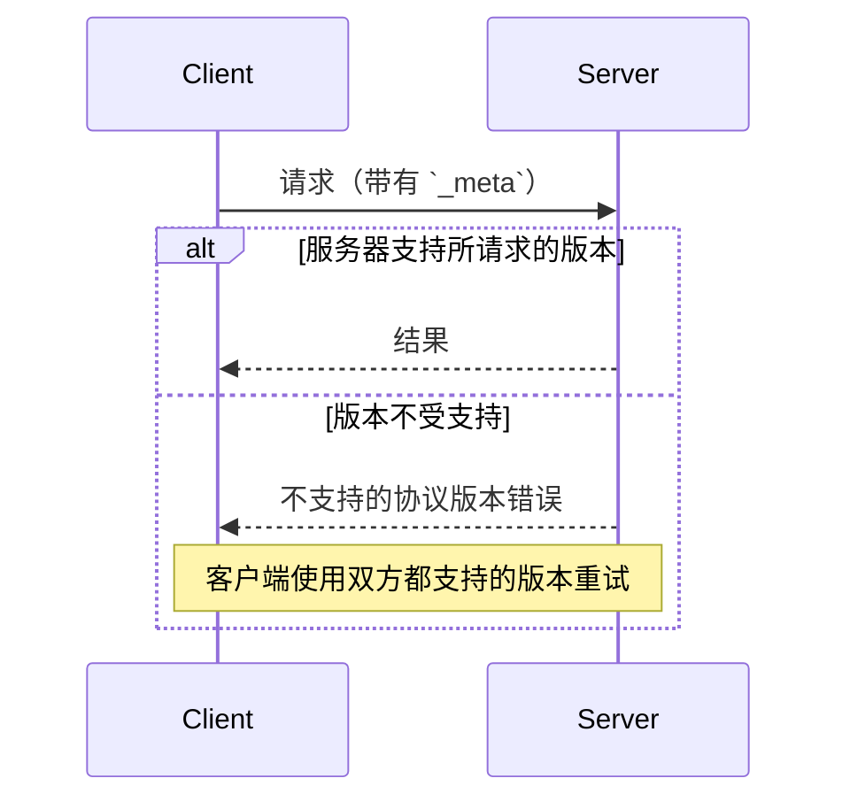

<div id="enable-section-numbers" />

本页定义了客户端和服务器如何就它们所使用的协议达成一致：
协议版本，在每个请求中声明；可选扩展，通过能力协商；以及与更早的、基于握手的协议修订版的互操作性。

不存在协商握手。每个请求都携带其协议版本，服务器独立接受或拒绝每个请求：



## 术语

本页使用以下术语来描述跨协议修订版的互操作性：

- **现代**：按每个请求元数据传递版本、身份和能力的协议版本（修订版 `2026-07-28` 及之后）。
- **传统**：通过 `initialize` 握手建立会话的协议版本（`2025-11-25` 及更早）。
- **双时代**：同时支持现代和传统版本的实现。

## 协议版本协商

每个请求都在其 [`_meta`](/specification/draft/basic/index#meta) 字段中声明其正在使用的协议版本。在 HTTP 上，这一信息也会通过
[`MCP-Protocol-Version` header](/specification/draft/basic/transports/streamable-http#protocol-version-header) 传递。

如果服务器未实现所请求的版本（无论该版本对服务器来说是未知的，还是服务器已知但选择不支持的版本），它 **MUST** 返回一个
[`UnsupportedProtocolVersionError`](/specification/draft/schema#unsupportedprotocolversionerror)，并列出其支持的版本：

```json
{
  "jsonrpc": "2.0",
  "id": 1,
  "error": {
    "code": -32022,
    "message": "不支持的协议版本",
    "data": {
      "supported": ["2026-07-28", "2025-11-25"],
      "requested": "1900-01-01"
    }
  }
}
```

客户端 **SHOULD** 从 `supported` 列表中选择一个双方都支持的版本并重试请求；如果不存在兼容版本，则向用户显示错误。

服务器 **MUST** 实现
[`server/discover`](/specification/draft/server/discover)。客户端
**MAY** 在发送任何其他请求之前调用它，以便提前了解服务器支持的版本，但这不是强制要求：客户端可以直接发起任意 RPC，并在首选版本不受支持时处理 `UnsupportedProtocolVersionError`。

## 扩展协商

客户端和服务器可以协商对核心协议之外的可选
[扩展](/docs/extensions/overview) 的支持。扩展
会在能力的 `extensions` 字段中声明，该字段是一个从
扩展标识符到各扩展设置对象的映射。扩展标识符
**MUST** 遵循带有强制前缀的
[`_meta` 键命名规则](/specification/draft/basic/index#meta)。

以下是一个声明了
[MCP Apps 扩展](/extensions/apps/overview) 的客户端示例，其标识符为 `io.modelcontextprotocol/ui`：

```json
{
  "capabilities": {
    "roots": {},
    "extensions": {
      "io.modelcontextprotocol/ui": {
        "mimeTypes": ["text/html;profile=mcp-app"]
      }
    }
  }
}
```

以下是一个 [Tasks 扩展](/extensions/tasks/overview) 的示例，其标识符为 `io.modelcontextprotocol/tasks`：

```json
{
  "capabilities": {
    "tools": {},
    "extensions": {
      "io.modelcontextprotocol/tasks": {}
    }
  }
}
```

每个扩展都指定其设置对象的 schema；空对象表示支持该扩展但不附带额外设置。

如果一方支持某个扩展而另一方不支持，支持该扩展的一方 **MUST** 退回到核心协议行为，或以适当错误拒绝该请求。扩展 **SHOULD** 文档化其预期的回退行为。

## 与基于初始化的版本向后兼容

希望同时支持[传统](#terminology)客户端（它们期望 `initialize` 握手）和[现代](#terminology)客户端（它们使用每个请求元数据）的服务器 **MAY** 同时实现这两种行为。

需要与这两类服务器互操作的客户端，可以通过绑定页面中规定的、与传输相关的机制来识别服务器属于哪个时代：

- [stdio](/specification/draft/basic/transports/stdio#backward-compatibility)：
  先探测 `server/discover`，并在任何无法识别为现代错误的错误上回退。
- [Streamable HTTP](/specification/draft/basic/transports/streamable-http#backward-compatibility)：
  先尝试一个现代请求，并在回退前检查 `400 Bad Request` 的响应体。

在这两种情况下，已识别的现代 JSON-RPC 错误（例如
[`UnsupportedProtocolVersionError`](/specification/draft/schema#unsupportedprotocolversionerror)）
都表明服务器是现代的：客户端会重试一个受支持的版本，而不是回退。其他任何情况都表明服务器是传统的。

时代判断是服务器的属性，而不是单个请求的属性。客户端 **SHOULD** 在服务器进程（stdio）或源站（HTTP）生命周期内缓存该结果，并 **MAY** 将其持久化到同一服务器配置的重启之间；如果缓存的假设之后失败，则重新探测。

一个仅支持[现代](#terminology)版本的服务器 **SHOULD** 在其对任何传输上的 `initialize` 请求返回的任何错误中写明其支持的协议版本；传统客户端没有向前回退机制，而这条消息可能是它们能够向用户呈现的唯一诊断信息。

### 兼容性矩阵

下表总结了客户端与服务器各时代组合时的预期结果：

| Client   | Server   | Outcome                                                                                                                                                                                                                                                                                                                                                                                                                                                                                                                                |
| -------- | -------- | -------------------------------------------------------------------------------------------------------------------------------------------------------------------------------------------------------------------------------------------------------------------------------------------------------------------------------------------------------------------------------------------------------------------------------------------------------------------------------------------------------------------------------------- |
| Modern   | Modern   | 可工作。`server/discover` 是可选的；版本不匹配会表现为 `UnsupportedProtocolVersionError`，客户端会使用双方都支持的版本重试。                                                                                                                                                                                                                                                                                                                                                                                                         |
| Modern   | Legacy   | 失败。服务器可能以实现定义的错误拒绝请求、保持静默，或者甚至按传统语义处理一个时代不明确的方法。在 stdio 上，客户端 **SHOULD** 先发送 `server/discover` 以确定性地失败；随后客户端向用户展示可操作的错误。                                                                                                                                                                                                                                                                                             |
| Dual-era | Modern   | 可工作。stdio 探测返回 `DiscoverResult`（或 `UnsupportedProtocolVersionError`）；在 HTTP 上，第一个现代请求成功或返回现代错误。客户端保持现代模式。                                                                                                                                                                                                                                                                                                                                                                                  |
| Dual-era | Legacy   | 可工作。stdio：探测返回非现代错误或超时，客户端回退到 `initialize`。HTTP：现代请求返回 `4xx`，且响应体中没有可识别的现代错误，客户端回退到 `initialize`（并且在必要时进一步回退到已废弃的 HTTP+SSE 传输）。                                                                                                                                                                                                                                                                                         |
| Legacy   | Modern   | 失败。stdio：服务器以 JSON-RPC 错误拒绝 `initialize`；具体错误码由实现决定（`initialize` 是未知方法，且请求还缺少必需的 `_meta` 字段）。HTTP：请求缺少必需的头部，并根据 [server validation](/specification/draft/basic/transports/streamable-http#server-validation) 被拒绝为 `400 Bad Request`（处于已废弃 HTTP+SSE 传输上的客户端则会在其初始 `GET` 时失败）。传统客户端没有向前回退机制。 |
| Legacy   | Dual-era | 可工作。服务器响应 `initialize`，并根据协商得到的传统修订版为客户端提供服务。                                                                                                                                                                                                                                                                                                                                                                                                                            |
| Legacy   | Legacy   | 根据传统修订版可工作；不在本文档范围内。                                                                                                                                                                                                                                                                                                                                                                                                                                                                |

一个双时代 **server** 会根据客户端的打开方式选择其行为：

- 携带现代每请求 `_meta` 的请求，会按照本修订版无状态地处理。
- `initialize` 请求会选择传统语义，其作用域为 stdio 进程（stdio）或会话（HTTP），具体取决于协商得到的传统协议版本。

双时代服务器 **MAY** 在同一端点或进程上同时提供两个时代的服务。
