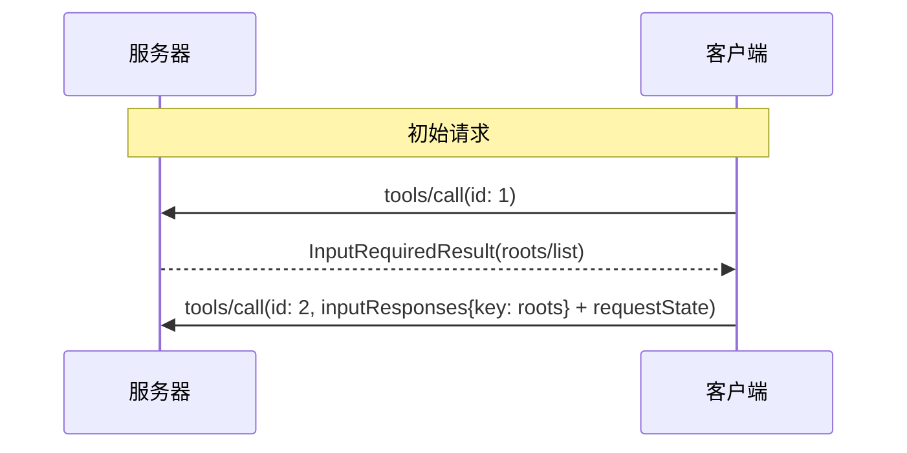

<div id="enable-section-numbers" />

<Warning>
  **已弃用**：自协议版本
  `2026-07-28`
  （[SEP-2577](https://github.com/modelcontextprotocol/modelcontextprotocol/pull/2577)）起，Roots 功能已被弃用。
  根据[功能生命周期政策](/community/feature-lifecycle)，在本次修订发布后，它会在规范中至少保留十二个月，之后才有资格被移除。新的实现**不应**采用它；现有实现**应**迁移为通过工具参数、资源 URI 或服务器配置传递目录或文件。详见[已弃用功能登记表](/specification/draft/deprecated)。
</Warning>

模型上下文协议（MCP）为客户端向服务器公开文件系统“根目录”提供了一种标准化方式。根目录会告知服务器客户端认为相关的目录和文件，以便服务器相应地集中其操作。它们是信息性指导，而不是访问控制机制。该协议并不强制服务器必须停留在根目录内。服务器可以从受支持的客户端请求根目录列表。

## 用户交互模型

MCP 中的根目录通常通过工作区或项目配置界面暴露。

例如，实现可以提供工作区/项目选择器，允许用户选择服务器应有权访问的目录和文件。这可以与来自版本控制系统或项目文件的自动工作区检测相结合。

然而，实现可以通过任何适合其需求的界面模式暴露根目录——协议本身不强制任何特定的用户交互模型。

## 能力

支持根目录的客户端**必须**在每次请求中于 `_meta.io.modelcontextprotocol/clientCapabilities` 中声明 `roots` 能力：

```json
{
  "_meta": {
    "io.modelcontextprotocol/clientCapabilities": {
      "roots": {}
    }
  }
}
```

## 协议消息

### 列出根目录

要在处理客户端请求期间检索根目录，服务器会发送一个包含 `roots/list` 请求的 `InputRequiredResult`：

**Input request (delivered inside [`InputRequiredResult.inputRequests`](/specification/draft/basic/patterns/mrtr#inputrequests)):**

```json
{
  "method": "roots/list"
}
```

**Client result (returned inside `inputResponses` on the retried request):**

```json
{
  "roots": [
    {
      "uri": "file:///home/user/projects/myproject",
      "name": "我的项目"
    }
  ]
}
```

## 消息流



## 数据类型

### 根目录

根目录定义包括：

- `uri`: 根目录的唯一标识符。在当前规范中，这**必须**是 `file://` URI。
- `name`: 可选的人类可读名称，用于显示目的。

不同用例的根目录示例：

#### 项目目录

```json
{
  "uri": "file:///home/user/projects/myproject",
  "name": "我的项目"
}
```

#### 多个仓库

```json
[
  {
    "uri": "file:///home/user/repos/frontend",
    "name": "前端仓库"
  },
  {
    "uri": "file:///home/user/repos/backend",
    "name": "后端仓库"
  }
]
```

## 错误处理

如果发生错误，客户端无需使用错误消息重放初始调用，因为服务器并不是在等待 `InputRequiredResult` 模式下的响应。

## 安全考虑

1. 客户端**必须**：
   - 仅暴露具有适当权限的根目录
   - 验证所有根目录 URI 以防止路径遍历
   - 实施适当的访问控制
   - 监控根目录可访问性

2. 服务器**应该**：
   - 处理根目录变得不可用的情况
   - 在操作期间尊重根目录边界
   - 针对提供的根目录验证所有路径

## 实现指南

1. 客户端**应该**：
   - 在暴露根目录给服务器之前提示用户同意
   - 提供清晰的根目录管理用户界面
   - 暴露前验证根目录可访问性
   - 监控根目录更改

2. 服务器**应该**：
   - 使用前检查根目录能力
   - 在操作中尊重根目录边界
   - 适当地缓存根目录信息
