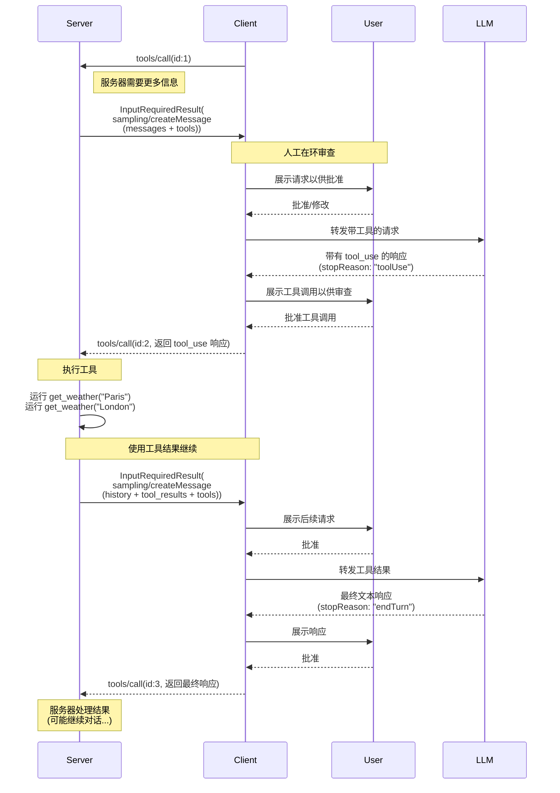
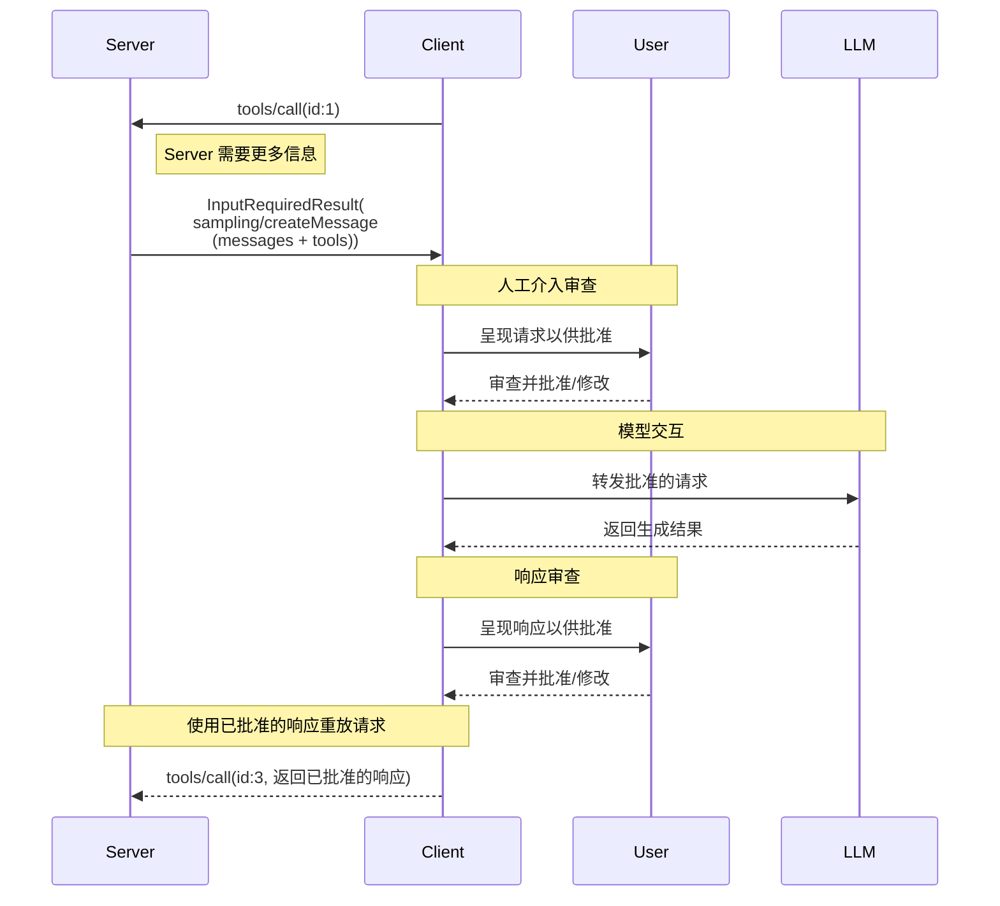

<div id="enable-section-numbers" />

<Warning>
  **已弃用**：自协议版本
  `2026-07-28`
  ([SEP-2577](https://github.com/modelcontextprotocol/modelcontextprotocol/pull/2577)) 起，采样功能已被弃用。
  根据[功能生命周期政策](/community/feature-lifecycle)，在本次修订发布后，该功能至少会保留在规范中十二个月，然后才会具备移除资格。新的实现 **SHOULD NOT**
  采用它；现有实现 **SHOULD** 迁移为直接集成 LLM 提供商 API。请参阅[已弃用功能注册表](/specification/draft/deprecated)。
</Warning>

模型上下文协议（MCP）提供了一种标准化方式，使服务器能够通过客户端请求语言模型进行 LLM 采样（“补全”或“生成”）。此流程允许客户端保持对模型访问、选择和权限的控制，同时使服务器能够利用 AI 能力——且无需服务器 API 密钥。服务器可以请求基于文本、音频或图像的交互，并可选择性地在提示词中包含来自 MCP 服务器的上下文。

## 用户交互模型

MCP 中的采样允许服务器实现代理行为，通过使 LLM 调用能够 _嵌套_ 发生在其他 MCP 服务器功能内部。

实现可以自由地通过任何适合其需求的接口模式暴露采样——协议本身不强制任何特定的用户交互模型。

<Warning>

为了信任、安全和安全性，**SHOULD** 始终有人工介入，能够拒绝采样请求。

应用程序 **SHOULD**：

- 提供用户界面，使其能够轻松直观地审查采样请求
- 允许用户在发送前查看和编辑提示词
- 在交付前展示生成的响应以供审查

</Warning>

## 采样中的工具

服务器可以通过在其采样请求中提供 `tools` 数组和可选的 `toolChoice` 配置，请求客户端的 LLM 在采样期间使用工具。`tools` 数组中的工具定义仅限于采样请求范围——它们不需要对应于注册的工具。这使得服务器能够实现代理行为，其中 LLM 可以调用专门指定的工具，接收结果，并继续对话——所有都在单个采样请求流程中完成。

客户端 **MUST** 通过 `sampling.tools` 能力声明对工具使用的支持，以接收启用工具的采样请求。服务器 **MUST NOT** 向未通过 `sampling.tools` 能力声明支持工具使用的客户端发送启用工具的采样请求。

## 能力

支持采样的客户端 **MUST** 在每个请求中的 `_meta.io.modelcontextprotocol/clientCapabilities` 声明 `sampling` 能力：

**基本采样：**

```json
{
  "_meta": {
    "io.modelcontextprotocol/clientCapabilities": {
      "sampling": {}
    }
  }
}
```

**带工具使用支持：**

```json
{
  "_meta": {
    "io.modelcontextprotocol/clientCapabilities": {
      "sampling": {
        "tools": {}
      }
    }
  }
}
```

**具有上下文包含支持（已弃用）：**

```json
{
  "_meta": {
    "io.modelcontextprotocol/clientCapabilities": {
      "sampling": {
        "context": {}
      }
    }
  }
}
```

<Note>
  `includeContext` 参数值 `"thisServer"` 和 `"allServers"` 已根据[功能生命周期
  政策](/community/feature-lifecycle#deprecating-a-feature)
  ([SEP-2596](https://github.com/modelcontextprotocol/modelcontextprotocol/pull/2596)) 被弃用；
  它们最迟会在采样功能本身被移除时一并移除。服务器
  **SHOULD** 避免使用这些值（例如，可以直接省略 `includeContext`，因为其默认值为 `"none"`），并且除非客户端
  声明了 `sampling.context` 能力，否则 **SHOULD NOT** 使用它们。请参阅[已弃用功能
  注册表](/specification/draft/deprecated)。
</Note>

## 协议消息

### 创建消息

要在处理客户端请求期间请求语言模型生成，服务器发送一个包含 `sampling/createMessage` 请求的 `InputRequiredResult`：

**输入请求（在 [`InputRequiredResult.inputRequests`](/specification/draft/basic/patterns/mrtr#inputrequests) 中传递）：**

```json
{
  "method": "sampling/createMessage",
  "params": {
    "messages": [
      {
        "role": "user",
        "content": {
          "type": "text",
          "text": "法国的首都是哪里？"
        }
      }
    ],
    "modelPreferences": {
      "hints": [
        {
          "name": "claude-3-sonnet"
        }
      ],
      "costPriority": 0.3,
      "intelligencePriority": 0.8,
      "speedPriority": 0.5
    },
    "temperature": 0.1,
    "systemPrompt": "你是一个乐于助人的助手。",
    "includeContext": "thisServer",
    "maxTokens": 100
  }
}
```

**客户端结果（在重试请求的 `inputResponses` 中返回）：**

```json
{
  "role": "assistant",
  "content": {
    "type": "text",
    "text": "法国的首都是巴黎。"
  },
  "model": "claude-3-sonnet-20240307",
  "stopReason": "endTurn"
}
```

### 带工具的采样

下图展示了带工具的采样的完整流程，包括多轮工具循环：



要请求具有工具使用能力的 LLM 生成，服务器在请求中包含 `tools` 和可选的 `toolChoice`：

**输入请求（Server -> Client，在 `InputRequiredResult.inputRequests` 中传递）：**

```json
{
  "method": "sampling/createMessage",
  "params": {
    "messages": [
      {
        "role": "user",
        "content": {
          "type": "text",
          "text": "巴黎和伦敦的天气怎么样？"
        }
      }
    ],
    "tools": [
      {
        "name": "get_weather",
        "description": "获取某个城市的当前天气",
        "inputSchema": {
          "type": "object",
          "properties": {
            "city": {
              "type": "string",
              "description": "城市名称"
            }
          },
          "required": ["city"]
        }
      }
    ],
    "toolChoice": {
      "mode": "auto"
    },
    "maxTokens": 1000
  }
}
```

**客户端结果（Client -> Server，在重试请求的 `inputResponses` 中返回）：**

```json
{
  "role": "assistant",
  "content": [
    {
      "type": "tool_use",
      "id": "call_abc123",
      "name": "get_weather",
      "input": {
        "city": "Paris"
      }
    },
    {
      "type": "tool_use",
      "id": "call_def456",
      "name": "get_weather",
      "input": {
        "city": "London"
      }
    }
  ],
  "model": "claude-3-sonnet-20240307",
  "stopReason": "toolUse"
}
```

### 多轮工具循环

在收到来自 LLM 的工具使用请求后，服务器通常：

1. 执行请求的工具使用。
2. 发送一个新的采样请求，追加工具结果
3. 接收 LLM 的响应（其中可能包含新的工具使用）
4. 根据需要重复多次（服务器可能会限制最大迭代次数，例如在最后一次迭代传递 `toolChoice: {mode: "none"}` 以强制最终结果）

**后续输入请求（Server -> Client，在 `InputRequiredResult.inputRequests` 中传递）并附带工具结果：**

```json
{
  "method": "sampling/createMessage",
  "params": {
    "messages": [
      {
        "role": "user",
        "content": {
          "type": "text",
          "text": "巴黎和伦敦的天气怎么样？"
        }
      },
      {
        "role": "assistant",
        "content": [
          {
            "type": "tool_use",
            "id": "call_abc123",
            "name": "get_weather",
            "input": { "city": "Paris" }
          },
          {
            "type": "tool_use",
            "id": "call_def456",
            "name": "get_weather",
            "input": { "city": "London" }
          }
        ]
      },
      {
        "role": "user",
        "content": [
          {
            "type": "tool_result",
            "toolUseId": "call_abc123",
            "content": [
              {
                "type": "text",
                "text": "巴黎天气：18°C，多云间晴"
              }
            ]
          },
          {
            "type": "tool_result",
            "toolUseId": "call_def456",
            "content": [
              {
                "type": "text",
                "text": "伦敦天气：15°C，有雨"
              }
            ]
          }
        ]
      }
    ],
    "tools": [
      {
        "name": "get_weather",
        "description": "获取某个城市的当前天气",
        "inputSchema": {
          "type": "object",
          "properties": {
            "city": { "type": "string" }
          },
          "required": ["city"]
        }
      }
    ],
    "maxTokens": 1000
  }
}
```

**最终客户端结果（Client -> Server，在重试请求的 `inputResponses` 中返回）：**

```json
{
  "role": "assistant",
  "content": {
    "type": "text",
    "text": "根据当前天气数据：\n\n- **巴黎**：18°C，局部多云，天气相当宜人！\n- **伦敦**：15°C，有雨——你会需要一把伞。\n\n今天巴黎的天气略微更暖和也更干燥。"
  },
  "model": "claude-3-sonnet-20240307",
  "stopReason": "endTurn"
}
```

## 消息内容约束

### 工具结果消息

当用户消息包含工具结果（类型："tool_result"）时，它 **MUST** 仅包含工具结果。不允许在同一消息中将工具结果与其他内容类型（文本、图像、音频）混合。

此约束确保与为工具结果使用专用角色的提供商 API 兼容（例如，OpenAI 的 "tool" 角色，Gemini 的 "function" 角色）。

**有效 - 单个工具结果：**

```json
{
  "role": "user",
  "content": {
    "type": "tool_result",
    "toolUseId": "call_123",
    "content": [{ "type": "text", "text": "结果数据" }]
  }
}
```

**有效 - 多个工具结果：**

```json
{
  "role": "user",
  "content": [
    {
      "type": "tool_result",
      "toolUseId": "call_123",
      "content": [{ "type": "text", "text": "结果 1" }]
    },
    {
      "type": "tool_result",
      "toolUseId": "call_456",
      "content": [{ "type": "text", "text": "结果 2" }]
    }
  ]
}
```

**无效 - 混合内容：**

```json
{
  "role": "user",
  "content": [
    {
      "type": "text",
      "text": "这些是结果："
    },
    {
      "type": "tool_result",
      "toolUseId": "call_123",
      "content": [{ "type": "text", "text": "结果数据" }]
    }
  ]
}
```

### 工具使用与结果平衡

在采样中使用工具使用时，每个包含 `ToolUseContent` 块的助手消息 **MUST** 后跟一个完全由 `ToolResultContent` 块组成的用户消息，每个工具使用（例如，`id: $id`）由相应的工具结果（`toolUseId: $id`）匹配，然后才是任何其他消息。

此要求确保：

- 工具使用总是在对话继续之前得到解决
- 提供商 API 可以并发处理多个工具使用并并行获取其结果
- 对话保持一致的请求 - 响应模式

**有效序列示例：**

1. 用户消息："巴黎和伦敦的天气怎么样？"
2. 助手消息：`ToolUseContent` (`id: "call_abc123", name: "get_weather", input: {city: "Paris"}`) + `ToolUseContent` (`id: "call_def456", name: "get_weather", input: {city: "London"}`)
3. 用户消息：`ToolResultContent` (`toolUseId: "call_abc123", content: "18°C，多云间晴"`) + `ToolResultContent` (`toolUseId: "call_def456", content: "15°C，有雨"`)
4. 助手消息：文本响应比较两个城市的天气

**无效序列 - 缺失工具结果：**

1. 用户消息："巴黎和伦敦的天气怎么样？"
2. 助手消息：`ToolUseContent` (`id: "call_abc123", name: "get_weather", input: {city: "Paris"}`) + `ToolUseContent` (`id: "call_def456", name: "get_weather", input: {city: "London"}`)
3. 用户消息：`ToolResultContent` (`toolUseId: "call_abc123", content: "18°C，多云间晴"`) ← 缺失 call_def456 的结果
4. 助手消息：文本响应（无效 - 并非所有工具使用都已解决）

## 跨 API 兼容性

采样规范旨在适用于多个 LLM 提供商 API（Claude、OpenAI、Gemini 等）。兼容性的关键设计决策：

### 消息角色

MCP 使用两个角色："user" 和 "assistant"。

工具使用请求在 CreateMessageResult 中以 "assistant" 角色发送。
工具结果在消息中以 "user" 角色发回。
包含工具结果的消息不能包含其他类型的内容。

### 工具选择模式

`CreateMessageRequest.params.toolChoice` 控制模型的工具使用能力：

- `{mode: "auto"}`：模型决定是否使用工具（默认）
- `{mode: "required"}`：模型在完成前必须使用至少一个工具
- `{mode: "none"}`：模型不得使用任何工具

### 并行工具使用

MCP 允许模型并行发出多个工具使用请求（返回 `ToolUseContent` 数组）。所有主要提供商 API 都支持此功能：

- **Claude**：原生支持并行工具使用
- **OpenAI**：支持并行工具调用（可通过 `parallel_tool_calls: false` 禁用）
- **Gemini**：原生支持并行函数调用

封装支持禁用并行工具使用的提供商的实现可以将此作为扩展公开，但这不是核心 MCP 规范的一部分。

## 消息流



## 数据类型

### 消息

采样消息 **必须** 包含 `"user"` 或 `"assistant"` 的 `role` 字段；以及表示消息数据的 `content` 字段。

采样请求中的消息列表 **不应** 在不同请求之间保留。

`content` 字段可以包含：

#### 文本内容

```json
{
  "type": "text",
  "text": "消息内容"
}
```

#### 图像内容

```json
{
  "type": "image",
  "data": "base64-encoded-image-data",
  "mimeType": "image/jpeg"
}
```

#### 音频内容

```json
{
  "type": "audio",
  "data": "base64-encoded-audio-data",
  "mimeType": "audio/wav"
}
```

### 模型偏好

MCP 中的模型选择需要仔细抽象，因为服务器和客户端可能使用具有不同模型产品的不同 AI 提供商。服务器不能简单地按名称请求特定模型，因为客户端可能无法访问该确切模型，或者可能更喜欢使用不同提供商的等效模型。

为解决此问题，MCP 实现了一个偏好系统，结合了抽象能力优先级与可选模型提示：

#### 能力优先级

服务器通过三个归一化优先级值 (0-1) 表达其需求：

- `costPriority`：最小化成本有多重要？较高的值偏好更便宜的模型。
- `speedPriority`：低延迟有多重要？较高的值偏好更快的模型。
- `intelligencePriority`：高级能力有多重要？较高的值偏好能力更强的模型。

#### 模型提示

虽然优先级有助于根据特征选择模型，但 `hints` 允许服务器建议特定模型或模型系列：

- 提示被视为可灵活匹配模型名称的子字符串
- 多个提示按偏好顺序评估
- 客户端 **可以** 将提示映射到不同提供商的等效模型
- 提示是建议性的——客户端进行最终模型选择

例如：

```json
{
  "hints": [
    { "name": "claude-3-sonnet" }, // 首选 Sonnet 类模型
    { "name": "claude" } // 回退到任何 Claude 模型
  ],
  "costPriority": 0.3, // 成本不太重要
  "speedPriority": 0.8, // 速度非常重要
  "intelligencePriority": 0.5 // 中等能力需求
}
```

客户端处理这些偏好以从其可用选项中选择适当的模型。例如，如果客户端无法访问 Claude 模型但有 Gemini，它可能会根据类似能力将 sonnet 提示映射到 `gemini-1.5-pro`。

### 系统提示

可选的 `systemPrompt` 字段允许服务器请求特定的系统提示。客户端 **可以** 修改或忽略此字段，而无需将此通知服务器。

### 上下文包含

`includeContext` 参数指定客户端在其响应中应包含哪些上下文信息：

- `"none"`：无额外上下文。
- `"thisServer"`：包含来自请求服务器的上下文。
- `"allServers"`：包含来自所有已连接 MCP 服务器的上下文。

`"thisServer"` 和 `"allServers"` 的值已弃用；请参见
[能力](#capabilities)。

客户端 **可以** 在不通知服务器的情况下修改或忽略此字段。
例如，客户端可以判断，在某个特定请求中遵守此字段
将需要与服务器共享敏感信息，并据此约束其响应。

### 采样参数

LLM 采样可以使用以下参数进行微调：

- `temperature`：控制模型响应中的随机性。较高的值产生较高的随机性，较低的值产生更稳定的输出。有效范围取决于模型提供商。
- `maxTokens`：生成的最大令牌数；必需。
- `stopSequences`：停止生成的序列数组。
- `metadata`：额外的提供商特定参数。

客户端 **必须** 遵守 `maxTokens` 参数。

客户端 **可以** 修改或忽略 `temperature`、`stopSequences` 和 `metadata`。例如，客户端可以使用不支持其中一个或多个参数的模型，因此将无法利用它们。

### 结果字段

采样结果将包含以下字段：

- `role`：消息角色；参见 [消息](#messages)。
- `content`：消息内容。这可以是：
  - 当响应仅包含一个内容块时的单个内容块，例如单个文本响应。
  - 当响应包含一个或多个内容块时的内容块数组，例如多个工具使用或混合内容。

  参见 [消息](#messages) 了解内容块类型。

- `model`：生成消息的模型名称。
- `stopReason`：采样停止的原因（如果已知）。规范定义了以下（非详尽）停止原因，尽管实现 **可以** 提供自己的任意值：
  - `"endTurn"`：参与者将对话让给另一方。
  - `"stopSequence"`：消息生成遇到请求的 `stopSequences` 之一。
  - `"maxTokens"`：达到令牌限制。
  - `"toolUse"`：模型想要使用一个或多个工具。

## 错误处理

如果发生错误或用户拒绝采样请求，客户端无需使用错误消息重放初始调用，因为服务器并未通过 `InputRequiredResult` 模式等待响应。

## 安全考虑

1. 客户端 **应该** 实现用户批准控制
2. 双方 **应该** 验证消息内容
3. 客户端 **应该** 遵守模型偏好提示
4. 客户端 **应该** 实现速率限制
5. 双方 **必须** 妥善处理敏感数据

当采样中使用工具时，适用额外的安全考虑：

6. 服务器 **必须** 确保在回复 `stopReason: "toolUse"` 时，每个 `ToolUseContent` 项都响应一个具有匹配 `toolUseId` 的 `ToolResultContent` 项，并且用户消息仅包含工具结果（无其他内容类型）
7. 双方 **应该** 为工具循环实现迭代限制
