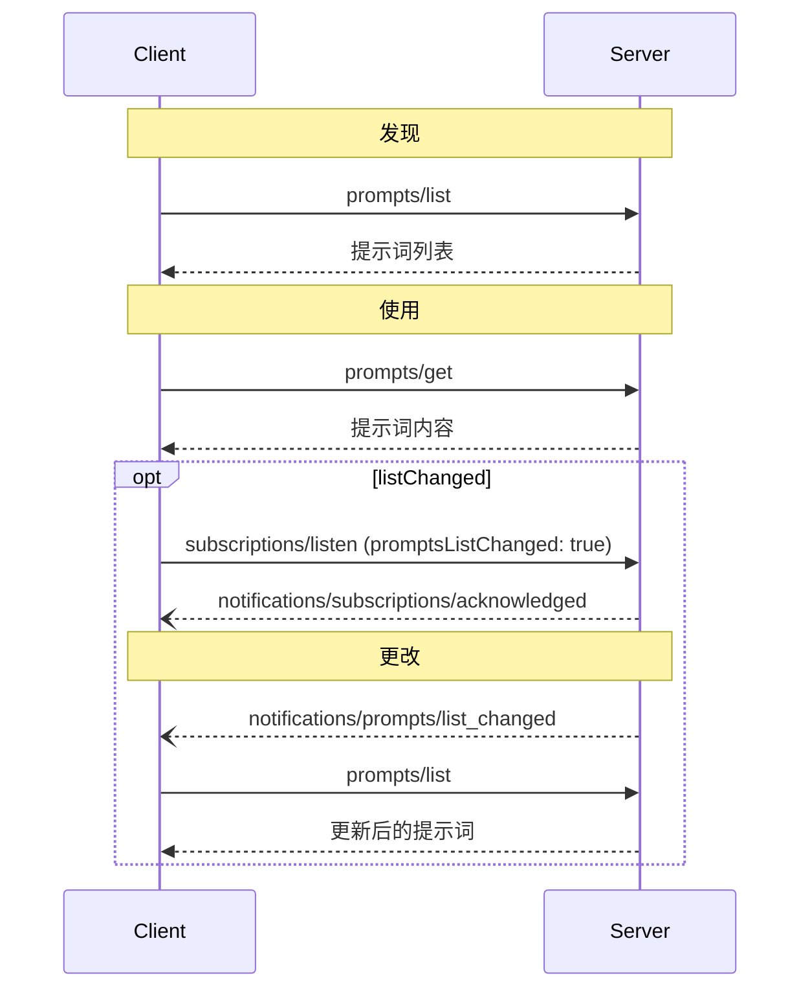

<div id="enable-section-numbers" />

Model Context Protocol (MCP) 提供了一种标准化方式，使服务器能够向客户端暴露提示词模板。提示词允许服务器提供结构化的消息和指令，以便与语言模型进行交互。客户端可以发现可用的提示词，检索其内容，并提供参数以自定义它们。

## 用户交互模型

提示词旨在成为**用户控制**的，这意味着它们从服务器暴露给客户端，目的是让用户能够明确选择使用它们。这指的是谁决定何时使用提示词，而不是谁编写其内容。提示词内容由服务器定义。

通常，提示词将通过用户界面中用户发起的命令触发，这允许用户自然地发现并调用可用的提示词。

例如，作为斜杠命令：


然而，实现者可以自由地通过任何适合其需求的界面模式暴露提示词&mdash;协议本身并不强制任何特定的用户交互模型。

## 能力

支持提示词的服务器 **必须** 在其 [`DiscoverResult`](/specification/draft/schema#discoverresult) 中声明 `prompts` 能力：

```json
{
  "capabilities": {
    "prompts": {
      "listChanged": true
    }
  }
}
```

`listChanged` 指示服务器是否将在可用提示词列表更改时发出通知。

声明了 `prompts` 能力的服务器 **必须** 以当前对请求客户端可用的提示词集合响应 `prompts/list` 请求。该集合**可以**为空，也**可以**随时间变化（参见 [列表更改通知](#list-changed-notification)），但**绝不能**因连接而异，或因该连接上的其他请求而产生副作用。该集合**可以**随请求中提供的授权而变化——例如，仅返回调用方已获授权范围内允许的提示词——因为凭据是逐请求输入，而不是连接状态。

## 协议消息

### 列出提示词

要检索可用的提示词，客户端发送 `prompts/list` 请求。此操作支持 [分页](/specification/draft/server/utilities/pagination) 和 [缓存](/specification/draft/server/utilities/caching)。

**请求：**

```json
{
  "jsonrpc": "2.0",
  "id": 1,
  "method": "prompts/list",
  "params": {
    "cursor": "optional-cursor-value"
  }
}
```

**响应：**

```json
{
  "jsonrpc": "2.0",
  "id": 1,
  "result": {
    "resultType": "complete",
    "prompts": [
      {
        "name": "code_review",
        "title": "请求代码审查",
        "description": "让 LLM 分析代码质量并提出改进建议",
        "arguments": [
          {
            "name": "code",
            "description": "要审查的代码",
            "required": true
          }
        ],
        "icons": [
          {
            "src": "https://example.com/review-icon.svg",
            "mimeType": "image/svg+xml",
            "sizes": ["any"]
          }
        ]
      }
    ],
    "nextCursor": "next-page-cursor",
    "ttlMs": 600000,
    "cacheScope": "public"
  }
}
```

### 获取提示词

要检索特定提示词，客户端发送 `prompts/get` 请求。参数可以通过 [补全 API](/specification/draft/server/utilities/completion) 自动完成。

**请求：**

```json
{
  "jsonrpc": "2.0",
  "id": 2,
  "method": "prompts/get",
  "params": {
    "name": "code_review",
    "arguments": {
      "code": "def hello():\n    print('world')"
    }
  }
}
```

**响应：**

```json
{
  "jsonrpc": "2.0",
  "id": 2,
  "result": {
    "resultType": "complete",
    "description": "代码审查提示词",
    "messages": [
      {
        "role": "user",
        "content": {
          "type": "text",
          "text": "请审查这段 Python 代码：\ndef hello():\n    print('world')"
        }
      }
    ]
  }
}
```

服务器**也可以**对 `prompts/get` 返回一个 [`InputRequiredResult`](/specification/draft/basic/patterns/mrtr#inputrequiredresult)，表示在提示词能够被解析之前还需要额外输入。这遵循 [多轮往返请求](/specification/draft/basic/patterns/mrtr#multi-round-trip-requests) 机制。重试请求时，客户端会在请求参数中包含 `inputResponses`，以及如果服务器提供了的话，还会包含 `requestState`。

### 列表更改通知

当可用提示词列表发生变化时，声明了 `listChanged`
能力的服务器 **应该** 向已打开带有
`promptsListChanged: true` 的
[`subscriptions/listen`](/specification/draft/basic/patterns/subscriptions) 流的客户端发送通知：

```json
{
  "jsonrpc": "2.0",
  "method": "notifications/prompts/list_changed"
}
```

## 消息流



## 数据类型

### 提示词

提示词定义包括：

- `name`: 提示词的唯一标识符
- `title`: 可选的用于显示目的的人类可读提示词名称。
- `description`: 可选的人类可读描述
- `icons`: 可选的用于用户界面显示的图标数组
- `arguments`: 可选的用于自定义的参数列表

### 提示词消息

提示词中的消息可以包含：

- `role`: "user" 或 "assistant" 以指示说话者
- `content`: 以下内容类型之一：

<Note>
  提示消息中的所有内容类型都支持可选的
  [annotations](/specification/draft/server/resources#annotations)，用于描述受众、优先级和修改时间等元数据。
</Note>

#### 文本内容

文本内容表示纯文本消息：

```json
{
  "type": "text",
  "text": "消息的文本内容"
}
```

这是用于自然语言交互最常见的内容类型。

#### 图像内容

图像内容允许在消息中包含视觉信息：

```json
{
  "type": "image",
  "data": "base64 编码的图像数据",
  "mimeType": "image/png"
}
```

图像数据**必须**进行 base64 编码并包含有效的 MIME 类型。这使得在视觉上下文重要的多模态交互成为可能。

#### 音频内容

音频内容允许在消息中包含音频信息：

```json
{
  "type": "audio",
  "data": "base64 编码的音频数据",
  "mimeType": "audio/wav"
}
```

音频数据必须进行 base64 编码并包含有效的 MIME 类型。这使得在音频上下文重要的多模态交互成为可能。

#### 资源链接

提示消息**可以**包含指向
[资源](/specification/draft/server/resources) 的链接，以在不直接嵌入资源内容的情况下提供额外上下文或
数据。在这种情况下，提示消息
返回一个可由客户端获取的 URI：

```json
{
  "type": "resource_link",
  "uri": "file:///project/src/main.rs",
  "name": "main.rs",
  "description": "主要应用程序入口点",
  "mimeType": "text/x-rust"
}
```

资源链接支持与常规资源相同的 [资源注释](/specification/draft/server/resources#annotations)，
以帮助客户端理解如何使用它们。

#### 嵌入资源

嵌入资源允许直接在消息中引用服务器端资源：

```json
{
  "type": "resource",
  "resource": {
    "uri": "resource://example",
    "mimeType": "text/plain",
    "text": "资源内容"
  }
}
```

资源可以包含文本或二进制（blob）数据，并且**必须**包括：

- 有效的资源 URI
- 适当的 MIME 类型
- 文本内容或 base64 编码的 blob 数据

嵌入资源使提示词能够无缝地将服务器管理的内容（如文档、代码示例或其他参考材料）直接纳入对话流中。

## 错误处理

服务器**应该**为常见失败情况返回标准 JSON-RPC 错误：

- 无效的提示词名称：`-32602`（无效参数）
- 缺少必需参数：`-32602`（无效参数）
- 内部错误：`-32603`（内部错误）

## 实现注意事项

1. 服务器**应该**在处理前验证提示词参数
2. 客户端**应该**处理大型提示词列表的分页
3. 双方**应该**遵守能力协商

## 安全性

实现**必须**仔细验证所有提示词输入和输出，以防止注入攻击或未经授权的资源访问。
