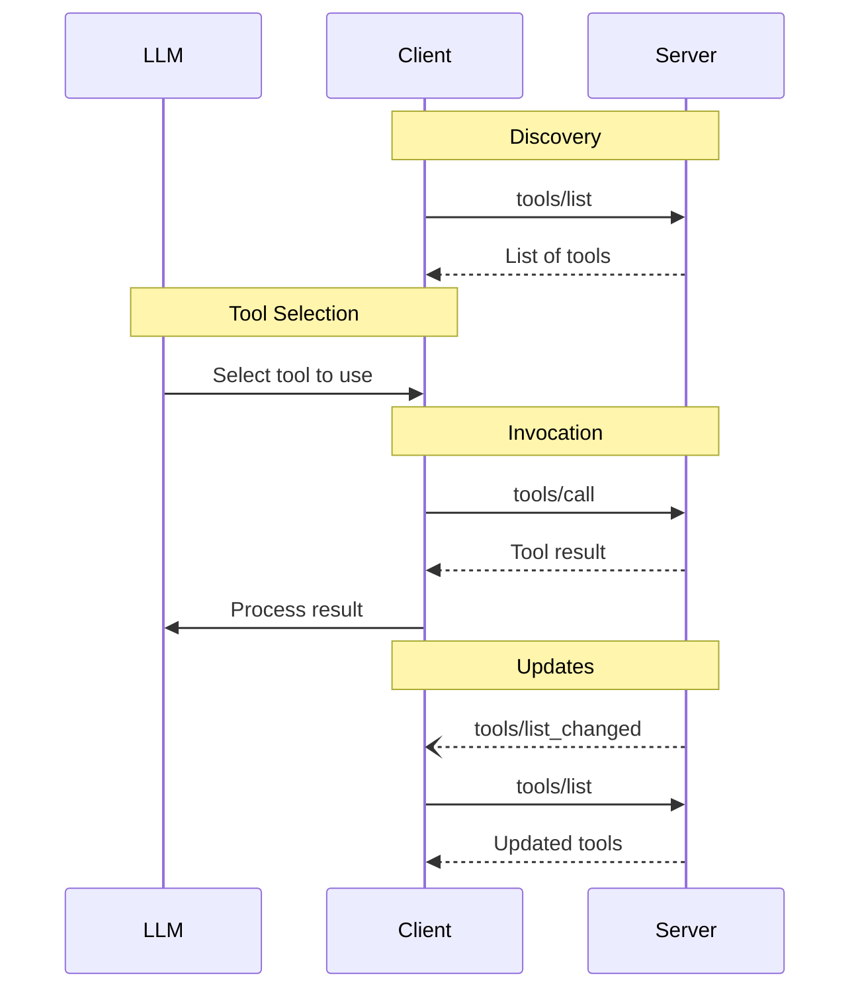

<div id="enable-section-numbers" />

模型上下文协议 (MCP) 允许服务器暴露可由语言模型调用的工具。工具使模型能够与外部系统交互，例如查询数据库、调用 API 或执行计算。每个工具都由一个名称唯一标识，并包含描述其模式的元数据。

## 用户交互模型

MCP 中的工具设计为 **模型控制**，这意味着语言模型可以根据其上下文理解和用户的提示自动发现和调用工具。

然而，实现可以自由地通过任何适合其需求的接口模式暴露工具&mdash;协议本身并不强制任何特定的用户交互模型。

<Warning>

为了信任、安全和安全性，**应当**始终有人类参与循环，能够拒绝工具调用。

应用程序 **应当**：

- 提供清晰显示哪些工具正暴露给 AI 模型的 UI
- 在调用工具时插入清晰的视觉指示器
- 向用户呈现操作确认提示，以确保人类参与循环

</Warning>

## 能力

支持工具的服务器 **必须** 声明 `tools` 能力：

```json
{
  "capabilities": {
    "tools": {
      "listChanged": true
    }
  }
}
```

`listChanged` 指示服务器是否在可用工具列表更改时发出通知。

声明了 `tools` 能力的服务器 **必须** 响应 `tools/list` 请求，返回当前对请求客户端可用的一组工具。此集合 **可以** 为空，并且 **可以** 在连接的生命周期内更改（参见 [列表变更通知](#list-changed-notification)）。

## 协议消息

### 列出工具

要发现可用工具，客户端发送 `tools/list` 请求。此操作支持 [分页](/specification/draft/server/utilities/pagination)。

**请求：**

```json
{
  "jsonrpc": "2.0",
  "id": 1,
  "method": "tools/list",
  "params": {
    "cursor": "optional-cursor-value"
  }
}
```

**响应：**

```json
{
  "jsonrpc": "2.0",
  "id": 1,
  "result": {
    "tools": [
      {
        "name": "get_weather",
        "title": "Weather Information Provider",
        "description": "Get current weather information for a location",
        "inputSchema": {
          "type": "object",
          "properties": {
            "location": {
              "type": "string",
              "description": "City name or zip code"
            }
          },
          "required": ["location"]
        },
        "icons": [
          {
            "src": "https://example.com/weather-icon.png",
            "mimeType": "image/png",
            "sizes": ["48x48"]
          }
        ],
        "execution": {
          "taskSupport": "optional"
        }
      }
    ],
    "nextCursor": "next-page-cursor"
  }
}
```

### 调用工具

要调用工具，客户端发送 `tools/call` 请求：

**请求：**

```json
{
  "jsonrpc": "2.0",
  "id": 2,
  "method": "tools/call",
  "params": {
    "name": "get_weather",
    "arguments": {
      "location": "New York"
    }
  }
}
```

**响应：**

```json
{
  "jsonrpc": "2.0",
  "id": 2,
  "result": {
    "content": [
      {
        "type": "text",
        "text": "Current weather in New York:\nTemperature: 72°F\nConditions: Partly cloudy"
      }
    ],
    "isError": false
  }
}
```

### 列表变更通知

当可用工具列表更改时，声明了 `listChanged` 能力的服务器 **应当** 发送通知：

```json
{
  "jsonrpc": "2.0",
  "method": "notifications/tools/list_changed"
}
```

## 消息流



## 数据类型

### 工具

工具定义包括：

- `name`: 工具的唯一标识符
- `title`: 可选的工具人类可读名称，用于显示目的。
- `description`: 功能的人类可读描述
- `icons`: 可选的图标数组，用于用户界面显示
- `inputSchema`: 定义预期参数的 JSON Schema
  - 遵循 [JSON Schema 使用指南](/specification/draft/basic#json-schema-usage)
  - 如果不存在 `$schema` 字段，默认为 2020-12
  - **必须** 是有效的 JSON Schema 对象（不是 `null`）
  - 对于没有参数的工具，使用以下有效方法之一：
    - `{ "type": "object", "additionalProperties": false }` - **推荐**：显式仅接受空对象
    - `{ "type": "object" }` - 接受任何对象（包括带有属性的对象）
- `outputSchema`: 可选的 JSON Schema，定义预期的输出结构
  - 遵循 [JSON Schema 使用指南](/specification/draft/basic#json-schema-usage)
  - 如果不存在 `$schema` 字段，默认为 2020-12
- `annotations`: 可选的属性，描述工具行为
- `execution`: 可选的对象，描述执行相关的属性
  - `taskSupport`: 指示此工具是否支持 [任务增强执行](/specification/draft/basic/utilities/tasks#tool-level-negotiation)。值：`"forbidden"`（默认）、`"optional"` 或 `"required"`

<Warning>
  为了信任、安全和安全性，客户端 **必须** 将工具注解视为不可信，除非它们来自受信任的服务器。
</Warning>

#### 工具名称

- 工具名称 **应当** 长度在 1 到 128 个字符之间（包含）。
- 工具名称 **应当** 被视为区分大小写。
- 以下 **应当** 是唯一允许的字符：大写和小写 ASCII 字母 (A-Z, a-z)、数字 (0-9)、下划线 (\_)、连字符 (-) 和点 (.)
- 工具名称 **不应当** 包含空格、逗号或其他特殊字符。
- 工具名称 **应当** 在服务器内唯一。
- 示例有效工具名称：
  - `getUser`
  - `DATA_EXPORT_v2`
  - `admin.tools.list`

<Note>

工具名称的唯一性范围限定于单个服务器。聚合来自多个服务器的工具的客户端或代理 **可能** 遇到命名冲突（例如，两个服务器各自暴露一个 `search` 工具），并且 **应当** 实现消歧策略，例如在工具名称前加上服务器标识符前缀。

[初始化](/specification/draft/basic/lifecycle#initialization) 期间返回的服务器 `name` 不保证在服务器之间唯一，并且 **不应当** 依赖于它进行消歧。

</Note>

### 工具结果

工具结果可能包含 [**结构化**](#structured-content) 或 **非结构化** 内容。

**非结构化** 内容在结果的 `content` 字段中返回，并且可以包含多种不同类型的内容项：

<Note>
  所有内容类型（文本、图像、音频、资源链接和嵌入资源）都支持可选的 [注解](/specification/draft/server/resources#annotations)，提供有关受众、优先级和修改时间的元数据。这与资源和提示使用的注解格式相同。
</Note>

#### 文本内容

```json
{
  "type": "text",
  "text": "Tool result text"
}
```

#### 图像内容

```json
{
  "type": "image",
  "data": "base64-encoded-data",
  "mimeType": "image/png",
  "annotations": {
    "audience": ["user"],
    "priority": 0.9
  }
}
```

#### 音频内容

```json
{
  "type": "audio",
  "data": "base64-encoded-audio-data",
  "mimeType": "audio/wav"
}
```

#### 资源链接

工具 **可以** 返回指向 [资源](/specification/draft/server/resources) 的链接，以提供额外的上下文或数据。在这种情况下，工具将返回一个 URI，客户端可以订阅或获取该 URI：

```json
{
  "type": "resource_link",
  "uri": "file:///project/src/main.rs",
  "name": "main.rs",
  "description": "Primary application entry point",
  "mimeType": "text/x-rust"
}
```

资源链接支持与常规资源相同的 [资源注解](/specification/draft/server/resources#annotations)，以帮助客户端了解如何使用它们。

<Info>
  工具返回的资源链接不保证出现在 `resources/list` 请求的结果中。
</Info>

#### 嵌入资源

[资源](/specification/draft/server/resources) **可以** 嵌入以使用合适的 [URI scheme](./resources#common-uri-schemes) 提供额外的上下文或数据。使用嵌入资源的服务器 **应当** 实现 `resources` 能力：

```json
{
  "type": "resource",
  "resource": {
    "uri": "file:///project/src/main.rs",
    "mimeType": "text/x-rust",
    "text": "fn main() {\n    println!(\"Hello world!\");\n}",
    "annotations": {
      "audience": ["user", "assistant"],
      "priority": 0.7,
      "lastModified": "2025-05-03T14:30:00Z"
    }
  }
}
```

嵌入资源支持与常规资源相同的 [资源注解](/specification/draft/server/resources#annotations)，以帮助客户端了解如何使用它们。

#### 结构化内容

**结构化** 内容作为 JSON 对象返回在结果的 `structuredContent` 字段中。

为了向后兼容，返回结构化内容的工具 **应当** 还在 TextContent 块中返回序列化的 JSON。

#### 输出模式

工具还可以提供输出模式以验证结构化结果。
如果提供了输出模式：

- 服务器 **必须** 提供符合此模式的结构化结果。
- 客户端 **应当** 针对此模式验证结构化结果。

带有输出模式的工具示例：

```json
{
  "name": "get_weather_data",
  "title": "Weather Data Retriever",
  "description": "Get current weather data for a location",
  "inputSchema": {
    "type": "object",
    "properties": {
      "location": {
        "type": "string",
        "description": "City name or zip code"
      }
    },
    "required": ["location"]
  },
  "outputSchema": {
    "type": "object",
    "properties": {
      "temperature": {
        "type": "number",
        "description": "Temperature in celsius"
      },
      "conditions": {
        "type": "string",
        "description": "Weather conditions description"
      },
      "humidity": {
        "type": "number",
        "description": "Humidity percentage"
      }
    },
    "required": ["temperature", "conditions", "humidity"]
  }
}
```

此工具的有效响应示例：

```json
{
  "jsonrpc": "2.0",
  "id": 5,
  "result": {
    "content": [
      {
        "type": "text",
        "text": "{\"temperature\": 22.5, \"conditions\": \"Partly cloudy\", \"humidity\": 65}"
      }
    ],
    "structuredContent": {
      "temperature": 22.5,
      "conditions": "Partly cloudy",
      "humidity": 65
    }
  }
}
```

提供输出模式通过以下方式帮助客户端和 LLM 理解并正确处理结构化工具输出：

- 启用对响应的严格模式验证
- 提供类型信息以便更好地与编程语言集成
- 指导客户端和 LLM 正确解析和利用返回的数据
- 支持更好的文档和开发者体验

### 模式示例

#### 带有默认 2020-12 模式的工具：

```json
{
  "name": "calculate_sum",
  "description": "Add two numbers",
  "inputSchema": {
    "type": "object",
    "properties": {
      "a": { "type": "number" },
      "b": { "type": "number" }
    },
    "required": ["a", "b"]
  }
}
```

#### 带有显式 draft-07 模式的工具：

```json
{
  "name": "calculate_sum",
  "description": "Add two numbers",
  "inputSchema": {
    "$schema": "http://json-schema.org/draft-07/schema#",
    "type": "object",
    "properties": {
      "a": { "type": "number" },
      "b": { "type": "number" }
    },
    "required": ["a", "b"]
  }
}
```

#### 无参数工具：

```json
{
  "name": "get_current_time",
  "description": "Returns the current server time",
  "inputSchema": {
    "type": "object",
    "additionalProperties": false
  }
}
```

## 错误处理

工具使用两种错误报告机制：

1. **协议错误** 表明请求结构本身存在问题，模型不太可能修复这些问题：
   - 未知工具
   - 格式错误的请求（未能满足 [CallToolRequest 架构](/specification/draft/schema#calltoolrequest) 的请求）
   - 服务器错误

   它们作为标准 JSON-RPC 错误返回：

   ```json
   {
     "jsonrpc": "2.0",
     "id": 3,
     "error": {
       "code": -32602,
       "message": "未知工具：invalid_tool_name"
     }
   }
   ```

2. **工具执行错误** 包含可操作的反馈，语言模型可以使用这些反馈进行自我纠正并使用调整后的参数重试：
   - API 故障
   - 输入验证错误（例如，日期格式错误、值超出范围）
   - 业务逻辑错误

   它们在工具结果中通过 `isError: true` 报告：

   ```json
   {
     "jsonrpc": "2.0",
     "id": 4,
     "result": {
       "content": [
         {
           "type": "text",
           "text": "无效的出发日期：必须在未来。当前日期是 08/08/2025。"
         }
       ],
       "isError": true
     }
   }
   ```

客户端 **MAY** 向语言模型提供协议错误，尽管这些错误不太可能导致成功恢复。
客户端 **SHOULD** 向语言模型提供工具执行错误以启用自我纠正。

## 安全注意事项

1. 服务器 **MUST**：
   - 验证所有工具输入
   - 实施适当的访问控制
   - 限制工具调用速率
   - 清理工具输出

2. 客户端 **SHOULD**：
   - 在敏感操作上提示用户确认
   - 在调用服务器之前向用户显示工具输入，以避免恶意或
     意外的数据泄露
   - 在传递给 LLM 之前验证工具结果
   - 为工具调用实施超时
   - 记录工具使用情况以供审计
