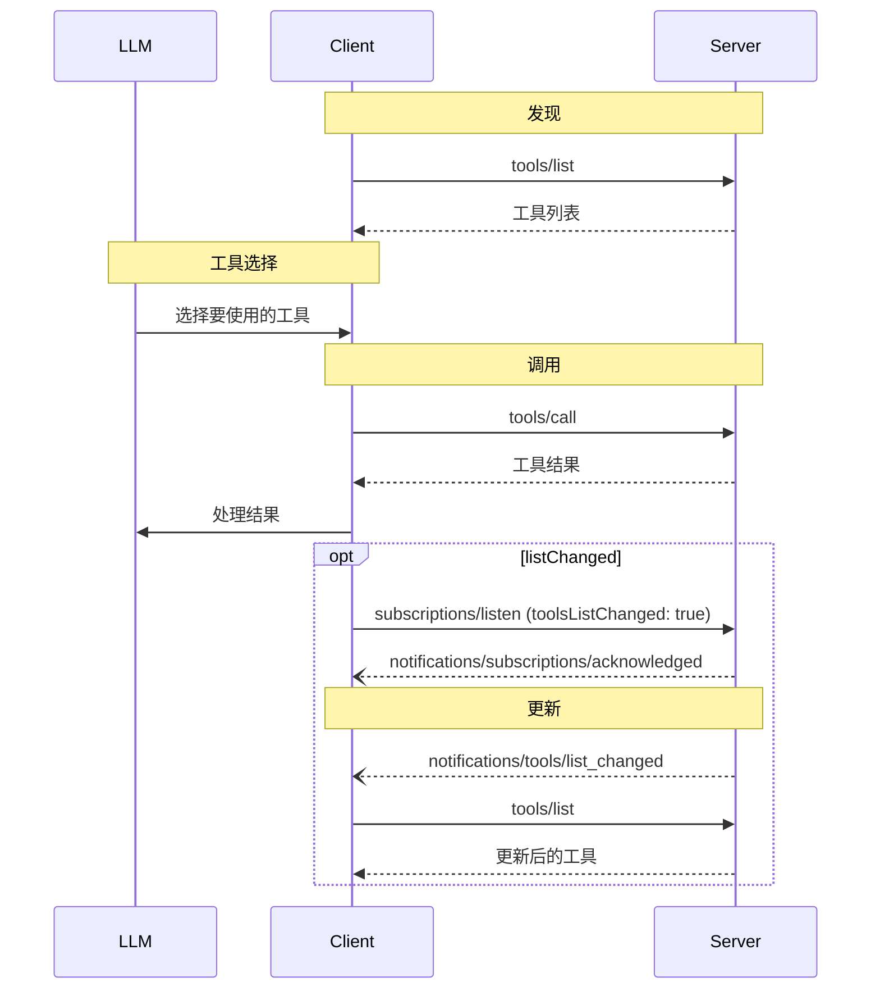

<div id="enable-section-numbers" />

模型上下文协议 (MCP) 允许服务器暴露可由语言模型调用的工具。工具使模型能够与外部系统交互，例如查询数据库、调用 API 或执行计算。每个工具都由一个名称唯一标识，并包含描述其模式的元数据。

## 用户交互模型

MCP 中的工具设计为 **模型控制**，这意味着语言模型可以根据其上下文理解和用户的提示自动发现和调用工具。

然而，实现可以自由地通过任何适合其需求的接口模式暴露工具&mdash;协议本身并不强制任何特定的用户交互模型。

<Warning>

为了信任、安全和安全性，**应当**始终有人类参与循环，能够拒绝工具调用。

应用程序 **应当**：

- 提供清晰显示哪些工具正暴露给 AI 模型的 UI
- 在调用工具时插入清晰的视觉指示器
- 向用户呈现操作确认提示，以确保人类参与循环

</Warning>

## 能力

支持工具的服务器 **必须** 声明 `tools` 能力：

```json
{
  "capabilities": {
    "tools": {
      "listChanged": true
    }
  }
}
```

`listChanged` 指示服务器是否在可用工具列表更改时发出通知。

声明 `tools` 能力的服务器 **必须** 以当前可供请求客户端使用的工具集合响应 `tools/list` 请求。该集合 **可以** 为空，也 **可以** 随时间变化（参见 [列表变更通知](#list-changed-notification)），但 **不得** 因连接不同而变化，也 **不得** 作为该连接上其他请求的副作用而变化。该集合 **可以** 随请求中提供的授权而变化——例如，仅返回调用方已获授权范围允许的工具——因为凭据是每次请求的输入，而不是连接状态。

服务器 **应当** 按确定性顺序返回工具（即当底层工具集合未发生变化时，不同请求之间保持相同排序）。确定性排序使客户端能够可靠地缓存工具列表，并在模型上下文中包含工具时提高 LLM 提示缓存命中率。

## 协议消息

### 列出工具

要发现可用工具，客户端发送 `tools/list` 请求。此操作支持 [分页](/specification/draft/server/utilities/pagination)。

**请求：**

```json
{
  "jsonrpc": "2.0",
  "id": 1,
  "method": "tools/list",
  "params": {
    "cursor": "optional-cursor-value"
  }
}
```

**响应：**

```json
{
  "jsonrpc": "2.0",
  "id": 1,
  "result": {
    "tools": [
      {
        "name": "get_weather",
        "title": "天气信息提供者",
        "description": "获取某个位置的当前天气信息",
        "inputSchema": {
          "type": "object",
          "properties": {
            "location": {
              "type": "string",
              "description": "城市名称或邮政编码"
            }
          },
          "required": ["location"]
        },
        "icons": [
          {
            "src": "https://example.com/weather-icon.png",
            "mimeType": "image/png",
            "sizes": ["48x48"]
          }
        ]
      }
    ],
    "nextCursor": "next-page-cursor"
  }
}
```

### 调用工具

要调用工具，客户端发送 `tools/call` 请求：

**请求：**

```json
{
  "jsonrpc": "2.0",
  "id": 2,
  "method": "tools/call",
  "params": {
    "name": "get_weather",
    "arguments": {
      "location": "纽约"
    }
  }
}
```

**响应：**

```json
{
  "jsonrpc": "2.0",
  "id": 2,
  "result": {
    "resultType": "complete",
    "content": [
      {
        "type": "text",
        "text": "纽约当前天气：\n温度：72°F\n天气状况：局部多云"
      }
    ],
    "isError": false
  }
}
```

### 需要输入的工具结果

服务器 **可以** 使用 [`InputRequiredResult`](/specification/draft/basic/utilities/mrtr#InputRequiredResult) 响应 `tools/call`，表示在完成工具调用之前还需要额外输入。这遵循 [多轮往返请求](/specification/draft/basic/utilities/mrtr#multi-round-trip-requests) 机制。

在使用输入响应重试请求时，客户端会在请求参数中包含 `inputResponses`，以及如果服务器提供了 `requestState`，则也会包含它：

**需要输入的响应：**

```json
{
  "jsonrpc": "2.0",
  "id": 2,
  "result": {
    "resultType": "input_required",
    "inputRequests": {
      "github_login": {
        "method": "elicitation/create",
        "params": {
          "mode": "form",
          "message": "请提供你的 GitHub 用户名",
          "requestedSchema": {
            "type": "object",
            "properties": {
              "name": { "type": "string" }
            },
            "required": ["name"]
          }
        }
      }
    },
    "requestState": "eyJsb2NhdGlvbiI6Ik5ldyBZb3JrIn0..."
  }
}
```

**使用输入响应重试：**

```json
{
  "jsonrpc": "2.0",
  "id": 3,
  "method": "tools/call",
  "params": {
    "name": "get_weather",
    "arguments": {
      "location": "New York"
    },
    "inputResponses": {
      "github_login": {
        "action": "accept",
        "content": {
          "name": "octocat"
        }
      }
    },
    "requestState": "eyJsb2NhdGlvbiI6Ik5ldyBZb3JrIn0..."
  }
}
```

请注意，初始请求与重试请求中的 JSON-RPC `id` **必须** 不同。

### 列表变更通知

当可用工具列表发生变化时，声明了 `listChanged` 能力的服务器 **应当** 向已打开带有 `toolsListChanged: true` 的 [`subscriptions/listen`](/specification/draft/basic/utilities/subscriptions) 流的客户端发送通知：

```json
{
  "jsonrpc": "2.0",
  "method": "notifications/tools/list_changed"
}
```

## 消息流



## 数据类型

### 工具

工具定义包括：

- `name`: 工具的唯一标识符
- `title`: 用于显示的可选人类可读工具名称。
- `description`: 功能的人类可读描述
- `icons`: 用于用户界面显示的可选图标数组
- `inputSchema`: 定义预期参数的 JSON Schema
  - 遵循 [JSON Schema 使用指南](/specification/draft/basic#json-schema-usage)
  - 如果不存在 `$schema` 字段，则默认为 2020-12
  - **必须** 是有效的 JSON Schema 对象（不能为 `null`）
  - 对于没有参数的工具，请使用以下有效方式之一：
    - `{ "type": "object", "additionalProperties": false }` - **推荐**：显式仅接受空对象
    - `{ "type": "object" }` - 接受任何对象（包括带有属性的对象）
  - 属性 **可以** 包含 [`x-mcp-header`](#x-mcp-header) 注解，以将参数值暴露为 HTTP 头
- `outputSchema`: 用于定义预期输出结构的可选 JSON Schema
  - 遵循 [JSON Schema 使用指南](/specification/draft/basic#json-schema-usage)
  - 如果不存在 `$schema` 字段，则默认为 2020-12
- `annotations`: 描述工具行为的可选属性

<Warning>
  为了信任、安全和安全性，客户端 **必须** 将工具注解视为不可信，除非它们来自受信任的服务器。
</Warning>

#### 工具名称

- 工具名称 **应当** 长度在 1 到 128 个字符之间（包含）。
- 工具名称 **应当** 被视为区分大小写。
- 以下 **应当** 是唯一允许的字符：大写和小写 ASCII 字母 (A-Z, a-z)、数字 (0-9)、下划线 (\_)、连字符 (-) 和点 (.)
- 工具名称 **不应当** 包含空格、逗号或其他特殊字符。
- 工具名称 **应当** 在服务器内唯一。
- 示例有效工具名称：
  - `getUser`
  - `DATA_EXPORT_v2`
  - `admin.tools.list`

<Note>

工具名称的唯一性范围限定于单个服务器。聚合来自多个服务器的工具的客户端或代理 **可能** 遇到命名冲突（例如，两个服务器各自暴露一个 `search` 工具），并且 **应当** 实现消歧策略，例如在工具名称前加上服务器标识符前缀。

服务器 `name`（来自 `serverInfo`）不能保证在各服务器之间唯一，**不应当** 依赖它来进行消歧。

</Note>

#### x-mcp-header

`x-mcp-header` 扩展属性允许服务器在使用 [Streamable HTTP transport](/specification/draft/basic/transports#custom-headers-from-tool-parameters) 时，将特定工具参数镜像到 HTTP 头中。
这使得网络中介（负载均衡器、代理、WAF）无需解析请求体即可基于参数值路由和处理请求。

`x-mcp-header` 属性直接放置在要镜像的属性的 JSON Schema 内。其值指定结果 `Mcp-Param-{name}` HTTP 头中的名称部分。

**`x-mcp-header` 值的约束：**

- **不得** 为空
- **必须** 仅包含 ASCII 字符，不包括空格和 `:`
- **必须** 在 `inputSchema` 中所有 `x-mcp-header` 值之间按大小写不敏感方式唯一
- **必须** 仅应用于原始类型参数（number、string、boolean）

客户端 **必须** 拒绝任何 `x-mcp-header` 值违反这些约束的工具定义。拒绝意味着客户端 **必须** 将无效工具从 `tools/list` 的结果中排除。客户端 **应当** 在拒绝工具定义时记录警告，包括工具名称和拒绝原因。这可确保单个格式错误的工具定义不会阻止其他有效工具的使用。

**带有 `x-mcp-header` 的工具定义示例：**

```json
{
  "name": "execute_sql",
  "description": "在 Google Cloud Spanner 上执行 SQL",
  "inputSchema": {
    "type": "object",
    "properties": {
      "region": {
        "type": "string",
        "description": "执行查询的区域",
        "x-mcp-header": "Region"
      },
      "query": {
        "type": "string",
        "description": "要执行的 SQL 查询"
      }
    },
    "required": ["region", "query"]
  }
}
```

在此示例中，当工具以 `"region": "us-west1"` 被调用时，客户端会向 HTTP 请求添加头 `Mcp-Param-Region: us-west1`。

<Warning>

服务器开发者 **不应当** 使用 `x-mcp-header` 标记敏感参数（密码、API 密钥、令牌、PII），因为头值对网络中介可见。

</Warning>

### 工具结果

工具结果可能包含 [**结构化**](#structured-content) 或 **非结构化** 内容。

**非结构化** 内容在结果的 `content` 字段中返回，并且可以包含多种不同类型的内容项：

<Note>
  所有内容类型（文本、图像、音频、资源链接和嵌入资源）都支持可选的 [注解](/specification/draft/server/resources#annotations)，提供有关受众、优先级和修改时间的元数据。这与资源和提示使用的注解格式相同。
</Note>

#### 文本内容

```json
{
  "type": "text",
  "text": "工具结果文本"
}
```

#### 图像内容

```json
{
  "type": "image",
  "data": "base64-encoded-data",
  "mimeType": "image/png",
  "annotations": {
    "audience": ["user"],
    "priority": 0.9
  }
}
```

#### 音频内容

```json
{
  "type": "audio",
  "data": "base64-encoded-audio-data",
  "mimeType": "audio/wav"
}
```

#### 资源链接

工具 **可以** 返回指向 [资源](/specification/draft/server/resources) 的链接，以提供额外的上下文或数据。在这种情况下，工具将返回一个 URI，客户端可以订阅或获取该 URI：

```json
{
  "type": "resource_link",
  "uri": "file:///project/src/main.rs",
  "name": "main.rs",
  "description": "主要应用程序入口点",
  "mimeType": "text/x-rust"
}
```

资源链接支持与常规资源相同的 [资源注解](/specification/draft/server/resources#annotations)，以帮助客户端了解如何使用它们。

<Info>
  工具返回的资源链接不保证出现在 `resources/list` 请求的结果中。
</Info>

#### 嵌入资源

[资源](/specification/draft/server/resources) **可以** 嵌入以使用合适的 [URI scheme](./resources#common-uri-schemes) 提供额外的上下文或数据。使用嵌入资源的服务器 **应当** 实现 `resources` 能力：

```json
{
  "type": "resource",
  "resource": {
    "uri": "file:///project/src/main.rs",
    "mimeType": "text/x-rust",
    "text": "fn main() {\n    println!(\"Hello world!\");\n}",
    "annotations": {
      "audience": ["user", "assistant"],
      "priority": 0.7,
      "lastModified": "2025-05-03T14:30:00Z"
    }
  }
}
```

嵌入资源支持与常规资源相同的 [资源注解](/specification/draft/server/resources#annotations)，以帮助客户端了解如何使用它们。

#### 结构化内容

结构化内容以结果的 `structuredContent` 字段中的 JSON 值返回。这可以是任何 JSON 值（对象、数组、字符串、数字、布尔值或 null），前提是它符合工具的 `outputSchema`（如果定义了）。

为了向后兼容，返回结构化内容的工具 **应当** 还在 TextContent 块中返回序列化的 JSON。

#### 输出模式

工具还可以提供输出模式以验证结构化结果。
如果提供了输出模式：

- 服务器 **必须** 提供符合此模式的结构化结果。
- 客户端 **应当** 针对此模式验证结构化结果。

带有输出模式的工具示例：

```json
{
  "name": "get_weather_data",
  "title": "天气数据检索器",
  "description": "获取某个位置的当前天气数据",
  "inputSchema": {
    "type": "object",
    "properties": {
      "location": {
        "type": "string",
        "description": "城市名称或邮政编码"
      }
    },
    "required": ["location"]
  },
  "outputSchema": {
    "type": "object",
    "properties": {
      "temperature": {
        "type": "number",
        "description": "摄氏温度"
      },
      "conditions": {
        "type": "string",
        "description": "天气状况描述"
      },
      "humidity": {
        "type": "number",
        "description": "湿度百分比"
      }
    },
    "required": ["temperature", "conditions", "humidity"]
  }
}
```

此工具的有效响应示例：

```json
{
  "jsonrpc": "2.0",
  "id": 5,
  "result": {
    "content": [
      {
        "type": "text",
        "text": "{\"temperature\": 22.5, \"conditions\": \"Partly cloudy\", \"humidity\": 65}"
      }
    ],
    "structuredContent": {
      "temperature": 22.5,
      "conditions": "Partly cloudy",
      "humidity": 65
    }
  }
}
```

带数组输出模式的工具示例：

```json
{
  "name": "list_users",
  "title": "User List",
  "description": "Returns a list of all users",
  "inputSchema": {
    "type": "object",
    "properties": {}
  },
  "outputSchema": {
    "type": "array",
    "items": {
      "type": "object",
      "properties": {
        "id": { "type": "string" },
        "name": { "type": "string" },
        "email": { "type": "string" }
      },
      "required": ["id", "name", "email"]
    }
  }
}
```

带数组输出的工具有效响应示例：

```json
{
  "jsonrpc": "2.0",
  "id": 6,
  "result": {
    "content": [
      {
        "type": "text",
        "text": "Found 2 users: Alice (alice@example.com) and Bob (bob@example.com)."
      }
    ],
    "structuredContent": [
      { "id": "1", "name": "Alice", "email": "alice@example.com" },
      { "id": "2", "name": "Bob", "email": "bob@example.com" }
    ]
  }
}
```

提供输出模式有助于客户端和 LLM 理解并正确处理结构化工具输出，其方式包括：

- 启用对响应的严格模式验证
- 提供类型信息以便更好地与编程语言集成
- 指导客户端和 LLM 正确解析和利用返回的数据
- 支持更好的文档和开发者体验

### 模式示例

#### 带有默认 2020-12 模式的工具：

```json
{
  "name": "calculate_sum",
  "description": "加两个数",
  "inputSchema": {
    "type": "object",
    "properties": {
      "a": { "type": "number" },
      "b": { "type": "number" }
    },
    "required": ["a", "b"]
  }
}
```

#### 带有显式 draft-07 模式的工具：

```json
{
  "name": "calculate_sum",
  "description": "加两个数",
  "inputSchema": {
    "$schema": "http://json-schema.org/draft-07/schema#",
    "type": "object",
    "properties": {
      "a": { "type": "number" },
      "b": { "type": "number" }
    },
    "required": ["a", "b"]
  }
}
```

#### 无参数工具：

```json
{
  "name": "get_current_time",
  "description": "返回当前服务器时间",
  "inputSchema": {
    "type": "object",
    "additionalProperties": false
  }
}
```

## 有状态工具

<Note>

本节是关于工具设计的非规范性指导。该协议并没有状态句柄的概念；从网络传输的角度来看，句柄只是工具结果中的普通字符串，以及后续工具调用中的普通参数。

</Note>

MCP 在协议层面没有会话，因此服务器不能依赖每个连接的隐式状态来关联前后两次工具调用。需要在调用之间维护状态的服务器——例如购物车、打开的浏览器上下文、数据库事务——应通过在创建工具中返回一个显式句柄，并在后续调用中将该句柄作为参数接收来实现。

例如，管理购物车的服务器可能会暴露：

```jsonc
// → 工具/调用
{ "name": "create_basket", "arguments": {} }

// ← 结果
{
  "content": [{ "type": "text", "text": "已创建购物篮 bsk_a1b2c3" }],
  "structuredContent": { "basket_id": "bsk_a1b2c3" }
}

// → 工具/调用
{
  "name": "add_item",
  "arguments": { "basket_id": "bsk_a1b2c3", "sku": "..." }
}
```

模型负责将 `basket_id` 继续传递下去；服务器将购物车内容存储在该键下，并在每次调用时查找它们。

在设计句柄时，服务器应考虑：

- **授权。** 对于已认证的服务器，句柄只是一个名称，而不是一个能力。服务器应在每次调用时根据句柄验证调用者的授权。对于未认证的服务器，由于句柄本质上就是持有者令牌，应使用足够的熵生成（例如 UUIDv4），并设置有界的有效期。
- **不透明性。** 编码了内部结构的句柄容易被解析或猜测；不透明标识符则不会。
- **生命周期。** 由于句柄会超出任何单次连接的存活时间，服务器的保留策略应在创建工具的描述中说明（例如：“购物篮在 24 小时无活动后过期”），这样模型在决定是否创建状态时就能看到。
- **过期错误。** 对已过期或未知句柄的调用应返回相应的工具执行错误，以便模型可以通过创建新的句柄来恢复。

## 错误处理

工具使用两种错误报告机制：

1. **协议错误** 表明请求结构本身存在问题，模型不太可能修复这些问题：
   - 未知工具
   - 格式错误的请求（未能满足 [CallToolRequest 架构](/specification/draft/schema#calltoolrequest) 的请求）
   - 服务器错误

   它们作为标准 JSON-RPC 错误返回：

   ```json
   {
     "jsonrpc": "2.0",
     "id": 3,
     "error": {
       "code": -32602,
       "message": "未知工具：invalid_tool_name"
     }
   }
   ```

2. **工具执行错误** 包含可操作的反馈，语言模型可以使用这些反馈进行自我纠正并使用调整后的参数重试：
   - API 故障
   - 输入验证错误（例如，日期格式错误、值超出范围）
   - 业务逻辑错误

   它们在工具结果中通过 `isError: true` 报告：

   ```json
   {
     "jsonrpc": "2.0",
     "id": 4,
     "result": {
       "content": [
         {
           "type": "text",
           "text": "无效的出发日期：必须在未来。当前日期是 08/08/2025。"
         }
       ],
       "isError": true
     }
   }
   ```

客户端 **MAY** 向语言模型提供协议错误，尽管这些错误不太可能导致成功恢复。  
客户端 **SHOULD** 向语言模型提供工具执行错误以启用自我纠正。

## 安全注意事项

1. 服务器 **MUST**：
   - 验证所有工具输入
   - 实施适当的访问控制
   - 限制工具调用速率
   - 清理工具输出

2. 客户端 **SHOULD**：
   - 在敏感操作上提示用户确认
   - 在调用服务器之前向用户显示工具输入，以避免恶意或
     意外的数据泄露
   - 在传递给 LLM 之前验证工具结果
   - 为工具调用实施超时
   - 记录工具使用情况以供审计
