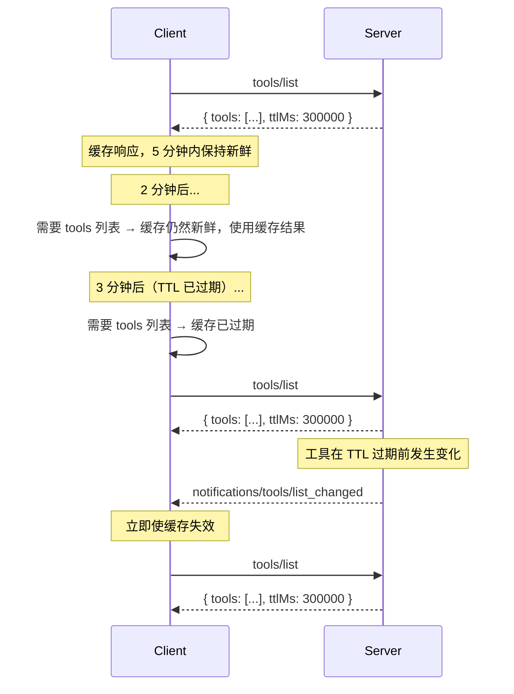

<div id="enable-section-numbers" />

模型上下文协议（MCP）支持对某些结果进行缓存。这使客户端能够缓存响应并减少不必要的重复获取。
缓存与[变更通知](#interaction-with-notifications)是互补的——两种
机制可以共存。

## 可缓存结果

服务器 MUST 在以下操作返回的结果中包含缓存提示：

- `server/discover`
- `tools/list`
- `prompts/list`
- `resources/list`
- `resources/templates/list`
- `resources/read`

## 可缓存模型

MCP 中的可缓存结果使用两个字段向客户端提供缓存提示：

- <b>生存时间（TTL）字段</b>，`ttlMs`，是一个以毫秒为单位的整数值，用于指定客户端 MAY 将结果视为新鲜的时长。
- <b>缓存范围字段</b>，`cacheScope`，表示缓存响应的预期范围，取值可以是 `"public"` 或 `"private"`。

### 生存时间（TTL）字段

`ttlMs` 字段是服务器给出的提示，表示客户端 MAY 在多少毫秒内认为结果仍然新鲜。其语义类似于 HTTP `Cache-Control: max-age`。

- 如果 `ttlMs` 为 `0`，则响应 **SHOULD** 被视为立即过期。客户端
  MAY 在每次需要结果时重新获取。
- 如果 `ttlMs` 为正值，客户端 **SHOULD** 在收到响应后的那段时间内
  将结果视为新鲜。
- 如果 `ttlMs` 缺失，客户端 **SHOULD** 默认将其视为 `0`（立即过期）
  并依赖自身的缓存启发式或通知。这种情况只应出现在较旧的服务器版本中。
- 如果 `ttlMs` 为负值，客户端 **SHOULD** 忽略它并将其视为 `0`。

服务器 **MUST** 提供一个 `ttlMs` 值，且该值 **>= 0**。

<Note>
  TTL 是一种 **新鲜度提示**，而不是保证。服务器 MAY 在 TTL 过期前更改
  底层数据。TTL 告诉客户端在多长时间内可以合理地避免重新获取，
  而不是数据保证保持不变的时长。
</Note>

#### 新鲜度计算

客户端记录收到响应时的本地时间（`t_received`）。只要满足以下条件，响应就被视为 **新鲜**：

```
now < t_received + ttlMs
```

一旦 TTL 过期，响应就变为 **过期**，客户端在下次访问时 **SHOULD** 重新获取。

客户端 **SHOULD NOT** 将 TTL 视为触发自动后台重新获取的轮询间隔。TTL 是一种新鲜度提示：客户端在需要数据时检查其新鲜度，仅在数据过期时才重新获取。如果实现确实选择轮询，则 **MUST** 使用抖动和退避。

如果客户端有理由相信数据已经变化，客户端 **MAY** 在 TTL 过期前重新获取（例如，工具调用收到意外错误，表明方法未找到或参数无效）。

如果在重新获取过程中发生错误，客户端 **MAY** 提供过期响应（例如，网络问题、服务器停机）。

### 缓存范围字段

`cacheScope` 字段控制谁可以缓存响应，类似于 HTTP
`Cache-Control: public` 与 `Cache-Control: private` 的区别。

| 值          | 含义                                                                                                                                                                                                                                                                           |
| ----------- | ------------------------------------------------------------------------------------------------------------------------------------------------------------------------------------------------------------------------------------------------------------------------------ |
| `"public"`  | 响应不包含用户特定数据。任何客户端、共享网关或缓存代理 **MAY** 存储该缓存响应，并将其提供给任何用户。                                                                                                                               |
| `"private"` | 响应包含不应在调用者之间共享的私有数据。缓存响应 **MAY** 在相同授权上下文中复用。缓存 **MUST NOT** 在不同授权上下文之间共享（例如，不同的访问令牌需要不同的缓存）。 |

#### 选择缓存范围

- 当工具、提示和资源模板列表对所有用户都相同时，**`"public"`** 是合适的。
- 对于依赖已认证用户的 `resources/read` 结果，或者因用户不同而变化的过滤列表结果，**`"private"`** 是合适的。

## 与通知的交互

TTL 和服务器推送通知是互补的：

- 服务器 **MAY** 提供 `ttlMs`，而不在其能力中声明 `listChanged: true`。在这种情况下，客户端完全依赖基于 TTL 的新鲜度判断。
- 服务器 **MAY** 同时声明 `listChanged: true` **并** 提供 `ttlMs`。在这种情况下，
  客户端可以使用 TTL 避免在通知之间不必要的重新获取，而通知则充当即时失效信号。

当在缓存响应仍然新鲜时收到相关通知，该通知会使缓存响应**失效**，并应被视为立即过期。



## 与分页的交互

当列表结果经过[分页](/specification/draft/server/utilities/pagination)时，每一页都是一个可独立缓存的响应——这与 HTTP
`Cache-Control` 对分页资源的处理方式一致。

- 每个页面响应都携带自己的 `ttlMs` 值。每一页的新鲜度计时从该页被接收时开始。
- 服务器 **MAY** 在不同页面返回不同的 `ttlMs` 值（例如，稳定列表的前几页 TTL 更长，最后一页 TTL 更短）。
- 当缓存页面过期时，客户端 **SHOULD** 使用其游标重新获取该页面。
- 不保证跨页一致性。如果底层数据在分页获取之间发生变化，客户端可能观察到重复或缺失。
- 需要完整列表一致性快照的客户端 **SHOULD** 从头开始重新获取（不带游标）。
- 如果某个游标变得无效（例如，服务器对之前有效的游标返回错误），客户端 **SHOULD** 丢弃所有已缓存页面并从头开始重新获取。

服务器 **MUST** 将相同的 `cacheScope` 应用于给定列表请求的所有响应页。例如，如果 `tools/list` 响应的第一页具有
`cacheScope: "private"`，则该请求的后续所有页面 **MUST** 也为
`"private"`。

## 安全注意事项

`cacheScope` 为 `"public"` 表示响应不包含用户特定数据，并且可以安全共享。服务器 MUST 意识到，带有 `"public"` `cacheScope` 的响应即使来自经过身份验证的端点，也可能在调用者之间共享。例如，来自经过身份验证的 `tools/list` 调用且 `cacheScope` 为 `"public"` 的结果，可能会被客户端缓存，并可能在初始请求的授权上下文之外共享。（即，不同的访问令牌可以利用同一个缓存）。

服务器实现者：

- 应确保 `cacheScope` 正确反映原语的预期可见性。
- MUST 对每个原语应用适当的访问控制，且 MUST NOT 仅依赖
  `cacheScope` 来防止对原语的未授权访问。
