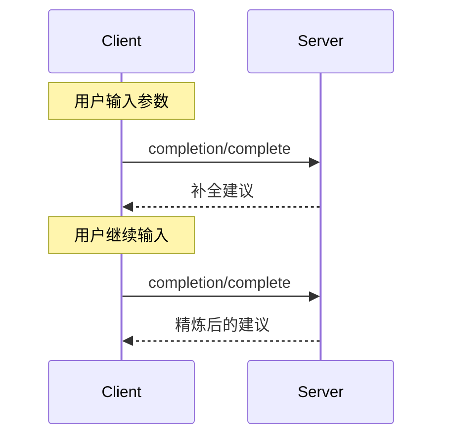

<div id="enable-section-numbers" />

Model Context Protocol (MCP) 提供了一种标准化方式，让服务器能够为提示词和资源模板的参数提供自动补全建议。当用户为特定提示词（通过名称识别）或资源模板（通过 URI 识别）填写参数值时，服务器可以提供上下文建议。

<Note>
  为简洁起见，本页中的请求示例省略了必需的 `_meta`
  请求元数据（`io.modelcontextprotocol/protocolVersion`、
  `io.modelcontextprotocol/clientInfo` 和
  `io.modelcontextprotocol/clientCapabilities`）。每个请求 **必须** 包含
  这些字段；请参见 [`_meta`](/specification/draft/basic/index#meta)。
</Note>

## 用户交互模型

MCP 中的补全功能旨在支持类似于 IDE 代码补全的交互式用户体验。

例如，应用程序可以在用户输入时在下拉菜单或弹出菜单中显示补全建议，并能够过滤和选择可用选项。

但是，实现方可以通过任何适合其需求的界面模式来暴露补全功能&mdash;协议本身并不强制要求任何特定的用户交互模型。

## 能力

支持补全功能的服务器 **必须** 声明 `completions` 能力：

```json
{
  "capabilities": {
    "completions": {}
  }
}
```

## 协议消息

### 请求补全

要获取补全建议，客户端发送 `completion/complete` 请求，通过引用类型指定正在补全的内容：

**请求：**

```json
{
  "jsonrpc": "2.0",
  "id": 1,
  "method": "completion/complete",
  "params": {
    "ref": {
      "type": "ref/prompt",
      "name": "code_review"
    },
    "argument": {
      "name": "language",
      "value": "py"
    }
  }
}
```

**响应：**

```json
{
  "jsonrpc": "2.0",
  "id": 1,
  "result": {
    "resultType": "complete",
    "completion": {
      "values": ["python", "pytorch", "pyside"],
      "total": 10,
      "hasMore": true
    }
  }
}
```

对于具有多个参数的提示词或 URI 模板，客户端应在 `context.arguments` 对象中包含之前的补全内容，以便为后续请求提供上下文。

**请求：**

```json
{
  "jsonrpc": "2.0",
  "id": 1,
  "method": "completion/complete",
  "params": {
    "ref": {
      "type": "ref/prompt",
      "name": "code_review"
    },
    "argument": {
      "name": "framework",
      "value": "fla"
    },
    "context": {
      "arguments": {
        "language": "python"
      }
    }
  }
}
```

**响应：**

```json
{
  "jsonrpc": "2.0",
  "id": 1,
  "result": {
    "resultType": "complete",
    "completion": {
      "values": ["flask"],
      "total": 1,
      "hasMore": false
    }
  }
}
```

### 引用类型

协议支持两种类型的补全引用：

| Type           | Description                               | Example                                             |
| -------------- | ----------------------------------------- | --------------------------------------------------- |
| `ref/prompt`   | 按名称引用提示词               | `{"type": "ref/prompt", "name": "code_review"}`     |
| `ref/resource` | 引用资源 URI 或 URI 模板 | `{"type": "ref/resource", "uri": "file:///{path}"}` |

### 补全结果

服务器返回按相关性排序的补全值数组，包括：

- 每个响应最多 100 项
- 可选的可用匹配总数
- 布尔值，指示是否存在更多结果

## 消息流



## 数据类型

### CompleteRequest

- `ref`: `PromptReference` 或 `ResourceTemplateReference`。对于
  `ResourceTemplateReference`，`uri` 是一个 URI 或 URI 模板。
- `argument`: 包含以下内容的对象：
  - `name`: 参数名称
  - `value`: 当前值
- `context`: 包含以下内容的对象：
  - `arguments`: 已解析参数名称到其值的映射。

### CompleteResult

- `completion`: 包含的对象：
  - `values`: 建议数组（最多 100 个）
  - `total`: 可选的匹配总数
  - `hasMore`: 更多结果标志

## 错误处理

服务器 **应该** 为常见失败情况返回标准 JSON-RPC 错误：

- 方法未找到：`-32601`（不支持的能力）
- 无效的提示词名称：`-32602`（无效的参数）
- 缺少必需参数：`-32602`（无效的参数）
- 内部错误：`-32603`（内部错误）

## 实现注意事项

1. 服务器 **应该**：
   - 返回按相关性排序的建议
   - 在适当的情况下实现模糊匹配
   - 对补全请求进行速率限制
   - 验证所有输入

2. 客户端 **应该**：
   - 对快速的补全请求进行防抖处理
   - 在适当的情况下缓存补全结果
   - 优雅地处理缺失或部分结果

## 安全性

实现方 **必须**：

- 验证所有补全输入
- 实施适当的速率限制
- 控制对敏感建议的访问
- 防止基于补全的信息泄露
