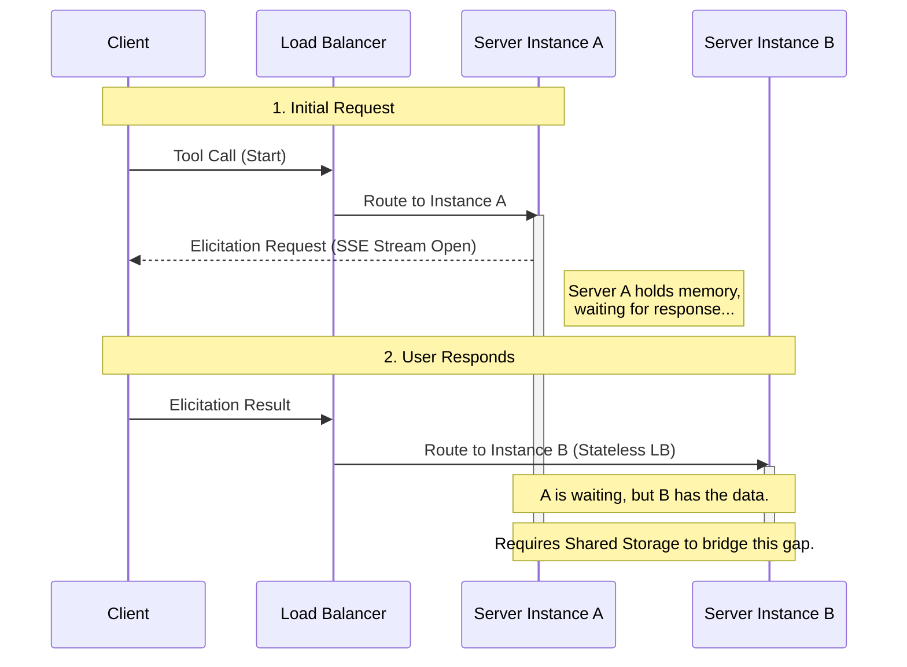
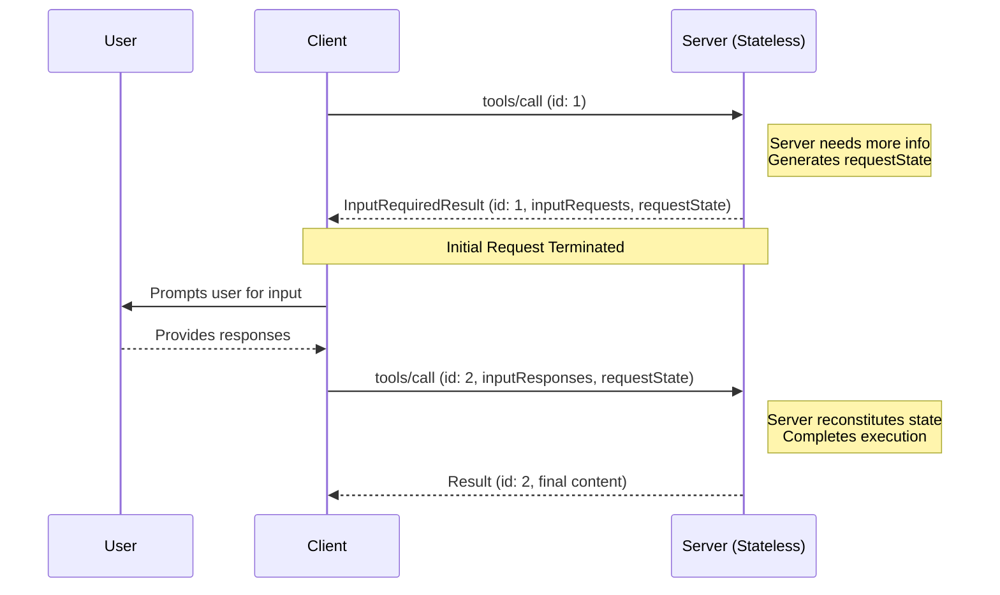
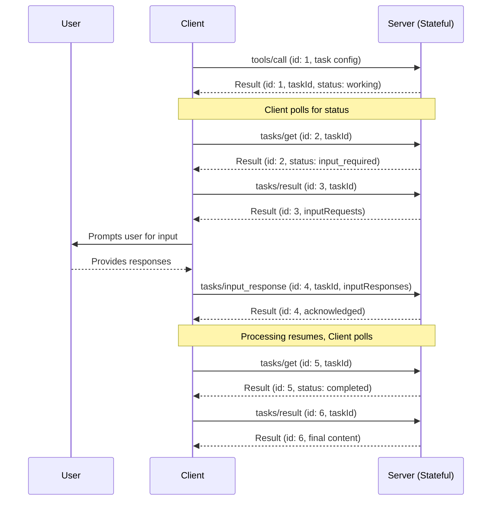

# SEP-2322: 多轮往返请求

- **Status**: Final
- **Type**: Standards Track
- **Created**: 2026-02-03
- **Author(s)**: Mark D. Roth (@markdroth), Caitie McCaffrey (@CaitieM20),
  Gabriel Zimmerman (@gjz22)
- **发起人**：Caitie McCaffrey (@CaitieM20)
- **PR**：https://github.com/modelcontextprotocol/specification/pull/{2322}

## 摘要

本提案规定了一种简单的方法，用于在客户端发起的请求上下文中处理服务器发起的请求
（例如，在工具调用上下文中的询问请求），而无需在多个服务器实例之间共享
存储层，也无需负载均衡具备状态保持能力。这将显著降低在常见场景下大规模运行
MCP 服务器的成本。它还减少了 HTTP 传输对 SSE 流的依赖，因为 SSE 流会在许多
无法支持长连接的环境中造成问题。

这种拟议的处理服务器发起请求的方式将取代当前发送服务器发起请求的方法。这是一个破坏性变更。

本 SEP 还规定了服务器可以在其上发送服务器发起请求的客户端请求子集。与当前规范相比，
其范围有所缩小，这同样也是一个破坏性变更。

之所以必须进行破坏性变更，是因为像 Elicitation、Sampling 和 ListRoots 这类
服务器发起请求功能，在许多远程 MCP 服务器或服务器托管客户端上采用率非常低，或者被阻断，
原因是支持 SSE 流和服务器端状态的运维复杂性很高。

## 动机

注：本 SEP 旨在提供一种通用机制，用于处理任何客户端发起请求上下文中的服务器发起请求。
为清晰起见，本文档中我们会专门以工具调用作为任何客户端发起请求的代表进行讨论，
但请将其理解为同样适用于（例如）资源或提示请求；类似地，我们会以询问请求作为
任何服务器发起请求的代表进行讨论，但请将其理解为同样适用于（例如）采样请求。

我们先观察 MCP 工具有两种类型：

1. **短暂型**：服务器端不累积状态。
   - 如果服务器在处理工具调用时需要更多信息，它在收到额外信息时可以从头开始。
   - 示例：天气应用、访问电子邮件
2. **持久型**：服务器端会累积状态。
   - 在向客户端请求更多信息之前，服务器可能已经生成了大量状态，并且在收到客户端信息后，
     可能需要接着使用这些状态继续处理。
   - 在等待客户端提供更多信息时，服务器可能需要在后台继续处理，此时需要服务器端状态来跟踪这项持续处理。
   - 示例：访问一个智能体、启动一台虚拟机并需要用户交互来操作该虚拟机

绝大多数 MCP 工具都是短暂型的，而且工具通常会部署在水平扩展、负载均衡的服务中，
因此我们需要针对这种情况进行优化。

目前，如果某个工具需要发送询问请求才能继续推进，工作流如下：

1. 客户端发送工具调用请求。对于这个示例，假设负载均衡器恰好将该请求发送到服务器实例 A。
2. 服务器 A 打开一个 SSE 流，并在该流上发送询问请求。
3. 客户端将询问响应作为一个独立请求发送，负载均衡器会为其选择一个与第 1 步完全独立的服务器实例。
   在这个示例中，假设负载均衡器恰好将该请求发送到服务器实例 B。
4. 服务器 A 必须设法发现发送到服务器 B 的询问响应。
5. 然后服务器 A 在第 2 步打开的 SSE 流上发送工具调用结果。



这里的难点在第 4 步，它需要某种服务器端状态保持能力。如今解决这个问题的主要方法是使用
所有服务器实例共享的存储层，这样多个服务器实例就能将一个服务器实例上的询问响应，
与另一个服务器实例上原始正在进行的工具调用配对起来。

目前可用来解决此问题的主要方法有两种：

- **跨服务器实例共享的持久存储层**：服务器可以部署并管理一个持久存储层
  （例如 PostgreSQL、Redis、DynamoDB），使多个服务器实例能够将一个实例上的询问响应，
  与另一个实例上原始正在进行的工具调用配对起来。这种方式有若干缺点：
  - 持久存储层**极其昂贵**，尤其是对于那些本来并不需要该层的短暂型工具（例如天气工具）。
  - 持久存储层带来显著的可靠性问题：它会变成关键依赖，因此可能成为单点故障。为避免这一点，
    它必须提供高可用、复制和备份机制。
  - 持久存储层会成为瓶颈，限制水平扩展能力。地理分布则需要昂贵的全局复制或粘性路由。
  - 持久存储层还会带来显著的运维复杂性。在水平扩展部署中，它需要分布式锁或共识协议。
    它还需要特殊的垃圾回收逻辑来判断何时可以清理共享状态，这需要谨慎权衡：过于激进地清理状态
    可以降低存储成本，但会限制用户可响应的时间；而清理不够激进则能容纳慢用户，但会增加存储成本。
  - 这种方式要求工具实现中有特殊行为，以便与持久存储层集成。当前 MCP SDK 并没有针对这类
    存储层集成的特殊钩子，这意味着很难通过 SDK 编写内联代码。
- **负载均衡中的状态保持**：借助 cookie，负载均衡层可以确保第 3 步中的询问请求被发送到与
  第 1 步原始请求相同的服务器实例。虽然这种方式通常比持久存储层便宜，但它有以下缺点：
  - 它要求负载均衡器进行特殊配置和行为，这通常难以管理。
  - 它破坏了正常的负载均衡模型，导致负载分布不均，从而提高服务运行成本。
  - 它要求客户端有特殊行为来传递用于状态保持的 cookie。
  - 它要求工具实现去匹配询问请求与正在进行的工具调用。（MCP SDK 中确实有一些代码来处理这一点，
    但在 HTTP 世界中这仍然是非常奇怪的模式。）
  - 它不具备故障容错能力。如果服务器实例宕机，所有状态都会丢失，工具调用需要从头开始。
    （这对短暂型工具未必重要，但对持久型工具而言是个问题。）

此外，这两种方法都依赖 SSE 流，而这会在无法支持长连接的环境中造成问题。它们还要求工具实例
无限期地保留在某个特定服务器实例的内存中。对于询问请求来说这尤其成问题，因为结果可能在很长时间内
都不会从用户那里返回（例如，可能是数天、数月，甚至永远不会）。

本 SEP 的目标是为处理客户端发起请求上下文中的服务器发起请求模式提供一种更简单的方法。
具体来说，我们需要在水平扩展、负载均衡部署中的短暂型工具这一常见场景下，降低支持这一模式的成本。
这意味着我们需要一个不依赖 SSE 流、也不需要持久存储层或有状态负载均衡的方案，
这反过来要求我们避免请求之间的依赖：服务器必须能够仅使用该单个请求中直接存在的信息来处理每个独立请求。

请注意，尽管这里的目标是优化短暂型工具这一常见场景，我们仍希望继续支持持久型工具，
而持久型工具通常本来就需要持久存储层。

## 规范

本 SEP 提出一种在客户端请求上下文中处理服务器请求的新机制。这种新机制对短暂型工具和持久型工具
将采用略有不同的工作流，其中后者会借助 Tasks。不过，这两种工作流都会使用相同的数据结构。

### 架构变更

首先，我们引入 `InputRequests` 的概念，它表示一组将被发送给客户端的一个或多个服务器发起请求；
同时引入 `InputResponses`，它表示客户端对这些请求的响应。请求和响应都存储在带字符串键的映射中。
对于 `InputRequests`，映射值是服务器发起请求（例如询问请求或采样请求）；而对于 `InputResponses`，
映射值则是对这些请求的响应。以下是在 typescript MCP schema 中的表示方式：

```typescript
export type InputRequest =
  | CreateMessageRequest
  | ElicitRequest
  | ListRootsRequest;

export interface InputRequests {
  [key: string]: InputRequest;
}

export type InputResponse =
  | CreateMessageResult
  | ElicitResult
  | ListRootsResult;

export interface InputResponses {
  [key: string]: InputResponse;
}
```

这些键由服务器在发起请求时分配。客户端会使用对应的键发送每个请求的响应。
例如，服务器可能发送如下输入请求：

```json5
"inputRequests": {
  // 询问请求。
  "github_login": {
    "method": "elicitation/create",
    "params": {
      "mode": "form",
      "message": "请提供你的 GitHub 用户名",
      "requestedSchema": {
        "type": "object",
        "properties": {
          "name": {
            "type": "string"
          }
        },
        "required": ["name"]
      }
    }
  },
  // 采样请求。
  "capital_of_france" : {
    "method": "sampling/createMessage",
    "params": {
      "messages": [
        {
          "role": "user",
          "content": {
            "type": "text",
            "text": "法国的首都是哪里？"
          }
        }
      ],
      "modelPreferences": {
        "hints": [
          {
            "name": "claude-3-sonnet"
          }
        ],
        "intelligencePriority": 0.8,
        "speedPriority": 0.5
      },
      "systemPrompt": "你是一个乐于助人的助手。",
      "maxTokens": 100
    }
  }
}
```

随后客户端会以如下形式发送响应：

```json5
"inputResponses": {
  // 询问响应（ElicitResult）。
  "github_login": {
    "action": "accept",
    "content": {
      "name": "octocat"
    }
  },
  // 采样响应（CreateMessageResult）。
  "capital_of_france": {
    "role": "assistant",
    "content": {
      "type": "text",
      "text": "法国的首都是巴黎。"
    },
    "model": "claude-3-sonnet-20240307",
    "stopReason": "endTurn"
  }
}
```

架构如下：

```typescript
export interface InputRequiredResult extends Result {
  // 由服务器发出的、在客户端重试原始请求前必须完成的请求。
  inputRequests?: InputRequests;
  // 将在客户端重试原始请求时回传给服务器的请求状态。
  // 注意：客户端必须将其视为不透明数据块；不得以任何方式解析它。
  requestState?: string;
}

// 包含输入响应和请求状态的 RequestParams 类型。
// 这些参数可以包含在任何客户端发起的请求中。
export interface InputResponseRequestParams extends RequestParams {
  // 新字段，用于承载来自 InputRequiredResult 消息的服务器请求的响应。
  // 对于 response 的 inputRequests 字段中的每个键，这里都必须出现同样的键及其关联响应。
  inputResponses?: InputResponses;
  // 从客户端回传给服务器的请求状态。
  requestState?: string;
}
```

由于此变更会为诸如 `tools/call` 之类的方法调用引入多态响应，因此我们要在 `Result` 中新增一个字段，用来指示 `ResultType`。客户端应解析该字段，以确定消息中所含 `Result` 的类型。如果未提供该字段，出于向后兼容性考虑，客户端应假定 `ResultType` 为 `"complete"`。

扩展 **MAY** 增加额外的 `ResultType` 值。支持的 `ResultType` 值集合 **MUST** 由核心协议中定义的集合构成，并包含通过 capabilities 公布的任意受支持扩展的附加值。

客户端 **SHOULD** 将无法识别的值视为无效协议响应。

schema 变更如下：

```typescript
/**
 * 通用结果字段。
 *
 * @category Common Types
 */
export interface Result {
  _meta?: MetaObject;
  // 用于指示结果类型的新字段，使客户端能够确定如何解析结果对象。如果未指定 resultType，则应假定为 "complete"。
  resultType: ResultType;
  [key: string]: unknown;
}

export type ResultType =
  | "complete" // 该请求已成功完成，结果包含最终内容。
  | "input_required" // 该请求尚未完成，结果包含一个 {@link InputRequiredResult} 对象
  | string; // 可供扩展
```

我们预计该字段将对未来的扩展性很有帮助，因为它允许我们引入新的结果类型，也可以同样适用于 `tasks`。

这些类型将用于两种不同的工作流，一种用于短暂型工具，另一种用于持久型工具。

### 对客户端请求的服务器发起请求支持

许多 `ClientRequest` 并没有明确的使用场景，需要服务器向客户端请求更多信息。本文档基于 [SEP-2260](https://modelcontextprotocol.io/seps/2260-Require-Server-requests-to-be-associated-with-Client-requests) 并进一步限制了服务器可以向客户端发送服务器发起请求的情况。

服务器 MAY 在以下客户端请求上发送 `InputRequiredResult` 响应：

| ClientRequest           | ServerResult           | InputRequiredResult Supported |
| ----------------------- | ---------------------- | ----------------------------- |
| `GetPromptRequest`      | `GetPromptResult`      | Yes                           |
| `ReadResourceRequest`   | `ReadResourceResult`   | Yes                           |
| `CallToolRequest`       | `CallToolResult`       | Yes                           |
| `GetTaskPayloadRequest` | `GetTaskPayloadResult` | Yes                           |

服务器 MUST NOT 在任何其他客户端请求上发送 `InputRequiredResult` 响应。下面的表格表示在撰写本 SEP 时排除的 `ClientRequest`。

| ClientRequest                  | InputRequiredResult Supported |
| ------------------------------ | ----------------------------- |
| `PingRequest`                  | No                            |
| `InitializeRequest`            | No                            |
| `CompleteRequest`              | No                            |
| `SetLevelRequest`              | No                            |
| `ListPromptsRequest`           | No                            |
| `ListResourcesRequest`         | No                            |
| `ListResourceTemplatesRequest` | No                            |
| `SubscribeRequest`             | No                            |
| `UnsubscribeRequest`           | No                            |
| `ListToolsRequest`             | No                            |
| `GetTaskRequest`               | No                            |
| `ListTasksRequest`             | No                            |
| `CancelTaskRequest`            | No                            |
| `TaskInputResponseRequest`     | No                            |

### 短暂型工具工作流

对于短暂型用例，除了输入请求之外，我们还引入请求状态的概念。当服务器需要更多信息时，请求状态会发送给客户端，
客户端会把状态原样回传给服务器，从而允许服务器保持无状态。

我们将为短暂型工具采用如下工作流：

1. 客户端发送工具调用请求。
2. 服务器返回一个单独的响应，表明请求不完整。该响应可以包含客户端必须完成的输入请求。
   它也可以包含一些请求状态，客户端必须将其回传给服务器。此响应会终止原始请求。
   通常它会作为单独响应发送，而不是在 SSE 流上发送；不过目前（这在未来某个 SEP 中可能会改变）
   也允许在 SSE 流上发送这个响应，且应当位于（例如）进度通知之后。如果这个不完整响应是通过 SSE 流发送的，
   那么它必须是 SSE 流上的最后一条消息，就像普通响应一样。
3. 客户端发送一个新的工具调用请求，它与原始请求完全独立。这个新的工具调用包含第 2 步中输入请求的响应。
   它还包含服务器在第 2 步指定的请求状态。
4. 服务器返回一个 CallToolResponse。



请注意，第 1 步和第 3 步中的请求是完全独立的：处理第 3 步请求的服务器不需要任何
并未直接存在于该请求中的信息。为了支持这种解耦，第 1 步和第 3 步发送的 JsonRPC Id
MUST 不同。

请注意，`inputRequests` 和 `requestState` 字段只会影响客户端下一次对原始请求的重试。
它们不会用于客户端可能并行发送的任何其他请求（例如工具列表，甚至另一个工具调用）。

<details>
<summary>点击展开：短暂型工具示例流程</summary>
<b>短暂型工具示例流程</b>

注：这是一个人为构造的示例，仅用于说明流程。

1. 客户端发送初始工具调用请求：

```json
{
  "jsonrpc": "2.0",
  "id": 2,
  "method": "tools/call",
  "params": {
    "name": "get_weather",
    "arguments": {
      "location": "New York"
    }
  }
}
```

2. 服务器返回一个不完整响应，表明客户端需要响应一个询问请求，工具调用才能完成，并包含要回传的请求状态：

```json
{
  "jsonrpc": "2.0",
  "id": 2,
  "result": {
    "resultType": "input_required",
    "inputRequests": {
      "github_login": {
        "method": "elicitation/create",
        "params": {
          "mode": "form",
          "message": "请提供你的 GitHub 用户名",
          "requestedSchema": {
            "type": "object",
            "properties": {
              "name": {
                "type": "string"
              }
            },
            "required": ["name"]
          }
        }
      }
    },
    "requestState": "foo"
  }
}
```

3. 客户端随后重试原始工具调用，这次包含对服务器输入请求的响应和请求状态：

```json
{
  "jsonrpc": "2.0",
  "id": 3,
  "method": "tools/call",
  "params": {
    "name": "get_weather",
    "arguments": {
      "location": "New York"
    },
    "inputResponses": {
      "github_login": {
        "action": "accept",
        "content": {
          "name": "octocat"
        }
      }
    },
    "requestState": "foo"
  }
}
```

4. 最后，服务器完成工具调用：

```json
{
  "jsonrpc": "2.0",
  "id": 3,
  "result": {
    "resultType": "complete",
    "content": [
      {
        "type": "text",
        "text": "纽约当前天气：\n温度：72°F\n状况：局部多云"
      }
    ],
    "isError": false
  }
}
```

</details>

#### 短暂型工作流的真实世界示例

这个示例展示了 `requestState` 如何支持一个由 [Azure DevOps 自定义规则](https://learn.microsoft.com/en-us/azure/devops/organizations/settings/work/custom-rules?view=azure-devops)
驱动的多轮往返询问流程。场景涉及一个 `update_work_item` 工具，它会将一个 Bug 工作项转换为“Resolved”。
ADO 自定义规则要求在某些状态转换发生时填写特定字段，而服务器使用迭代式询问来收集这些字段——并在多轮之间
在 `requestState` 中累积上下文，从而最终更新可以在没有任何服务器端存储的情况下执行。

<details>
<summary>点击展开 ADO 自定义规则示例</summary>

**背景 — ADO 自定义规则生效中：**

- _规则 1：_ 当 State 变为 "Resolved" → 需要 "Resolution" 字段（例如，Fixed、Won't Fix、Duplicate、By Design）。
- _规则 2：_ 当 Resolution 为 "Duplicate" → 需要 "Duplicate Of" 字段（指向原始工作项的链接）。

##### 第 1 轮 — 工具调用触发状态变更，服务器询问 Resolution

1. 客户端调用 `update_work_item` 工具来将 Bug #4522 解决：

```json
{
  "jsonrpc": "2.0",
  "id": 1,
  "method": "tools/call",
  "params": {
    "name": "update_work_item",
    "arguments": {
      "workItemId": 4522,
      "fields": { "System.State": "Resolved" }
    }
  }
}
```

2. 服务器识别出将 State 设为 "Resolved" 会触发规则 1，而该规则要求提供 Resolution 值。服务器没有直接失败，而是返回一个带有询问请求的不完整响应。此时还不需要 `requestState`，因为原始工具调用参数会在重试时重新发送：

```json
{
  "jsonrpc": "2.0",
  "id": 1,
  "result": {
    "resultType": "input_required",
    "inputRequests": {
      "resolution": {
        "method": "elicitation/create",
        "params": {
          "message": "将 Bug #4522 设为已解决需要一个 resolution。这个 bug 是如何被解决的？",
          "requestedSchema": {
            "type": "object",
            "properties": {
              "resolution": {
                "type": "string",
                "enum": ["Fixed", "Won't Fix", "Duplicate", "By Design"],
                "description": "该 bug 的 resolution 类型"
              }
            },
            "required": ["resolution"]
          }
        }
      }
    }
  }
}
```

3. 用户选择 "Duplicate"。客户端带着询问响应重试原始工具调用：

```json
{
  "jsonrpc": "2.0",
  "id": 2,
  "method": "tools/call",
  "params": {
    "name": "update_work_item",
    "arguments": {
      "workItemId": 4522,
      "fields": { "System.State": "Resolved" }
    },
    "inputResponses": {
      "resolution": {
        "action": "accept",
        "content": { "resolution": "Duplicate" }
      }
    }
  }
}
```

##### 第 2 轮 — Resolution 触发另一条规则，服务器询问 Duplicate Of

4. 服务器合并用户响应后发现，Resolution = "Duplicate" 触发规则 2，需要一个 "Duplicate Of" 链接。
   它返回另一个不完整响应，这次将已经收集到的 resolution 编码进 `requestState`，这样无论下一次重试由哪个服务器实例处理，
   这些信息都可用：

```json
{
  "jsonrpc": "2.0",
  "id": 2,
  "result": {
    "resultType": "input_required",
    "inputRequests": {
      "duplicate_of": {
        "method": "elicitation/create",
        "params": {
          "message": "由于这是一个重复项，原始工作项是哪一个？",
          "requestedSchema": {
            "type": "object",
            "properties": {
              "duplicateOfId": {
                "type": "number",
                "description": "原始 bug 的工作项 ID"
              }
            },
            "required": ["duplicateOfId"]
          }
        }
      }
    },
    "requestState": "eyJyZXNvbHV0aW9uIjoiRHVwbGljYXRlIn0..."
  }
}
```

5. 用户提供原始工作项 ID。客户端重试工具调用，回传 `requestState` 并包含新的询问响应：

```json
{
  "jsonrpc": "2.0",
  "id": 3,
  "method": "tools/call",
  "params": {
    "name": "update_work_item",
    "arguments": {
      "workItemId": 4522,
      "fields": { "System.State": "Resolved" }
    },
    "inputResponses": {
      "duplicate_of": {
        "action": "accept",
        "content": { "duplicateOfId": 4301 }
      }
    },
    "requestState": "eyJyZXNvbHV0aW9uIjoiRHVwbGljYXRlIn0..."
  }
}
```

##### 最终 — 服务器完成更新

6. 服务器解码 `requestState`（其中包含 resolution），读取 `inputResponses`（其中包含 duplicate ID），现在已经拥有所有必需字段。它完成工具调用：

```json
{
  "jsonrpc": "2.0",
  "id": 3,
  "result": {
    "resultType": "complete",
    "content": [
      {
        "type": "text",
        "text": "Bug #4522 已解决为 Bug #4301 的重复项。状态已设为 Resolved，并已创建重复链接。"
      }
    ],
    "isError": false
  }
}
```

**关键结论：** 在两轮询问过程中，服务器都没有持有任何内存中的或持久化的状态。`requestState`
字段通过客户端承载了累积上下文，而任何服务器实例都可以处理任意一轮。

</details>

#### 请求状态的用例

`requestState` 机制提供了一种对同一逻辑请求进行多次往返的方法。它主要有两个用例。

##### 用例 1：滚动升级

假设你正在对水平扩展的服务器实例进行滚动升级，以部署某个工具实现的新版本。
旧版本有两个输入请求，键分别为 "github_login" 和 "google_login"。然而在新版本的工具实现中，
它仍然使用 "github_login" 输入请求，但将 "google_login" 输入请求替换成了新的 "microsoft_login" 输入请求。

如果第一个请求发送到服务器的旧版本，而第二次尝试（包含输入响应）发送到服务器的新版本，
那么服务器会看到它需要的 "github_login" 结果，但看不到 "microsoft_login" 的结果。
（它也会看到 "google_login" 的结果，但它已经不再需要这个结果，所以没关系。）
此时服务器需要发送一个针对 "microsoft_login" 的新输入请求，但它又不想丢失已经得到的 "github_login" 答案，
因此它会使用 1685 中提出的那类状态来保留该信息，而无需在服务器端存储该状态。

这里的工作流如下：

1. 客户端发送一个工具调用请求，该请求命中了运行旧版本的服务器实例。
2. 服务器返回一个不完整响应，指出需要 "github_login" 和 "google_login" 的输入请求。
3. 客户端发送一个新的工具调用请求，其中包含对 "github_login" 和 "google_login" 输入请求的响应。
   这一次它命中了运行新版本的服务器实例。
4. 服务器返回另一个不完整响应，指出需要 "microsoft_login" 的输入请求，而客户端尚未提供该请求。
   然而，该响应也包含请求状态，其中保留了已提供的 "github_login" 响应，因此客户端无需再次提示用户提供相同信息。
5. 客户端发送第三个工具调用请求，其中包含对 "microsoft_login" 输入请求的响应，并回传服务器在第 4 步提供的请求状态。
6. 服务器现在在请求状态中看到 "github_login" 信息，在输入响应中看到 "microsoft_login" 状态，因此该请求已经包含服务器执行工具调用并返回完整响应所需的一切。

##### 用例 2：负载削减

假设你有一个 MCP 服务器实例正在处理一批工具调用，并且它发现自身负载过高，因此它想把其中一个正在进行的工具调用转移到另一个服务器实例。
然而，它已经对该工具调用进行了大量处理，因此它不想简单地让调用失败并让客户端在另一个服务器实例上从头开始；
相反，它希望保留已经累积的状态，这样无论哪个服务器实例恢复处理，都可以从原始服务器实例停止的地方继续。
这可以通过发送一个包含请求状态但不包含任何输入请求的不完整请求来实现。

这里的工作流如下：

1. 客户端发送原始请求，负载均衡器将其路由到服务器实例 A。
2. 服务器实例 A 在做了大量计算后决定需要削减负载。它发送一个不完整响应，其中在 `requestState`
   字段中包含其累积状态，但不包含 `inputRequests` 字段。
3. 客户端使用附加了 `requestState` 字段的请求进行重试。负载均衡器将该请求路由到服务器实例 B。
4. 服务器实例 B 从它在 `requestState` 字段中看到的状态开始，从而接续服务器实例 A 停止的计算，最终返回完整响应。

#### 短暂型工作流的协议要求

1. **服务器行为：**
   - 服务器 MAY 对任何客户端发起的请求响应 `InputRequiredResult`。
     该消息 MAY 作为独立响应发送，或者作为 SSE 流上的最后一条消息发送，不过实现方应优先使用前者。
     如果使用 SSE 流，服务器 MUST NOT 在不完整响应消息之后继续在该流上发送任何消息。
   - `InputRequiredResult` MAY 包含 `inputRequests` 字段。
   - `InputRequiredResult` MAY 包含 `requestState` 字段。如果指定，该字段是一个仅对服务器有意义的不透明字符串。
     服务器可以自由选择任意格式来编码状态（例如普通 JSON、base64 编码 JSON、加密 JWT、序列化二进制等）。
   - 如果请求包含 `requestState` 字段，服务器 MUST 始终验证该状态，因为客户端是不可信中介。
     如果担心篡改，服务器 SHOULD 使用其选择的加密算法加密 `requestState` 字段（例如，可以使用 AES-GCM 或签名 JWT）
     以确保机密性和完整性。请注意，还存在重放/劫持攻击风险，即经过身份验证的攻击者重新发送原本发送给另一个用户的状态。
     因此，如果请求状态包含任何特定于原始用户的数据，服务器 MUST 使用某种机制在密码学上将数据绑定到原始用户，
     并 MUST 验证客户端发送的 `requestState` 数据与当前经过身份验证的用户相关联。使用明文状态的服务器 MUST 将解码后的值视为不可信输入，
     并以与验证任何客户端提供数据相同的方式验证它们。

2. **客户端行为：**
   - 如果客户端收到 `InputRequiredResult` 消息，且该消息包含 `inputRequests` 字段，那么客户端 MUST 在重试原始请求前构造所请求的输入。
     相比之下，如果该消息不包含 `inputRequests` 字段，则客户端 MAY 立即重试原始请求。
   - 如果客户端收到包含 `requestState` 字段的 `InputRequiredResult` 消息，那么在重试原始请求时，它 MUST 原样回传该字段的确切值。
     客户端 MUST NOT 检查、解析、修改或对 `requestState` 内容作任何假设。如果 `InputRequiredResult` 不包含 `requestState` 字段，
     客户端 MUST NOT 在重试中包含该字段。

### 持久型工具工作流

持久型工具工作流将借助 Tasks。[`Tasks`](https://modelcontextprotocol.io/specification/draft/basic/utilities/tasks) 已经提供了一种机制，
用于指示完成请求还需要更多信息。`input_required` Task Status 允许服务器表明需要额外信息来完成任务处理。

`Tasks` 的工作流如下：

1. 服务器将 Task Status 设为 `input_required`。此时服务器可以暂停处理该请求。
2. 客户端通过调用 `tasks/get` 检索 Task Status，并看到还需要更多信息。
3. 客户端调用 `tasks/result`
4. 服务器返回 `InputRequests` 对象。
5. 客户端调用 `tasks/input_response` 请求，其中包含 `InputResponses` 对象以及 `Task` 元数据字段。
6. 服务器恢复处理，并将 TaskStatus 改回 `working`。



由于 `Tasks` 很可能运行时间更长、具有相关状态、且计算成本更高，因此请求更多信息并不会结束最初请求的操作
（例如工具调用）。相反，在必要信息提供后，服务器可以恢复处理。

为了与 MRTR 语义保持一致，服务器会对 `tasks/result` 请求返回一个 `InputRequests` 对象。二者将具有相同的 JsonRPC `id`。
当客户端以 `InputResponses` 对象响应时，这是一条新的客户端请求，具有新的 JSONRPC `id`，因此需要新的方法名。
我们提议使用 `tasks/input_response`。

上述工作流和下面的示例都没有使用任何可选的 Task Status Notifications，尽管本 SEP 并不排除其使用。

<details>
<summary>点击展开：持久型工具示例流程</summary>

下面的示例演示了一个 Echo Tool 的完整 Task Message 流程，该工具可以通过 Elicitation 向客户端请求额外信息。

1. <b>客户端请求</b> 调用 EchoTool。

```json
{
  "jsonrpc": "2.0",
  "id": 1,
  "method": "tools/call",
  "params": {
    "name": "echo",
    "task": {
      "ttl": 60000
    }
  }
}
```

2. <b>服务器响应</b> 一个 `Task`

```json
{
  "id": 1,
  "jsonrpc": "2.0",
  "result": {
    "task": {
      "taskId": "echo_dc792e24-01b5-4c0a-abcb-0559848ca3c5",
      "status": "working",
      "statusMessage": "Task has been created for echo tool invocation.",
      "createdAt": "2026-01-27T03:32:48.3148180Z",
      "lastUpdatedAt": "2026-01-27T03:32:48.3148180Z",
      "ttl": 60000,
      "pollInterval": 100
    }
  }
}
```

3. <b>客户端请求</b> 使用 `tasks/get` 周期性检查 `Task` 的状态。

```json
{
  "jsonrpc": "2.0",
  "id": 2,
  "method": "tasks/get",
  "params": {
    "taskId": "echo_dc792e24-01b5-4c0a-abcb-0559848ca3c5"
  }
}
```

4. <b>服务器响应</b> Task 状态为 `input_required`

```json
{
  "id": 2,
  "jsonrpc": "2.0",
  "result": {
    "taskId": "echo_dc792e24-01b5-4c0a-abcb-0559848ca3c5",
    "status": "input_required",
    "statusMessage": "Input Required to Proceed call tasks/result",
    "createdAt": "2026-01-27T03:38:07.7534643Z",
    "lastUpdatedAt": "2026-01-27T03:38:07.7534643Z",
    "ttl": 60000,
    "pollInterval": 100
  }
}
```

5. <b>客户端请求</b> 发送 `tasks/result` 消息，以了解继续执行所需的输入。

```json
{
  "jsonrpc": "2.0",
  "id": 3,
  "method": "tasks/result",
  "params": {
    "taskId": "echo_dc792e24-01b5-4c0a-abcb-0559848ca3c5"
  }
}
```

6. <b>服务器响应</b> 返回 `inputRequests` 以请求额外输入

```json
{
  "id": 3,
  "jsonrpc": "2.0",
  "result": {
    "resultType": "input_required",
    "inputRequests": {
      "echo_input": {
        "method": "elicitation/create",
        "params": {
          "mode": "form",
          "message": "请提供要回显的输入字符串",
          "requestedSchema": {
            "type": "object",
            "properties": {
              "input": { "type": "string" }
            },
            "required": ["input"]
          }
        }
      }
    }
  },
  "_meta": {
    "io.modelcontextprotocol/related-task": {
      "taskId": "echo_dc792e24-01b5-4c0a-abcb-0559848ca3c5"
    }
  }
}
```

7. <b>客户端请求</b> 向用户展示 Elicitation，收集输入，然后向服务器发送消息。

```json
{
  "jsonrpc": "2.0",
  "id": 4,
  "method": "tasks/input_response",
  "params": {
    "inputResponses": {
      "echo_input": {
        "action": "accept",
        "content": {
          "input": "Hello World!"
        }
      }
    },
    "_meta": {
      "io.modelcontextprotocol/related-task": {
        "taskId": "echo_dc792e24-01b5-4c0a-abcb-0559848ca3c5"
      }
    }
  }
}
```

8. <b>服务器响应</b> 服务器应通过发送 `JSONRPCResponse` 来确认收到 `tasks/input_response` 消息。若消息成功接收，则发送包含 `taskId` 的 `JSONRPCResultResponse`。若发生错误，则发送 `JSONRPCErrorResponse`。服务器现在可以使用提供的输入继续完成 `Task`，并且 `Task` 状态变为 `Working`。

```json
{
  "id": 4,
  "jsonrpc": "2.0",
  "result": {
    "_meta": {
      "io.modelcontextprotocol/related-task": {
        "taskId": "echo_dc792e24-01b5-4c0a-abcb-0559848ca3c5"
      }
    }
  }
}
```

9. <b>客户端请求</b> 继续使用 `tasks/get` 轮询输入状态，直到服务器响应 Task 状态为 `Completed`

```json
{
  "jsonrpc": "2.0",
  "id": 5,
  "method": "tasks/get",
  "params": {
    "taskId": "echo_dc792e24-01b5-4c0a-abcb-0559848ca3c5"
  }
}
```

10. <b>服务器响应</b> Task 状态为 `completed`

```json
{
  "id": 5,
  "jsonrpc": "2.0",
  "result": {
    "taskId": "echo_dc792e24-01b5-4c0a-abcb-0559848ca3c5",
    "status": "completed",
    "statusMessage": "Task has been completed successfully, call tasks/result",
    "createdAt": "2026-01-27T03:38:07.7534643Z",
    "lastUpdatedAt": "2026-01-27T03:38:08.1234567Z",
    "ttl": 60000,
    "pollInterval": 100
  }
}
```

11. <b>客户端请求</b> 调用 `tasks/result` 以获取该 `Task` 的最终结果。

```json
{
  "id": 6,
  "jsonrpc": "2.0",
  "method": "tasks/result",
  "params": {
    "taskId": "echo_dc792e24-01b5-4c0a-abcb-0559848ca3c5"
  }
}
```

12. <b>服务器响应</b> 返回该 `Task` 的最终结果

```json
{
  "id": 6,
  "jsonrpc": "2.0",
  "result": {
    "resultType": "complete",
    "isError": false,
    "content": [
      {
        "type": "text",
        "text": "Echo: Hello World!"
      }
    ],
    "_meta": {
      "io.modelcontextprotocol/related-task": {
        "taskId": "echo_dc792e24-01b5-4c0a-abcb-0559848ca3c5"
      }
    }
  }
}
```

</details>

#### 持久型工作流的协议要求

1. **服务器行为：**
   - 服务器 MAY 通过表明任务处于 `input_required` 状态来响应 `tasks/get`。
   - 当任务处于 `input_required` 状态时，服务器 MUST 在 `tasks/result` 响应中包含 `inputRequests` 字段。

2. **客户端行为：**
   - 当 `tasks/get` 显示状态为 `input_required` 时，客户端 MUST 调用 `tasks/result` 以获取输入请求。客户端 SHOULD 构造这些请求的结果，然后调用 `tasks/input_response` 并携带输入响应，以为任务提供所需输入。
   - 客户端 MAY 选择不满足这些输入请求，在这种情况下可以取消任务。

### 短暂型与持久型工作流之间的交互

如果某个工具实现需要客户端先对一组输入请求作出响应，才能开始处理，但之后又需要进行持久处理，那么它可以先使用短暂型工作流，
然后在那一刻创建任务并切换到持久型工作流。这样就避免了服务器在真正拥有开始处理请求所需信息之前必须存储状态。

该工作流如下：

1. 客户端发送带有 task 元数据的工具调用请求。
2. 服务器返回 `inputRequests` 响应，表明处理请求还需要更多信息。此响应会终止原始请求。
3. 客户端发送一个新的工具调用请求，它与原始请求完全独立，并包含 `inputResponses` 对象以及 task 元数据。
4. 服务器返回一个 task ID，表明它会在后台处理该请求。后续所有交互都将通过 Tasks API 完成。

请注意，反向情况并不成立：一旦工具实现返回了 task，它就已经承诺在 task 持续期间在服务器端存储状态，
且没有办法再切回短暂型模型。后续所有交互都必须通过 Tasks API 执行。

### 错误处理指导

本节为以下场景中的错误处理提供实现指导：客户端在 `inputResponses` 对象中提供了意外或格式错误的数据。

与任何收到的请求一样，服务器 SHOULD 验证客户端提供的数据是否为有效的 `inputResponses` 对象，
以及其中的信息能否被正确解析。协议错误，例如格式错误的 JSON、无效的 schema 或阻止处理请求的内部服务器错误，
应返回带有适当错误代码和消息的 `JSONRPCErrorResponse`。

如果 `inputResponses` 对象中提供了额外参数，服务器 SHOULD 将其视为可选参数。因此，它 SHOULD 忽略 `inputResponses`
对象中任何它不识别或不需要的意外信息。

客户端也可能未能发送先前 `inputRequests` 所请求的全部信息。如果缺失的信息对于服务器处理请求是必要的，
那么它 SHOULD 返回一个新的 `InputRequiredResult`。

我们曾讨论过返回一个特定的应用层错误码，但客户端在所有场景中可能都没有足够信息进行恢复。因此，我们决定依赖
现有的通过 `InputRequiredResult` 请求更多输入的机制，以确保客户端始终可以通过让服务器再次请求必要信息来恢复。

恶意客户端可能会故意在 `inputResponses` 对象中发送错误信息，并通过反复迫使服务器请求相同信息来制造负载。
不过，这并不是这种工作流引入的新问题，因为恶意客户端本来就已经可以通过发送格式错误的请求制造负载。
服务器实现者可以使用速率限制和节流等标准技术来防御此类攻击。

在短暂型工作流中，这将类似如下情况：

1. 客户端重试原始工具调用，这次包含 `inputResponses` 对象，但响应缺少服务器处理请求所需的必要信息。

```json
{
  "jsonrpc": "2.0",
  "id": 3,
  "method": "tools/call",
  "params": {
    "name": "get_weather",
    "arguments": {
      "location": "New York"
    },
    "inputResponses": {
      "not_requested_info": {
        "action": "accept",
        "content": {
          "not_requested_param_name": "服务器未请求的信息"
        }
      }
    }
  }
}
```

2. 服务器返回一个不完整响应，表明客户端需要响应一个询问请求，工具调用才能完成，并包含要回传的请求状态：

```json
{
  "jsonrpc": "2.0",
  "id": 2,
  "result": {
    "resultType": "input_required",
    "inputRequests": {
      "github_login": {
        "method": "elicitation/create",
        "params": {
          "mode": "form",
          "message": "请提供你的 GitHub 用户名",
          "requestedSchema": {
            "type": "object",
            "properties": {
              "name": {
                "type": "string"
              }
            },
            "required": ["name"]
          }
        }
      }
    }
  }
}
```

2. 服务器返回一个不完整响应，表明客户端需要提供缺失信息以使请求成功。

在持久型工作流中，这将类似如下情况：
上文第 7 步：<b>客户端请求</b> 客户端误操作或恶意地向服务器发送了未预期但格式正确的数据，以响应输入请求。

```json
{
  "jsonrpc": "2.0",
  "id": 4,
  "method": "tasks/input_response",
  "params": {
    "inputResponses": {
      "echo_input": {
        "action": "accept",
        "content": {
          "not_requested_parameter": "服务器未请求的信息。"
        }
      }
    },
    "_meta": {
      "io.modelcontextprotocol/related-task": {
        "taskId": "echo_dc792e24-01b5-4c0a-abcb-0559848ca3c5"
      }
    }
  }
}
```

上文第 8 步。<b>服务器响应</b> 服务器通过发送 `JSONRPCResultResponse` 确认收到响应。然而，由于响应缺少必要信息，服务器不会继续处理该任务，并将 Task 状态保持为 `input_required`。下次客户端调用 `tasks/result` 时，服务器会返回一个新的 `inputRequest`，再次请求所需信息。

```json
{
  "id": 4,
  "jsonrpc": "2.0",
  "result": {
    "_meta": {
      "io.modelcontextprotocol/related-task": {
        "taskId": "echo_dc792e24-01b5-4c0a-abcb-0559848ca3c5"
      }
    }
  }
}
```

## 原因

我们曾考虑用双向流方案来替代 SSE 流。
然而，这种方案会让线协议更加复杂（例如，它将需要 HTTP/2 或 HTTP/3）。此外，它也无法消除那些无法支持长连接环境中的问题，也无法解决容错问题。

关于输入请求应该是一个 map，还是一个单独对象，曾有过讨论；也有人建议可能利用请求中的某个字段（例如 elicitation ID）来区分它们。我们决定采用 map 是合理的，因为它在结构上保证了键的唯一性，从而避免了 SDK 和应用程序中为防止冲突而进行显式检查的需要。

在持久化工作流中，我们曾考虑将输入请求直接包含在 `tasks/get` 响应中，而不是要求客户端先看到 `input_required` 状态，然后再调用 `tasks/result` 获取输入请求。我们决定将这两者分开，以尊重那些将任务状态和实际工具实现分别使用不同基础设施的实现；其思路是，`tasks/get` 调用应当具有一致的延迟特征，而不应取决于任务状态的实际情况。我们认识到这需要额外一次往返服务器，但如果这将成为问题，我们将来可以对其进行优化。

## 向后兼容性

如今，许多 SDK 通过一种内联但异步的方式支持 elicitation，它会在将工具调用响应发送回原始 SSE 流之前等待 elicitation 响应；这种方式适用于单进程的 MCP Server，或者能够确保请求粘性路由的情况。

```python
def my_tool():
  do_work()
  await elicit_more_info()
  do_more_work()
  return tool_result
```

SDK 可以继续为现有工具以及向后兼容性支持这种 elicitation 方式，但它们应该将这种模式标记为遗留/已弃用。

今后，示例和 SDK 需要支持新的 elicitation 方式，在这种方式下，代码不能假设同一个进程同时处理工具调用。这种编程模型不太理想；不过它确保了 MCP Server 可以从单进程的 Stdio MCP server 平滑过渡到多进程的远程 MCP Server，而无需大规模重写，并且确保我们在未来拥有一种统一推荐的 elicitation 方式。

```python
def my_tool(request):
  if(request.requestState):
      state = decode(request.requestState)
  if(request.inputResponses):
      additionalInfo = decode(request.inputResponses)

  do_work(state, additionalInfo)
  if(more_info_needed):
    return IncompleteResponse();
  else
    do_more_work()
    return tool_result
```

这里考虑的其他方案是提供两种彼此独立的编程模型，开发者可以根据其 MCP Server 是单进程还是多进程部署来选择，从而继续支持 await 语义；然而，这会增加开发者体验的复杂性，并且会使开发者在单进程和多进程部署之间切换时更加困难。

## 安全影响

由于 `requestState` 会经过客户端，恶意或被攻破的客户端可能会尝试修改它，以改变服务器行为、绕过授权检查，或破坏服务器逻辑。为缓解这一问题，我们要求服务器按照上述协议要求验证此状态。

## 参考实现

待定

### 致谢

感谢 Luca Chang（@LucaButBoring）对如何将输入请求集成到 Tasks 中所提供的宝贵意见。
