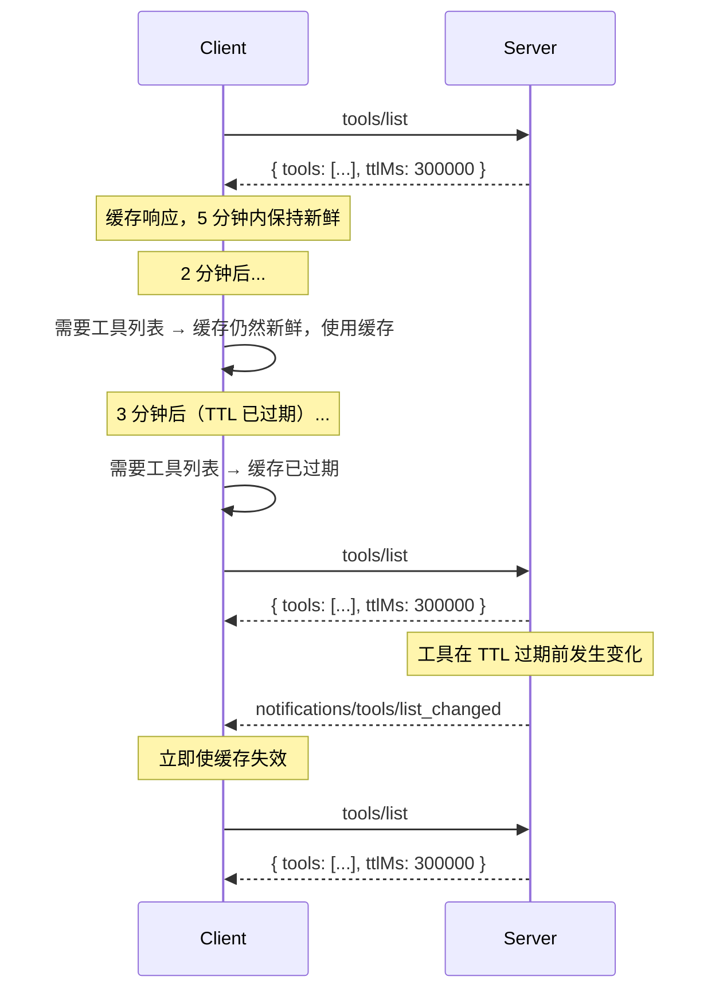

# SEP-2549: 列表结果的 TTL

- **状态**: 已接受
- **类型**: 标准轨道
- **创建时间**: 2026-04-09
- **作者**: Caitie McCaffrey (@CaitieM20)
- **赞助者**: @CaitieM20
- **PR**: https://github.com/modelcontextprotocol/specification/pull/2549

## 摘要

本 SEP 提议为 `tools/list`、`prompts/list`、`resources/list`、`resources/read` 和 `resources/templates/list` 返回的结果对象添加字段以支持缓存。将新增两个字段：`ttlMs` 和 `cacheScope`。TTL 告诉客户端在重新获取之前，响应在多长时间内可被视为新鲜。这使客户端能够缓存特性列表，并在完全向后兼容的同时减少对服务器推送通知的依赖。`cacheScope` 字段控制谁可以缓存响应。TTL 是对现有通知机制的补充，而不是替代——两者可以共存。

## 动机

当前，MCP 客户端通过调用服务器上的方法来发现服务器特性。这些调用会返回当前的特性集合。为了了解变化，客户端依赖服务器推送通知。下表将服务器方法映射到通知类型。

| 服务器方法                | 通知类型                              |
| ------------------------- | ------------------------------------- |
| `tools/list`              | `notifications/tools/list_changed`    |
| `prompts/list`            | `notifications/prompts/list_changed`   |
| `resources/list`          | `notifications/resources/list_changed` |
| `resources/templates/list` | `notifications/resources/list_changed` |
| `resources/read`          | `notifications/resources/updated`      |

这种方法有几个限制：

1. **基于 HTTP 的传输需要 SSE 流**：许多客户端和服务器在支持长连接 SSE 流方面存在挑战，而通知正需要这种机制。目标是让 SSE 流成为一种可选优化，但协议功能不依赖它们也能正常工作。TTL 允许客户端按可预测的时间表轮询，而无需依赖服务器推送通知。

2. **实现复杂度**：客户端和服务器都必须实现通知订阅与传递基础设施。许多简单服务器的特性列表变化很少（甚至从不变化），但如果它们希望客户端保持最新状态，仍然必须支持通知机制。

3. **缺少新鲜度信号**：即使能接收通知的客户端，也无法得知一个列表有多“稳定”。一个工具列表每天变化一次的服务器和一个每秒变化一次的服务器，对客户端来说看起来没有区别——两者只是在变化发生时发送通知。TTL 提供了明确的新鲜度提示。

4. **与 Web 标准保持一致**：HTTP 缓存（`Cache-Control: max-age`）和 DNS TTL 长期以来都证明了，基于时间的新鲜度提示是一种简单、广为理解、可减少不必要重新获取的机制。MCP 可以从同样的模式中受益。

为列表响应添加 TTL 字段，以最小且向后兼容的协议变更解决了所有这些问题。

## 规范

### 新接口：`CacheableResult`

引入一个新的 `CacheableResult` 接口作为独立类型扩展 `Result`。它拥有 `ttlMs` 和 `cacheScope` 字段。

#### Schema 变更（TypeScript）

```typescript
/**
 * 一个支持客户端侧缓存的时间到期（TTL）提示的结果。
 *
 * @internal
 */
export interface CacheableResult extends Result {
  /**
   * 来自服务器的提示，指示客户端在重新获取之前可以缓存此响应多长时间
   * （以毫秒为单位）。语义类似于 HTTP Cache-Control 的 max-age。
   *
   * - 如果为 0，则该响应 SHOULD 被视为立即过期，客户端
   *   MAY 在每次需要该结果时重新获取。
   * - 如果为正值，客户端 SHOULD 在收到响应后将该结果视为
   *   在这段毫秒数内保持新鲜。
   */
  ttlMs: number & { readonly minimum: 0 };

  /**
   * 指示缓存响应的预期范围，类似于 HTTP
   * Cache-Control: public 与 Cache-Control: private。
   *
   * - "public"：任何客户端或中间代理（例如共享网关、代理）
   *   MAY 缓存该响应，并将其提供给任何用户。
   * - "private"：只有请求该响应的用户的客户端 MAY 缓存该响应。
   *   共享缓存（例如多租户网关）MUST NOT 将缓存副本提供给
   *   不同的用户。
   *
   * 如果省略，默认为 "public"。
   */
  cacheScope: "public" | "private";
}
```

### 语义

TTL 是对新鲜度的估计，而不是保证。服务器 MAY 在 TTL 过期之前更改底层列表；如果服务器这样做，并且已声明 listChanged，则 SHOULD 发送相应通知。

服务器 MUST 为 `tools/list`、`prompts/list`、`resources/list`、`resources/read` 和 `resources/templates/list` 返回的 `Results` 提供 `ttlMs`。

`ttlMs` MUST >= 0。如果服务器返回负值，客户端 SHOULD 忽略它，并将其视为 0（立即过期）。

| 条件                                               | 客户端行为                                                                                             |
| -------------------------------------------------- | ------------------------------------------------------------------------------------------------------- |
| `ttlMs` = 0                                        | 该响应 SHOULD 被视为立即过期，客户端 MAY 在每次需要该结果时重新获取。                                   |
| `ttlMs` > 0                                        | 客户端 SHOULD 将该响应视为从收到时起 `ttlMs` 毫秒内保持新鲜。                                           |
| TTL 处于有效期内时收到相关通知                     | 通知会使缓存的响应失效。客户端 SHOULD 无论剩余 TTL 多少都重新获取。                                     |
| `cacheScope` = `"public"`                          | 任何客户端或共享中间件（网关、代理）MAY 缓存并向任何用户提供该响应。                                     |
| `cacheScope` = `"private"`                         | 只有请求该响应的用户的客户端 MAY 缓存。共享缓存 MUST NOT 将缓存副本提供给不同用户。                     |

#### 新鲜度计算

客户端记录收到响应的本地时间（`t_received`）。当 `now < t_received + ttlMs` 时，该响应被视为**新鲜**。一旦 TTL 过期，该响应即为**过期**，客户端 SHOULD 在下次访问时重新获取。

客户端 SHOULD NOT 将 TTL 视为会触发自动后台重新获取的轮询间隔。TTL 是一个**新鲜度提示**：客户端在需要列表时检查其新鲜度，并且仅在已过期时才重新获取。选择进行轮询的实现 SHOULD 应用抖动和退避策略。

即使 TTL 尚未过期，客户端 MAY 在有理由相信数据已变化时重新获取。例如，在工具调用中收到一个意外错误，表明该方法不存在或参数无效。

如果在重新获取结果时发生错误（例如网络问题、服务器宕机），客户端 MAY 提供过期响应。TTL 是一个提示，说明客户端可以在多长时间内安全地依赖数据，但现实条件可能需要灵活处理。

### 缓存范围

`cacheScope` 字段控制谁可以缓存响应：

- **`"public"`**：响应不包含用户特定数据。任何客户端、共享网关或缓存代理 MAY 存储并向任何用户提供缓存响应。这适用于对所有用户都相同的工具、提示和资源模板列表。
- **`"private"`**：响应包含用户特定数据。只有请求该响应的用户的客户端 MAY 缓存它。共享缓存（例如多租户 API 网关）MUST NOT 将 `"private"` 缓存响应提供给不同用户。这适用于依赖已认证用户的 `resources/read` 结果，或按用户变化的筛选列表结果。

此设计借鉴了 HTTP `Cache-Control: public` 与 `Cache-Control: private`，并在 MCP 协议层应用相同且广为理解的语义。

### 与通知的交互

TTL 与服务器推送通知是互补的：

- 服务器 MAY 提供 `ttlMs`，而不在其能力中声明 `listChanged: true`。在这种情况下，客户端完全依赖 TTL。
- 服务器 MAY 同时声明 `listChanged: true` **并** 提供 `ttlMs`。在这种情况下，客户端可以利用 TTL 避免通知之间不必要的重新获取，而通知则作为即时失效信号。



### 与分页的交互

当列表结果是分页的（包含 `nextCursor`）时，每一页都是一个可独立缓存的响应——这与 HTTP `Cache-Control` 对分页资源的处理方式一致。具体而言：

- 每个页面响应都携带自己的 `ttlMs` 值。每一页的新鲜度时钟从该页被接收时开始计算。
- 服务器 MAY 在不同页面上返回不同的 `ttlMs` 值（例如：稳定列表的前几页 TTL 更长，最后一页 TTL 更短）。
- 不存在跨页一致性保证。如果底层数据在分页获取之间发生变化，客户端可能观察到重复或缺失——这与 HTTP 分页 API 适用相同的权衡。
- 需要完整列表一致性快照的客户端 SHOULD 从头重新获取（不带 cursor）。
- 如果 cursor 变得无效（例如服务器对一个先前有效的 cursor 返回错误），客户端 SHOULD 丢弃所有缓存页面并从头重新获取。

服务器 MUST 对同一次列表请求的所有响应页面应用相同的 cacheScope。例如，如果 `tools/list` 响应的第一页具有 `cacheScope: "private"`，那么该请求的后续所有页面也 MUST 被视为 `"private"`。

### 错误处理

- 如果 `ttlMs` 存在但为负整数，客户端 SHOULD 忽略它，并按 0（立即过期）处理。

## 原因

### 为什么不替换 `list_changed` 通知？

通知提供即时失效，这对长连接非常有价值。TTL 提供了一种互补机制，针对无状态传输进行了优化，并有助于减少不必要的轮询。这两种机制服务于不同的使用场景，并且可以自然共存。

### 为什么 TTL 使用整数毫秒？

我们选择整数毫秒而不是秒，因为我们希望在整个 MCP 协议中 TTL 只使用一种单位。Tasks 有亚秒级 TTL 的使用场景，而使用毫秒可以在 MCP 中为所有 TTL 提供一致的表示。

许多现有系统将整数秒用于 TTL，但也有一些系统（例如 gRPC retry pushback）使用毫秒。关键在于为 MCP 中所有 TTL 选择单一且一致的单位。整数毫秒在保持实现和理解简单的同时，提供了所需的精度。

| 系统                          | 机制                  | 备注                                                              |
| ----------------------------- | --------------------- | ---------------------------------------------------------------- |
| HTTP `Cache-Control: max-age` | 整数秒                | Web 基础设施中部署最广泛的新鲜度提示                              |
| DNS TTL                       | 整数秒                | 控制解析器缓存 DNS 记录的时长                                     |
| GraphQL `@cacheControl`       | `maxAge` 整数秒       | GraphQL 响应中按字段提供的缓存提示                                |
| gRPC `grpc-retry-pushback-ms` | 毫秒                  | 服务端提供的重试提示（不同的使用场景，相似的模式）               |

### 为什么不直接使用 HTTP 缓存？

MCP 与传输层无关。虽然基于 HTTP 的传输在理论上可以使用 `Cache-Control` 头，但 MCP 也可以通过 stdio 运行，并且支持可插拔传输，在这些情况下 HTTP 头可能不可用。将 TTL 嵌入 JSON 响应体可确保它在所有传输方式上一致工作。

## 向后兼容性

- 现有不提供该字段的服务器可以继续原样工作。如果缺少 `ttlMs` 字段，客户端 SHOULD 假定默认 `ttlMs` 为 0（立即过期），并依赖自身的缓存启发式或通知，这与当前行为一致。
- 现有不理解该字段的客户端会忽略它，因为 MCP 结果对象通过基础类型 `Result` 上的 `[key: string]: unknown` 允许额外属性。
- `cacheScope` 是必需的，因为对于旧服务器来说不存在安全的默认值。服务器必须显式声明预期的缓存范围，以防止意外缓存特定用户的数据。
- 不会修改或移除任何现有字段或行为。
- 不需要能力协商。
- SDK 维护者可以选择在其 SDK 中为 ttl 和 cacheScope 添加默认值，以简化采用，但这不是合规所必需的。

## 参考实现

_暂无参考实现。_

---

## 安全影响

配置错误或恶意的服务器可能会设置过长的 TTL，导致客户端将陈旧数据缓存的时间比预期更长。不过，由于 TTL 只是一个提示，客户端可以选择忽略它，或者在怀疑有变化时重新获取，因此安全风险很小。客户端应设计为能够优雅地处理意外的 TTL 值。
