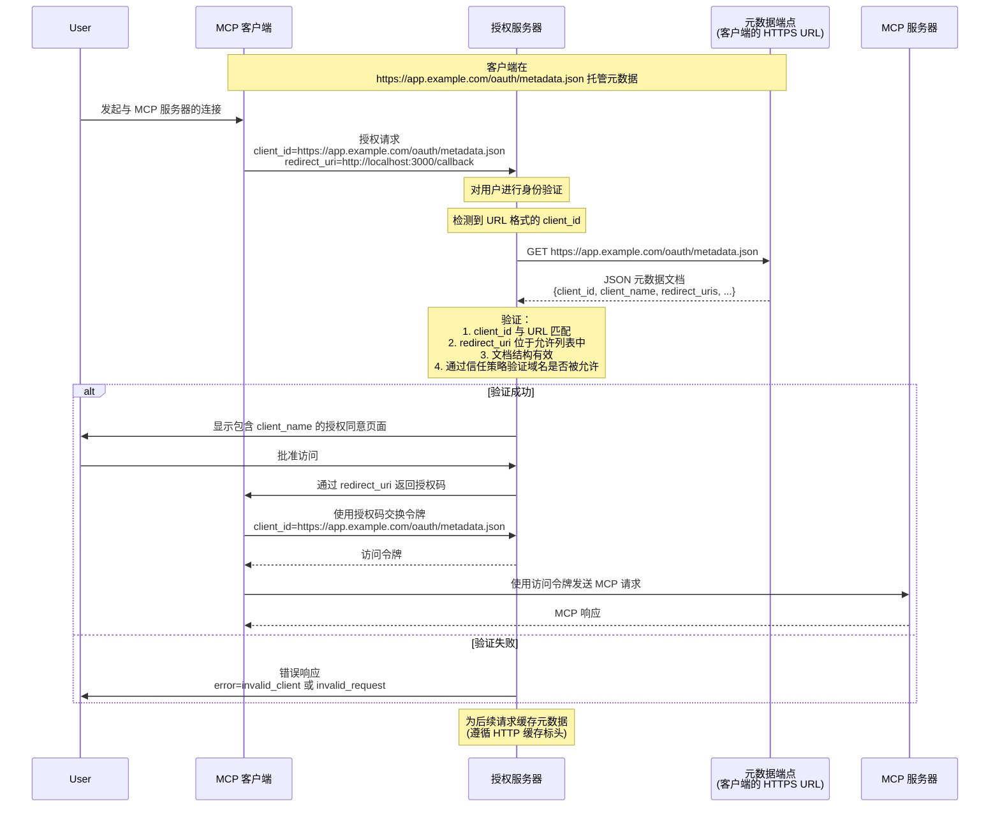

# SEP-991：使用 OAuth 客户端 ID 元数据文档启用基于 URL 的客户端注册

- **状态**：已定稿
- **类型**：标准轨道
- **创建日期**：2025-07-07
- **作者**：Paul Carleton (@pcarleton) Aaron Parecki (@aaronpk)
- **问题**：#991

# SEP：面向 MCP 的 OAuth 客户端 ID 元数据文档

## 摘要

本 SEP 提议采用 [draft-parecki-oauth-client-id-metadata-document-03](https://datatracker.ietf.org/doc/draft-parecki-oauth-client-id-metadata-document/) 中规定的 OAuth 客户端 ID 元数据文档，作为模型上下文协议（MCP）的一种额外客户端注册机制。该方法允许 OAuth 客户端使用 HTTPS URL 作为客户端标识符，其中该 URL 指向一个包含客户端元数据的 JSON 文档。这专门解决了 MCP 中服务器与客户端之间不存在预先关系的常见场景，使服务器无需预先协调即可信任客户端，同时仍能完全控制访问策略。

## 动机

模型上下文协议目前支持两种客户端注册方式：

1. **预注册**：要求客户端开发者或用户手动向每个服务器注册客户端
2. **动态客户端注册（DCR）**：通过向授权服务器上的注册端点发送客户端元数据，支持即时注册。

对于 MCP 的使用场景而言，这两种方式都有显著局限，因为客户端经常需要连接到此前从未遇到过的服务器：

- 开发者进行预注册并不现实，因为客户端发布时服务器可能尚不存在
- 用户进行预注册会带来糟糕的用户体验，需要手动管理凭据
- DCR 要求服务器管理无界增长的数据库、处理过期问题，并信任自我声明的元数据

### 目标使用场景：不存在预先关系

本提案专门针对常见的 MCP 场景：

- 用户希望将客户端连接到自己发现的服务器
- 客户端开发者从未听说过该服务器
- 服务器运营者从未听说过该客户端
- 双方需要在没有事先协调的情况下建立信任

对于存在预先关系的场景，预注册仍然是最佳方案。然而，MCP 的价值在于能够连接任意客户端和服务器，因此解决“不存在预先关系”的情况至关重要。

相关地，MCP 服务器的数量远多于客户端（类似于 Web 浏览器的数量远多于 API）。一个常见场景是，MCP 服务器开发者希望将使用限制在一组他们信任的客户端之内。

### 核心创新：无需事先协调的服务器控制型信任

客户端 ID 元数据文档支持一种独特的信任模型，其中：

1. **服务器可以信任此前从未见过的客户端**，依据包括：
   - 托管元数据的 HTTPS 域名
   - 元数据内容本身
   - 域名声誉和安全策略

2. **服务器通过灵活的策略保持完全控制**：
   - **开放服务器**：可以接受任何 HTTPS client_id，从而实现最大的互操作性
   - **受保护服务器**：可以限制为受信任的域名或特定客户端

3. **无需客户端事先协调**：
   - 客户端无需提前了解服务器
   - 客户端只需托管其元数据文档
   - 信任源自客户端的域名，而非事先注册

## 规范变更

规范变更将把客户端 ID 元数据文档作为 SHOULD 添加，并将 DCR 改为 MAY，因为我们认为，对于此场景，客户端 ID 元数据文档是更好的默认选项。

我们将主要依赖链接 RFC 中的文本，尽量不重复其中的大部分内容。以下是我们需要规范的简短版本。



### 客户端要求

- 客户端 MUST 在符合 RFC 要求的 HTTPS URL 上托管其元数据文档
- client_id URL MUST 使用 "https" 方案，并包含路径组件
- 元数据文档 MUST 是有效的 JSON，并至少包含：
  - `client_id`：与文档 URL 完全匹配
  - `client_name`：用于授权提示的人类可读名称
  - `redirect_uris`：允许的重定向 URI 数组
  - `token_endpoint_auth_method`：公共客户端使用 "none"

请注意，客户端可以为 `token_endpoint_auth_method` 使用 `private_key_jwt`，因为客户端元数据可以提供公钥信息。

### 服务器要求

- 服务器在遇到 URL 格式的 client_id 时 SHOULD 获取元数据文档
- 服务器 MUST 验证获取的文档包含匹配的 client_id
- 服务器 SHOULD 遵循 HTTP 标头缓存元数据（建议最长 24 小时）
- 服务器 MUST 验证重定向 URI 与元数据文档中的 URI 匹配

### 发现

- 服务器通过 OAuth 元数据声明支持：`client_id_metadata_document_supported: true`
- 客户端检测支持情况，并可在不可用时回退到 DCR 或预注册

示例元数据文档：

```json
{
  "client_id": "https://app.example.com/oauth/client-metadata.json",
  "client_name": "Example MCP Client",
  "client_uri": "https://app.example.com",
  "logo_uri": "https://app.example.com/logo.png",
  "redirect_uris": [
    "http://127.0.0.1:3000/callback",
    "http://localhost:3000/callback"
  ],
  "grant_types": ["authorization_code"],
  "response_types": ["code"],
  "token_endpoint_auth_method": "none"
}
```

### 与现有 MCP 身份验证的集成

本提案将客户端 ID 元数据文档作为第三种注册选项加入预注册和 DCR 之外。服务器 MAY 支持这些方式的任意组合：

- 预注册保持不变
- DCR 保持不变
- 通过 URL 格式的 client_id 检测客户端 ID 元数据文档，并在 OAuth 元数据中声明服务器支持该功能。

## 理由

### 为什么这能解决“预先不存在关系”的问题

不同于需要协调的预注册，或需要服务器管理注册数据库的 DCR，客户端 ID 元数据文档提供了：

1. **可验证的身份**：HTTPS URL 同时充当标识符和信任锚点
2. **无需协调**：客户端发布元数据，服务器使用元数据
3. **灵活的信任策略**：服务器自行决定信任标准，无需客户端进行更改
4. **稳定的标识符**：不同于 DCR 的临时 ID，URL 是稳定且可审计的

### 重定向 URI 证明

客户端 ID 元数据文档的一项关键优势是能够证明重定向 URI：

1. **元数据文档通过 HTTPS 将重定向 URI 以加密方式绑定到客户端身份**
2. **服务器可以信任元数据中的重定向 URI 由客户端控制**，而不是由攻击者提供
3. **这可以防止自我声明注册中常见的重定向 URI 篡改攻击**

### 此方法的风险

#### 风险：localhost URL 冒充

客户端 ID 元数据文档本身无法阻止 localhost URL 冒充，这是其局限性之一。攻击者可以通过以下方式声称自己是任意客户端：

1. 将合法客户端的元数据 URL 作为其 client_id 提供
2. 绑定到合法客户端使用的同一个 localhost 端口
3. 在用户批准时拦截授权码

这种攻击令人担忧，因为服务器看到的是正确的元数据
文档，用户看到的也是正确的客户端名称，因此很难被发现。

平台特定的证明机制（iOS DeviceCheck、Android
Play Integrity）可以解决这一问题，但它们并非普遍可用。其工作方式是：开发者运行一个后端服务来消费 DeviceCheck / Play Integrity
签名，并返回一个 JWT，该 JWT 可用作 `token_endpoint_auth_method` 的
`private_key_jwt` 身份验证。

一种无需平台特定证明机制、但仍能提高攻击成本的类似方法，是使用 JWKS 和由客户端开发者托管的服务器端组件签署的短期 JWT。该组件可以使用平台特定机制之外的其他证明机制来证明客户端身份，例如客户端的标准登录流程。使用短期 JWT 可以降低凭据泄露和重放的风险，但无法完全消除这些风险——攻击者仍然可以代理请求到合法
客户端的签名端点。

完全缓解这一风险不在本提案的范围内。本
提案在 localhost 重定向场景下具有与 DCR 相同的风险。

服务器 SHOULD 为仅使用 localhost 的客户端显示额外警告。

#### 风险：服务器端请求伪造（SSRF）

授权服务器从未知客户端获取一个 URL，然后获取该 URL。恶意客户端可能利用这一点，代表授权服务器发送非元数据请求。例如，它可以发送一个对应于授权服务器能够访问的私有管理端点的 URL。

可以通过在发起获取请求之前，验证 URL 以及这些 URL 解析到的 IP 来防止此问题。

#### 风险：分布式拒绝服务（DDoS）

类似地，攻击者可能试图利用一组授权服务器，对非 MCP 服务器发起拒绝服务攻击。

获取请求不会产生额外的放大效应（即客户端发起请求所需的带宽，大致等于发送到目标服务器的请求所需的带宽），并且每个授权服务器都可以积极缓存这些元数据获取结果，因此它不太可能成为有吸引力的 DDoS 攻击向量。

#### 风险：所引用规范的成熟度

客户端 ID 元数据文档的 RFC 仍处于草案阶段。Bluesky 平台已经实现了该规范，但除此之外，该规范尚未获得批准，也未被广泛采用，并且未来可能会不断演进。我们的意图是随着后续草案以及任何最终标准的发展进行演进和保持一致，同时尽量减少对现有实现的干扰和破坏。

这种方法存在协议中尚未暴露实现挑战或缺陷的风险。然而，尽管 DCR 已获得批准，开发者在尝试将其用于 MCP 这类开放生态系统场景时，同样面临许多实现挑战。这些挑战正是本提案提出的动机。

#### 风险：客户端实现负担，尤其是本地客户端

本规范要求客户端增加一项基础设施，因为客户端需要在 HTTPS URL 后托管一个元数据文件。如果没有本规范，客户端例如可以完全只是一个桌面应用程序。

托管此端点的负担预计较低，因为托管静态 JSON 文件相当简单，而且大多数已知客户端都有用于宣传其客户端或提供下载链接的网页。

#### 风险：授权方式的碎片化

MCP 的授权对于客户端和服务器而言，实现起来已经很有挑战性。如何正确实现以及最佳实践方面的问题，是社区中最常见的问题之一。在授权流程中增加另一个分支，意味着这一流程可能变得更加复杂和碎片化，从而导致更少的开发者能够成功遵循本规范，并使兼容性和开放生态系统的愿景因此受到影响。

本提案旨在通过提供一种更清晰的机制来信任重定向 URI，并减少运维负担，从而简化授权服务器和资源服务器开发者所面对的整体方案。本提案的前提是，这种简单性对于大多数人来说明显是更好的选择，这将推动更多采用，并最终使其成为获得最广泛支持的选项。如果我们不认为它明显是更好的选择，那么就不应采用本提案。

本提案还为开放服务器以及希望限制可使用客户端的服务器提供了一种统一机制。本提案的替代方案要求客户端和服务器针对开放用例和受保护用例实现不同的机制。

## 已考虑的替代方案

1. **通过软件声明增强 DCR**：更加复杂，需要托管 JWKS 并对 JWT 进行签名
2. **强制预注册**：对于 MCP 的分布式生态系统而言，开发者和用户体验较差
3. **双向 TLS**：需要信任客户端证书颁发机构，在开放生态系统中不切实际
4. **维持现状**：继续存在服务器实现者当前面临的痛点

对于最常见的开放生态系统用例而言，客户端 ID 元数据文档是对 DCR 的严格改进。未来还可以进一步扩展，以更好地支持操作系统级证明和 jwks_uri 等功能。

## 向后兼容性

此提案完全向后兼容：

- 现有的预注册客户端可继续正常工作
- 现有的 DCR 实现可继续正常工作
- 服务器可以逐步采用客户端 ID 元数据文档
- 客户端可以检测是否支持，并回退到其他方法

## 原型实现

[此处](https://github.com/modelcontextprotocol/typescript-sdk/pull/839)提供了一个原型实现，演示了：

1. 客户端元数据文档托管
2. 服务端元数据获取与验证
3. 与现有 MCP OAuth 流程的集成
4. 适当的错误处理与回退行为

## 安全影响

1. **防范网络钓鱼**：醒目显示客户端主机名
2. **SSRF 防护**：验证 URL、限制响应大小、设置请求超时、限制出站请求速率

### 最佳实践

- 仅在对用户进行身份验证后获取客户端元数据
- 对出站元数据获取实施速率限制
- 考虑针对新域名/未知域名/本地主机域名添加额外警告
- 记录元数据获取失败，以便进行监控

## 参考资料

- [draft-parecki-oauth-client-id-metadata-document-03](https://www.ietf.org/archive/id/draft-parecki-oauth-client-id-metadata-document-03.txt)
- [OAuth 2.1](https://datatracker.ietf.org/doc/draft-ietf-oauth-v2-1/)
- [RFC 7591 - OAuth 2.0 动态客户端注册](https://www.rfc-editor.org/rfc/rfc7591.html)
- [MCP 规范 - 授权](https://modelcontextprotocol.org/docs/spec/authorization)
- [演进模型上下文协议中的 OAuth 客户端注册](https://github.com/modelcontextprotocol/modelcontextprotocol/pull/1027/)
